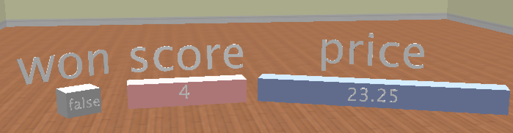

## Table of Contents
{: .no_toc .text-delta }

{: .fs-2 }
- TOC
{:toc}

---

{:.note}
📖 This page is a condensed version of [CSAwesome Topic 1.2](https://runestone.academy/ns/books/published/csawesome2/topic-1-2-variables.html) 

---

## What is a Variable?

<html>
<dl>
 <dt>Variable</dt>
 <dd>A <strong>labeled memory location</strong> in the computer that can <em>store</em> a value that can change or vary while a program is running.
 </dd>
</dl>
</html>

When you play a game, it will often have a `score`. Scores often start at 0 and increase, so they can _change_. A score can be _stored_ in a **variable**.


#### INTRODUCTORY ACTIVITY
{:.no_toc}

<div class="task" markdown="block">

🎮📱 As a class, brainstorm some examples of important pieces of **information (data)** in video games that you play (or apps you use in general).

> * How/why would a program be able to be _personalized_ for each player that plays the game?
> * What kind of information (data) does the game need to remember about each player?

</div>

## Data Types

Every variable has a **name** and a **data type** that determines the kind of data it can hold. 

<div class="important" markdown="block">
There are two types of variables in Java: 
 
* **Primitive variables** that hold one simple unit of data, like a number
* **Object (reference) variables** that hold a reference to a more complex set of data 
 > A _reference_ is a way to locate the object (like a UPS tracking number helps you find your package)
 
</div>

_Primitive Types tested on the AP Exam:_
- `int` which can represent **integers**, i.e. numbers with no fractional part such as 3, 0, -76, and 20393.
- `double` which can represent **decimal numbers** like 6.3, -0.9, and 60293.93032.
  > Computer people call these “floating point” numbers because the decimal point “floats” relative to the magnitude of the number, similar to scientific notation like 6.5 × 10^8. 
- `boolean` which can represent only two possible values: `true` or `false`.
  > The data type is named for [George Boole](https://en.wikipedia.org/wiki/George_Boole).

{:.highlight}
`String` is one of the **object (reference) types** on the exam and is the name of a class in Java. A `String` is written in a Java program as a sequence of characters enclosed in a pair of double quotes — like `"Hello"`. 

A data type is a set of possible _values_ (a domain) but also a set of _operations_ on them. 
> For example, you can do addition operations with `int`s and `double`s but not with `boolean`s or `String`s.

<div class="task" markdown="block">

💬 With the people at your table, discuss the situations below. **Select the appropriate data type** out of the following choices: `int`, `double`, `boolean`, `String`
 
- What type should you use to represent the average grade for a course?  
- What type should you use to represent the number of people in a household?  
- What type should you use to hold the first name of a person?  
- What type should you use to record if it is raining or not?  
- What type should you use to represent the amount of money you have?  

</div>

### Declaring Variables in Java

Creating a new variable is also called **declaring a variable**. The type must be a recognized keyword like `int`, `double`, or `boolean`, but you get to make up the name for the variable. 

When you create a **primitive variable** Java will set aside enough bits in memory for that primitive type and associate that _memory location_ with the name that you used.
> Computers store all values using **bits** (binary digits). A **bit** can represent two values and we usually say that the value of a bit is either 0 or 1. 


> Examples of variables with names and values. Notice that the different types get a different amount of memory space.



<div class="important" markdown="block">

#### DECLARE
{:.no_toc}

To **declare** (create) a variable, specify the _type_, leave at least one space, then the _name_ for the variable, and end the line with a semicolon (`;`). 

```java
int score;
````

#### ASSIGN
{:.no_toc}

After declaring a variable, you can **assign a value** to it using an equals sign `=` followed by the value:

```java
score = 4;
```

#### INITIALIZE
{:.no_toc}

Or you can combine both steps into one line, declaring the type AND setting an initial value for a variable:

```java
int score = 4;
```

</div>

### Concatenation


When you are printing out variables, you can use the **string concatenation** operator ``+`` to combine them with another string inside System.out.print. 
> Never put variables inside quotes ``""`` because that will print out the variable name letter by letter. You do not want to print out the variable name, but the *value of the variable* in memory. 

<div class="task" markdown="block">

In your Java file in GitHub Codespaces, type and run each line below in the `main` method. Observe the output, then change values, add/remove spaces, and (on purpose) put quotes around a variable name to see what happens.

```java
int score = 0;
System.out.print("The score is ");
System.out.println(score);

double price = 23.25;
System.out.println("The price is " + price);

boolean won = false;
System.out.println(won);
won = true;
System.out.println(won);

String name = "Jose";
System.out.println("Hi " + name);
```

</div>


<div class="task" markdown="block">


1. Type the **wrong** assignment below, run it, and read the compiler error.
2. Then fix it and run again.

```java
int score;
4 = score;            // wrong on purpose
System.out.println(score);
```

</div>


### Naming Variables

While you can name your variable almost anything, there are some rules. A variable name should always start with an alphabetic character and can include letters, numbers, and underscores `_`. **It must be all one word with no spaces.**

You also can't use any of the keywords or reserved words as variable names in Java (`for`, `if`, `class`, `static`, `int`, `double`, etc). For a complete list of keywords and reserved words, see [https://docs.oracle.com/javase/specs/jls/se14/html/jls-3.html#jls-3.9](https://docs.oracle.com/javase/specs/jls/se14/html/jls-3.html#jls-3.9).

<div class="important" markdown="block">

**Variable Naming Guidelines:**

* Use a meaningful variable name that describe the data it holds.
* Start variable names with a lowercase letter and use `camelCase` for names with multiple words.
 > Variable names are case-sensitive and spelling-sensitive... every use must match the original declaration!

</div>

<!--
#### Debugging Challenge : Weather Report

Debug the following code that reads out a weather report. Make sure the data types match the values put into the variables. Can you find all the bugs and get the code to run? Work with a programming buddy if you get stuck.

<div class="task" markdown="block">

**Coding Challenge (Codespaces)**
Type these **inside your `main` method** (or adapt to your file). The lines contain multiple bugs (types, capitalization, quotes, semicolons). Fix them so the program prints a coherent weather report.

```java
int temperature = 70.5;
double tvChannel = 101;
boolean sunny = 1

System.out.print("Welcome to the weather report on Channel ")
System.out.println(TVchannel);
System.out.print("The temperature today is );
System.out.println(tempurature);
System.out.print("Is it sunny today? ");
System.out.println(sunny);
```

*Target output (example):*

```
Welcome to the weather report on Channel 101
The temperature today is 70.5
Is it sunny today? true
```

</div>

---

#### Groupwork Coding Challenge : Mad Libs

Have you ever played MAD LIBS? In this game, you first choose words by prompts like “a color” or “a plural noun,” and then those words are filled into a story to make it wacky!

<div class="task" markdown="block">

**Pair Activity (Codespaces)**

1. Declare and initialize the variables, then print the poem using concatenation.
2. Replace the placeholder words with your own.
3. Create your own silly poem using **at least 5 new `String` variables**.
4. (Optional) Explore user input later with the Java `Scanner` class: <a href="https://www.w3schools.com/java/java_user_input.asp" target="_blank">Scanner class</a>.

```java
// Fill these in with your words (don’t peek at the poem yet)
String pluralNoun1 = "Replace";
String color1 = "Replace";
String color2 = "Replace";
String food = "Replace";
String pluralNoun2 = "Replace";

// Poem
System.out.println("Roses are " + color1);
System.out.println(pluralNoun1 + " are " + color2);
System.out.println("I like " + food);
System.out.println("Do " + pluralNoun2 + " like them too?");
```

</div>
-->

---

## Summary

* (AP 1.2.B.2) A **variable** is a memory storage location that holds a value, which can change while the program is running.
* (AP 1.2.B.2) Every variable has a name and an associated data type that determines the kind of data it can hold. A primitive variable holds a primitive value from that type.
* Variables can be declared and initialized like:

```java
int score;
double gpa = 3.5;
```

* (AP 1.2.A.1) A **data type** is a set of values and operations. Data types can be primitive types (like `int`) or reference types (like `String`).
* (AP 1.2.A.2) The **primitive** data types used in this course define the set of values and operations for numbers and Boolean values.
* (AP 1.2.A.3) A **reference** type, like `String`, is used to define objects that are not primitive types.
* (AP 1.2.B.1) The three primitive data types used in this course are **`int`** (integer numbers), **`double`** (decimal numbers), and **`boolean`** (true or false).
* `String` is a reference data type representing a sequence of characters.

---

#### Acknowledgement
{: .no_toc }

Content on this page is adapted from [Runestone Academy - Barb Ericson, Beryl Hoffman, Peter Seibel](https://runestone.academy/ns/books/published/csawesome2/csawesome2.html).
{: .fs-2 }
