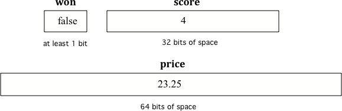

## Table of Contents
{: .no_toc .text-delta }

{: .fs-2 }
- TOC
{:toc}

---

{:.note}
📖 This page is a condensed version of [CSAwesome Topic 1.2]() 

---

# Lesson 1.2: Variables & Data Types

## What is a Variable?

A **variable** is a memory location in the computer that can store a value that can change or vary while the program is running. The following video explains what a variable is and gives some real-world examples of variables.

<iframe width="700" height="400" src="https://www.youtube.com/embed/pHgYlVjagmA" frameborder="0" allowfullscreen></iframe>

For example, when you play a game, it will often have a score. Scores often start at 0 and increase, so they can change. A score can be stored in a variable.


---

## Data Types

Every variable has a name and a data type that determines the kind of data it can hold. There are two types of variables in Java: **primitive variables** that hold values of primitive types like numbers and **reference variables** that hold a reference to a more complex object. A reference is a way to find the object (like a UPS tracking number helps you find your package).

The primitive types on the Advanced Placement Computer Science A exam are:

- `int` which can represent integers, i.e. numbers with no fractional part such as 3, 0, -76, and 20393.
- `double` which can represent non-integer numbers like 6.3, -0.9, and 60293.93032. Computer people call these “floating point” numbers because the decimal point “floats” relative to the magnitude of the number, similar to scientific notation like 6.5 × 10^8. The name `double` comes from the fact that doubles are represented using 64 bits, double the 32 bits used for the type `float` (rarely used in AP CS A).
- `boolean` which can represent only two values: `true` and `false`. (The data type is named for [George Boole](https://en.wikipedia.org/wiki/George_Boole).)

`String` is one of the object (reference) types on the exam and is the name of a class in Java. A `String` is written in a Java program as a sequence of characters enclosed in a pair of double quotes — like `"Hello"`. You will learn more about `String` objects later.

A data type is a set of values (a domain) and a set of operations on them. For example, you can do addition operations with `int`s and `double`s but not with `boolean`s and `String`s.

<div class="task" markdown="block">

**Check Your Understanding:** 

With the people at your table, discuss the situations below. Select the appropriate data type out of the following choices: `int`, `double`, `boolean`, `String`
 
- What type should you use to represent the average grade for a course?  
- What type should you use to represent the number of people in a household?  
- What type should you use to hold the first name of a person?  
- What type should you use to record if it is raining or not?  
- What type should you use to represent the amount of money you have?  

</div>

---

### Declaring Variables in Java

To create a variable, you must tell Java its data type and its name. Creating a variable is also called **declaring a variable**. The type is a keyword like `int`, `double`, or `boolean`, but you get to make up the name for the variable. When you create a **primitive variable** Java will set aside enough bits in memory for that primitive type and associate that memory location with the name that you used.

Computers store all values using **bits** (binary digits). A **bit** can represent two values and we usually say that the value of a bit is either 0 or 1. When you declare a variable, you have to tell Java the type of the variable because Java needs to know how many bits to use and how to represent the value. The 3 different primitive types all require different number of bits. An integer gets 32 bits of memory, a double gets 64 bits of memory and a boolean could be represented by just one bit.



To **declare** (create) a variable, specify the type, leave at least one space, then the name for the variable and end the line with a semicolon (`;`). Java uses the keyword **int** for integer, **double** for a floating point number, and **boolean** for a Boolean value (true or false).

Here is an example declaration of a variable called score.

```java
int score;
````

After declaring a variable, you can give it a value using an equals sign `=` followed by the value.

```java
int score;
score = 4;
```

Or you can set an initial value for the variable in the variable declaration.

```java
int score = 4;
```

When you are printing out variables, you can use the **string concatenation** operator `+` to add them to another string inside `System.out.print`. Never put variables inside quotes `""` because that will print out the variable name letter by letter. If you want spaces between words and variables, you must put the space in the quotes.

<div class="task" markdown="block">

**Coding Exercise — String Concatenation**

In your Java file in GitHub Codespaces, type and run each line below in the `main` method. Observe the output, then change values, add/remove spaces, and (on purpose) put quotes around a variable name to see what happens.

```java
int score = 0;
System.out.print("The score is ");
System.out.println(score);

double price = 23.25;
System.out.println("The price is " + price);

boolean won = false;
System.out.println(won);
won = true;
System.out.println(won);

String name = "Jose";
System.out.println("Hi " + name);
```

</div>

{:.highlight}
**Note:** Variables are never put inside quotes (`""`) in `System.out.print` statements. That would print the variable **name** instead of its **value**.

<div class="task" markdown="block">

**Check Your Understanding — Find the Declarations**
In the code below, list all the **variable declarations** (type + name).

```java
public class Test2 {
    public static void main(String[] args) {
        int numLives;
        numLives = 0;
        System.out.println(numLives);
        double health;
        health = 8.5;
        System.out.println(health);
        boolean powerUp;
        powerUp = true;
        System.out.println(powerUp);
    }
}
```

*Write your answers as comments or bullet points.*

</div>

<br>

<div class="task" markdown="block">

**Check Your Understanding — Find the Initializations**
In the code below, list all the **initializations** (first time a variable is set to a value).

```java
public class Test2 {
    public static void main(String[] args) {
        int numLives;
        numLives = 0;
        System.out.println(numLives);
        double health = 8.5;
        System.out.println(health);
        boolean powerUp = true;
        System.out.println(powerUp);
    }
}
```

*Write your answers as comments or bullet points.*

</div>

The equal sign `=` here doesn't mean the same as it does in a mathematical equation where it implies that the two sides are equal. Here it means set the value in the memory location associated with the variable name on the left to a **copy** of the value on the right. A variable must be on the left side of the `=` and a value or expression on the right.

<div class="task" markdown="block">

**Coding Exercise — Assignment Order (Codespaces)**

1. Type the **wrong** assignment below, run it, and read the compiler error.
2. Then fix it and run again.

```java
int score;
4 = score;            // wrong on purpose
System.out.println(score);
```

**Fix:**

```java
int score;
score = 4;            // correct
System.out.println(score);
```

</div>

<div class="task" markdown="block">

**Check Your Understanding — Fill in the Blanks**

1. Declare `age` to be an integer and set its value to 5.
   *Your answer:* `_____ age = _____;`

2. What type should you use for a shoe size like 8.5?
   *Your answer:* `_____`

3. What type should you use for a number of tickets?
   *Your answer:* `_____`

</div>

---

### Naming Variables

While you can name your variable almost anything, there are some rules. A variable name should start with an alphabetic character and can include letters, numbers, and underscores `_`. It must be all one word with no spaces.

You can't use any of the keywords or reserved words as variable names in Java (`for`, `if`, `class`, `static`, `int`, `double`, etc). For a complete list of keywords and reserved words, see [https://docs.oracle.com/javase/specs/jls/se14/html/jls-3.html#jls-3.9](https://docs.oracle.com/javase/specs/jls/se14/html/jls-3.html#jls-3.9).

The name of the variable should describe the data it holds. A name like `score` helps make your code easier to read. A name like `x` is not a good variable name in programming, because it gives no clues as to what kind of data it holds. Do not name your variables extremely long names on the AP exam.

<div class="important" markdown="block">

**Variable Naming Guidelines:**

* Use meaningful variable names.
* Start variable names with a lowercase letter and use camelCase.
* Variable names are case-sensitive and spelling-sensitive — every use must match the declaration.
* Never put variables inside quotes (`" "`).

The convention in Java is to start a variable name with a lowercase letter and uppercase the first letter of each additional word, for example `gameScore`. This is called **camel case**. Another option is to use underscore `_` to separate words, but no spaces are allowed.

<div class="task" markdown="block">

**Coding Exercise — Case Sensitivity (Codespaces)**
Type the lines below. The second line is intentionally wrong. Run it, read the error, then fix it to use the correct variable name.

```java
int gameScore = 0;                 // camelCase
System.out.println("gameScore is " + gamescore);  // wrong name on purpose
```

</div>

<br>

<div class="task" markdown="block">

**Check Your Understanding — Camel Case Names**

1. Camel case name for a variable that represents a shoe size?
   *Your answer:* `__________`

2. Camel case name for a variable that represents the top score?
   *Your answer:* `__________`

</div>

---

#### Debugging Challenge : Weather Report

Debug the following code that reads out a weather report. Make sure the data types match the values put into the variables. Can you find all the bugs and get the code to run? Work with a programming buddy if you get stuck.

<div class="task" markdown="block">

**Coding Challenge (Codespaces)**
Type these **inside your `main` method** (or adapt to your file). The lines contain multiple bugs (types, capitalization, quotes, semicolons). Fix them so the program prints a coherent weather report.

```java
int temperature = 70.5;
double tvChannel = 101;
boolean sunny = 1

System.out.print("Welcome to the weather report on Channel ")
System.out.println(TVchannel);
System.out.print("The temperature today is );
System.out.println(tempurature);
System.out.print("Is it sunny today? ");
System.out.println(sunny);
```

*Target output (example):*

```
Welcome to the weather report on Channel 101
The temperature today is 70.5
Is it sunny today? true
```

</div>

---

#### Groupwork Coding Challenge : Mad Libs

Have you ever played MAD LIBS? In this game, you first choose words by prompts like “a color” or “a plural noun,” and then those words are filled into a story to make it wacky!

<div class="task" markdown="block">

**Pair Activity (Codespaces)**

1. Declare and initialize the variables, then print the poem using concatenation.
2. Replace the placeholder words with your own.
3. Create your own silly poem using **at least 5 new `String` variables**.
4. (Optional) Explore user input later with the Java `Scanner` class: <a href="https://www.w3schools.com/java/java_user_input.asp" target="_blank">Scanner class</a>.

```java
// Fill these in with your words (don’t peek at the poem yet)
String pluralNoun1 = "Replace";
String color1 = "Replace";
String color2 = "Replace";
String food = "Replace";
String pluralNoun2 = "Replace";

// Poem
System.out.println("Roses are " + color1);
System.out.println(pluralNoun1 + " are " + color2);
System.out.println("I like " + food);
System.out.println("Do " + pluralNoun2 + " like them too?");
```

</div>

---

## Summary

* (AP 1.2.B.2) A **variable** is a memory storage location that holds a value, which can change while the program is running.
* (AP 1.2.B.2) Every variable has a name and an associated data type that determines the kind of data it can hold. A primitive variable holds a primitive value from that type.
* Variables can be declared and initialized like:

```java
int score;
double gpa = 3.5;
```

* (AP 1.2.A.1) A **data type** is a set of values and operations. Data types can be primitive types (like `int`) or reference types (like `String`).
* (AP 1.2.A.2) The **primitive** data types used in this course define the set of values and operations for numbers and Boolean values.
* (AP 1.2.A.3) A **reference** type, like `String`, is used to define objects that are not primitive types.
* (AP 1.2.B.1) The three primitive data types used in this course are **`int`** (integer numbers), **`double`** (decimal numbers), and **`boolean`** (true or false).
* `String` is a reference data type representing a sequence of characters.

---

### AP Practice

<div class="task" markdown="block">

**Multiple Choice**
Which of the following pairs of declarations are the most appropriate to store a student’s average course grade in the variable `GPA` and the number of students in the variable `numStudents`?

* A. `int GPA; int numStudents;`
* B. `double GPA; int numStudents;`
* C. `double GPA; double numStudents;`
* D. `int GPA; boolean numStudents;`
* E. `double GPA; boolean numStudents;`

<details>
<summary>ANSWER:</summary>

**B** — the average can be decimal (`double`), and the number of students is an integer (`int`).

</details>

</div>


---

<div class="warn" markdown="block">

🛑 When class ends, don't forget to **SAVE YOUR WORK**!

1. Navigate to the `Source Control` menu on the _LEFT_ sidebar
2. Type a brief **commit message** in the box, for example: `updated Main.java`
3. Click the <button type="button" name="button" class="btn btn-green">commit changes</button> button on the _LEFT_ menu
4. Click the <button type="button" name="button" class="btn btn-green">sync changes</button> button on the _LEFT_ menu
5. _Finally you can close your Codespace!_

</div>

---

#### Acknowledgement
{: .no_toc }

Content on this page is adapted from [Runestone Academy - Barb Ericson, Beryl Hoffman, Peter Seibel](https://runestone.academy/ns/books/published/csawesome2/csawesome2.html).
{: .fs-2 }
