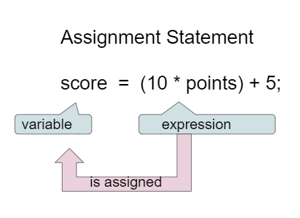

## Table of Contents
{: .no_toc .text-delta }

{: .fs-2 }
- TOC
{:toc}

---

{:.note}
📖 This page is a condensed version of [CSAwesome Topic 1.4](https://runestone.academy/ns/books/published/csawesome2/topic-1-4-assignment.html) 

---

## Assignment Statements

**Assignment statements** initialize or change the value stored in a variable using the assignment operator `=`. An assignment statement always has a single variable on the left-hand side. The value of the **expression** on the right is assigned to and stored in the variable on the left.

Instead of saying “equals” for the `=`, say “gets” or “is assigned” to remember that the **variable** _stores_ the **value** on the right.  


> Here, the variable `score` is assigned the value of `10 * points + 5`.

<iframe width="700" height="415" src="https://www.youtube.com/embed/MZwIgM__5C8" frameborder="0" allowfullscreen></iframe>

You can also set one variable's value to a _copy_ of the value of another variable:

```java
y = x;
```
> This does not change the value of the original variable.

<div class="task" markdown="block">

**Predict:** what will be printed after running this code?

```java
int x = 0;
int y = 1;
int z = 2;
x = y;
y = y * 2;
z = 3;
System.out.println(x);
System.out.println(y);
System.out.println(z);
```

</div>


### Data Types in Assignments

Every variable must be assigned a value before it can be used in an **expression**. That value must be from a compatible data type.

<div class="task" markdown="block">

The code below will cause a **type mismatch error**. Change one variable’s type so it works, then run it and confirm the output.

```java
int x = 1;
double y = 2.2;
x = 2 * y;
System.out.println(x);
```

</div>


### Incrementing & Decrementing

If you use a variable to keep score, you would probably increment it (add one to
the current value) whenever score should go up. You can do this by setting the
variable to the **current value** of the variable plus one (``score = score + 1``)
as shown below. 
> The formula would look strange in math class, but it makes sense in coding because it is _assigning_ a new **value** to the variable on the left that comes from _evaluating_ the arithmetic **expression** on the right.

To **increment** (increase an existing value by 1):

```java
score = score + 1;
```

To **decrement** (decrease an existing value by 1):
```java
score = score - 1;
```

---

## Input with Variables

Variables are a powerful abstraction in programming because the same algorithm can be used with _different input values_ saved in variables.  

Input can come in a variety of forms: 
* **Tactile** for example by clicking on a button
* **Audio** with speech
* **Visual** using a webcam
* Or the most common form, **text** that the user types in.

The ``Scanner`` class in Java is one way to obtain text input from the **keyboard**.

<div class="task" markdown="block">

Type and run this code. Try it with different names.

```java
   import java.util.Scanner; // IMPORT SCANNER AT TOP

   public class Main 
   {
       public static void main(String[] args) 
       {
           System.out.println("Please type in a name in the input box below.");
           Scanner scan = new Scanner(System.in);
           String name = scan.nextLine();
           System.out.println("Hello " + name);
           scan.close();
        }
    }
```
> The code above using the ``Scanner`` class will say hello to anyone who types in their name and will have _different results for different name values_. 

</div>

Although you will not be tested in the AP CSA exam on using the Java input from the keyboard, learning how to handle input in Java is very useful and fun. For more information on using the ``Scanner`` class, go to: [W3Schools - Java User Input](https://www.w3schools.com/java/java_user_input.asp)

<!--
## Groupwork: Coding Challenge – Dog Years

<div class="task" markdown="block">

**Coding Challenge (Codespaces)**
Fill in the missing values and formulas to calculate:

1. Your age from your birth year
2. Your pet’s age from its birth year
3. Your pet’s age in dog years (7 × human years)

Then print all three results with labels.

```java
int currentYear = ;
int birthYear = ;
int dogBirthYear = ;

// Calculate ages
int age = ;
int dogAge = ;
int dogYearsAge = ;

// Print results
```

</div>


 As a class, brainstorm types of information used by computer programs. What types of data might be entered? How might the information be gathered by the program? (Types of input to programs/apps)
-->

---

## Summary

- (AP 1.4.A.2) The **assignment operator** (``=``) allows a program to initialize or change the
  value stored in a variable. The value of the expression on the right is stored in the variable on the left.

- (AP 1.4.A.1) Every variable must be assigned a value before it can be used in an expression. That value must be from a compatible data type. 

- (AP 1.4.A.1) A variable is **initialized** the first time it is assigned a value. 

- (AP 1.4.A.1) Reference types can be assigned a new object or ``null`` if there is no object. The literal ``null`` is a special value used to indicate that a reference is not associated with any object.

- (AP 1.4.A.3) During execution, an expression is evaluated to produce a single value. The value of an expression has a type based on the types of the values and operators used in the expression.

- (AP 1.4.B.1) Input can come in a variety of forms, such as tactile, audio, visual, or text. The ``Scanner`` class is one way to obtain text input from the keyboard, although input from the keyboard will not be on the AP exam. 

{:.highlight}
This lesson ends the section for the **College Board Unit 1 Part 1**. 

---

<!--

## AP Practice

<div class="task" markdown="block">

**Multiple Choice**
What is printed?

```java
int a = 5;
int b = a / 2;
double c = a / 2.0;
double d = 5 + a / b * c - 2;
System.out.println(d);
```

A. `8`
B. `8.0` ✅
C. `10.5`
D. Incompatible type error

</div>

--> 

---

#### Acknowledgement
{: .no_toc }

Content on this page is adapted from [Runestone Academy - Barb Ericson, Beryl Hoffman, Peter Seibel](https://runestone.academy/ns/books/published/csawesome2/csawesome2.html).
{: .fs-2 }
