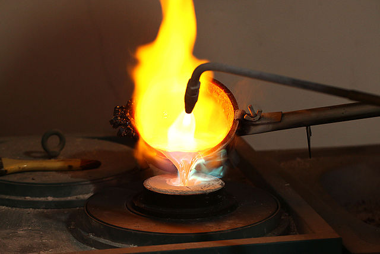

## Table of Contents
{: .no_toc .text-delta }

{: .fs-2 }
- TOC
{:toc}

---

{:.note}
📖 This page is a condensed version of [CSAwesome Topic 1.5](https://runestone.academy/ns/books/published/csawesome2/topic-1-5-casting.html) 

---

## Casting

In Java, **type casting** is used to convert values from one type to another. By **casting** we’re “reshaping” the value’s type, similar to reshaping metal during bronze casting—just without the heat.



The **cast operator** is written in parentheses before an expression, e.g., `(int)` or `(double)`. It converts the expression’s value to the given type.

- `(double) 1 / 3` → `0.33333333` (a `double`)
- `(int) 3.6` → `3` (truncates to an `int`)
- Casting an `int` to `double` adds `.0` (e.g., `3` → `3.0`)
- Casting a `double` to `int` **truncates** the decimal part

<div class="task" markdown="block">

**Coding Exercise (Codespaces)**  
Type these in your program, run, and observe. Then **add one more line** that divides `5` by `2` using a `(double)` cast.

```java
System.out.println(3 / 4);          // int / int
System.out.println(3.0 / 4);        // double / int
System.out.println(3 / 4.0);        // int / double
System.out.println((double) 3 / 4); // cast int to double, then divide
System.out.println((int) 3.0 / 4);  // cast double to int, then divide
// TODO: add a line that divides 5 by 2 using (double) and prints 2.5
````

</div>

When Java divides two `int`s, the result is an `int` with the decimal part **truncated** (not rounded). So `9 / 10` is `0`. In any expression involving a `double`, the result is a `double`. For example, `9.0 / 10` evaluates to `0.9`. This automatic widening from `int` to `double` is sometimes called **contagious**: `double` “wins”.

Casting an `int` to `double` forces a `double` result in mixed expressions—handy when you want non-integer division:

```java
int total; // sum of ints
int count; // how many ints
double average = (double) total / count;
```

A conversion from `int` to `double` is a **widening conversion** (every `int` fits in a `double`).

> **Note:**
> `int`s are always 32-bit signed: from `-2^31` to `2^31 - 1`.
> `Integer.MIN_VALUE` and `Integer.MAX_VALUE` hold these limits.
> Doubles represent wider ranges and can exactly represent consecutive integers up to `±2^53`.

---

## Rounding

Values of type `double` (within `int` range) can be rounded to the nearest `int` by adding/subtracting `0.5` and then casting:

```java
double number =  /* positive value */;
double negNumber = /* negative value */;

int nearestInt    = (int) (number + 0.5);
int nearestNegInt = (int) (negNumber - 0.5);
```

Example: `7.0 / 4.0` is `1.75`. Casting directly to `int` gives `1`. Using `+ 0.5` before casting gives `2`.

<div class="task" markdown="block">

**Coding Exercise (Codespaces)**
Type and run, then **add one more line** to round `(number + 2.3)` to the nearest int.

```java
double number = 5.0 / 3;
int nearestInt = (int) (number + 0.5);
System.out.println("5.0/3 = " + number);
System.out.println("5/3 truncated: " + (int) number);
System.out.println("5.0/3 rounded to nearest int: " + nearestInt);

double negNumber = -number;
int nearestNegInt = (int) (negNumber - 0.5);
System.out.println("-5.0/3 rounded to nearest negative int: " + nearestNegInt);

// TODO: print the result of rounding (number + 2.3) to the nearest int
```

</div>

---

## Range of Values

What about repeating decimals like `3.333333...`? Java `double` values keep about **14–15 significant digits**; beyond that, the number is rounded.

`int` values are stored in **4 bytes** (32 bits).

* Largest `int`: `Integer.MAX_VALUE` → `2147483647`
* Smallest `int`: `Integer.MIN_VALUE` → `-2147483648`

Storing a number outside this range causes an **integer overflow** (compile-time error for too-large literals, or wrap-around for operations). Try it:

<div class="task" markdown="block">

**Coding Exercise (Codespaces)**
This literal is too big for `int` and won’t compile. **Fix** it by deleting the last `0` in each number so it compiles and runs.

```java
int id = 2147483650;       // overflow: literal too large
int negative = -2147483650; // overflow: literal too large
System.out.println(id);
System.out.println(negative);
```

</div>

Computers allot a fixed memory size per type. `double` uses **8 bytes** (twice `int`), but precision is still finite. If an expression needs more precision than fits, you get **round-off error**. For example, `2.0/3` prints as approximately `0.6666666666666666`. You can format output to a limited number of decimal places.

<div class="task" markdown="block">

**Coding Exercise (Codespaces)**
Format a decimal to 2 digits using `printf`:

```java
double number = 10.0 / 3;
System.out.println("Number cut off after 15 digits: " + number);
System.out.println("Number as an int: " + (int) number);
System.out.printf("Formatted number: %.2f", number);
System.out.printf("\nFormatted number: $%.2f\n", number);

// TODO: print 2.0/3 formatted to 2 decimal places
```

</div>

---

## Check Your Understanding

<div class="task" markdown="block">

**True or False**
Java rounds up automatically when you do integer division.
**Answer:** `False` — Java **truncates** integer division.

</div>

<div class="task" markdown="block">

**True or False**
Casting always results in a `double` type.
**Answer:** `False` — Casting converts to **the type you specify**. `(int) 3.6` → `3`.

</div>

---

## Groupwork: Coding Challenge — Average 3 Numbers

Work in pairs and switch drivers often. Type three made-up `int` grades, compute the **sum** and **average**, and **cast** to ensure the average is a `double`.

<div class="task" markdown="block">

**Coding Challenge (Codespaces)**

**Pseudocode steps**

1. Declare `int grade1, grade2, grade3` and **initialize** them.
2. Declare `int sum`.
3. Declare `double average`.
4. Set `sum` to the total of the three grades.
5. Set `average` to the sum divided by 3 — use **casting** so it’s a `double`.
6. Print the average.

**Starter (write in your file):**

```java
// 1) declare and initialize grades
// int grade1 = ...;
// int grade2 = ...;
// int grade3 = ...;

// 2) declare sum
// int sum;

// 3) declare average as double
// double average;

// 4) compute sum
// sum = grade1 + grade2 + grade3;

// 5) compute average with casting
// average = (double) sum / 3;

// 6) print result
// System.out.println(average);
```

</div>

---

## Bonus Challenge: Unicode

Java uses **Unicode** for characters (not on the AP exam, but fun!). Many code points (especially emoji) don’t fit in a `char`. Use an `int` code point with `Character.toString(codePoint)` to build a `String`.

<div class="task" markdown="block">

**Coding Exercise (Codespaces)**
Print characters from different languages and an emoji. Then look up more code points (decimal) and print them.

```java
System.out.println("'A' in ASCII and Unicode: " + Character.toString(65));
System.out.println("Chinese for 'sun': " + Character.toString(11932));
System.out.println("A smiley emoji: " + Character.toString(128512));

// Old style (char) may fail for many code points:
System.out.println("This also works: " + (char) 65);
// System.out.println("But this doesn't: " + (char) 128512); // not reliable

// TODO: print letters from 3 different languages using Character.toString(<decimal code point>)
```

</div>

---

## Summary

* **Type casting** converts a value from one type to another.
* `(int)` and `(double)` are common cast operators.
* Casting a `double` to `int` **truncates** the decimal part.
* In expressions with a `double`, the result is a `double` (widening).
* Round a `double` to nearest int via `(int)(x + 0.5)` (or `(int)(x - 0.5)` for negatives).
* `Integer.MAX_VALUE` / `Integer.MIN_VALUE` define `int` limits.
* **Integer overflow** occurs when a result is outside `int`’s range.
* **Round-off error** occurs when a `double` can’t represent a value exactly; format or round as needed.

---

## AP Practice

<div class="task" markdown="block">

**Multiple Choice**
Which returns the correct average for a total that is the sum of 3 `int` values?

A. `(double) (total / 3);`
B. `total / 3;`
C. **`(double) total / 3;`** ✅
D. `(int) total / 3;`

Explanation: Casting **before** dividing prevents truncating integer division.

</div>

---

#### Acknowledgement
{: .no_toc }

Content on this page is adapted from [Runestone Academy - Barb Ericson, Beryl Hoffman, Peter Seibel](https://runestone.academy/ns/books/published/csawesome2/csawesome2.html).
{: .fs-2 }
