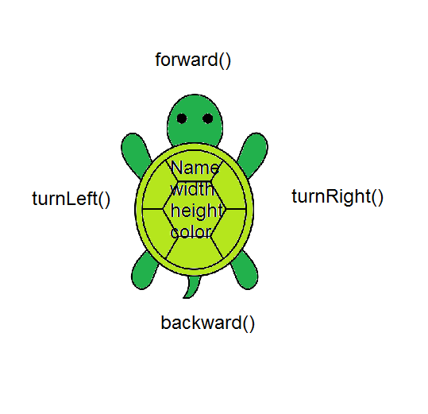

## Table of Contents
{: .no_toc .text-delta }

{: .fs-2 }
- TOC
{:toc}

---

{:.note}
📖 This page is a condensed version of [CSAwesome Topic 1.7](https://runestone.academy/ns/books/published/csawesome2/topic-1-7-APIs-and-libraries.html) 

---

We have already been using `System.out.println()` to print text to the screen. That method belongs to the `Java API` – the **Application Programming Interface** for Java’s standard **libraries** and **packages**.

## APIs, Libraries, Packages

<html>
  <dl>
    <dt>📚 Library</dt>
    <dd>A collection of <strong>prewritten code</strong> (classes) that you can reuse in your own program.</dd>
    <dt>📦 Package</dt>
    <dd>A group of related classes that can be <strong>imported</strong> into a program, like a folder of classes in a library's file directory.</dd>
    <dt>👉 Method</dt>
    <dd>A block of code that performs a specific task, like instructions for a process. Classes often contain many methods.</dd>
    <dt>🖥️ API</dt>
    <dd><strong>Application Programming Interface</strong> refers mainly to a library's documentation that tells the programmer <em>how to use</em> its classes and their methods.</dd>
  </dl>
</html>

APIs and libraries are essential to programming because they allow you to use code that has **already been written** by others. This saves you time and allows you to focus on the specific task you are trying to accomplish.
> The terms library, API, and package are often used _interchangeably_ to mean similar things.

<div class="task" markdown="block">

💬 **Discuss:** Did we use any *libraries* last year in Web Development for either `HTML`, `CSS`, or `JavaScript`? If so, how did we learn how to use someone else's code?

</div>

### The `java.lang` Package

The ``java.lang`` package contains built-in classes and interfaces that are fundamental to the Java programming language, such as the ``String`` class and the ``System`` class which we use in ``System.out.println``. 

Take a look at the summary for the `java.lang` package here: [Oracle – Java Documentation](https://docs.oracle.com/javase/8/docs/api/java/lang/package-summary.html). 
> Can you find the ``System`` class in the documentation?

📖 **Documentation** found in API specifications and libraries is essential to understanding the _attributes_ and _behaviors_ of a class defined by the API. 
> The ``System`` class has an object called ``out`` that is type ``PrintStream``, and the ``PrintStream`` class has a method called ``println()`` that we use to print to the screen. 

<div class="task" markdown="block">

**Check Your Understanding:**  

1. How many distinct `println(...)` methods are listed in the `PrintStream` class [official documentation](https://docs.oracle.com/javase/8/docs/api/java/io/PrintStream.html)?
2. Try finding the same documentation on **DevDocs**, an unofficial collection of documentation (_linked in the top right corner of this website_).
  > Would you prefer using the official docs from Oracle, or DevDocs?
3. Try asking an **AI bot** like ChatGPT the original question (_"how many println methods does Java have?"_) and determine if it produces a correct answer. 

</div>

### Turtle Library

🐢 The **Turtle** library (by Dr. Barbara Ericson) lets you draw with an animated turtle that moves, turns, and draws lines. A **class** like `Turtle` defines the data (**attributes/fields**) and **behaviors/methods** shared by all turtle-type **objects** you create. 
> The `Turtle` class is not tested on the AP Exam, but working with its visual interface is helpful when learning about **object-oriented programming** concepts. 

<html>
  <dl>
    <dt>Attributes/Fields)</dt>
    <dd><strong>Data</strong> the object “knows” (e.g., <code>name</code>, <code>height</code>, <code>width</code>, <code>position</code></dd>
    <dt>Behaviors/Methods</dt>
    <dd><strong>Actions</strong> the object “does” (e.g., <code>forward()</code>, <code>turnLeft()</code>) or what can be done to it.</dd>
  </dl>
</html>

We will learn more about classes, objects, attributes, and methods in the next lessons, but this lesson introduces them to explore APIs.



> This diagram of a turtle shows some of the generic `Turtle` **attributes** like `name`, `width`, `height`, `color` in the body of the turtle and its **methods** like `forward()`, `backward()`, written around the turtle. 

<div class="imp" markdown="block">
  
📣 You **CALL** (activate/run) methods with the **dot operator** (`.`), just like `System.out.println()`:

```java
myrtle.forward();
myrtle.turnRight();
```
> Assume `myrtle` is a `Turtle` object. The code above calls two **methods** on that turtle: first, `forward()` then `turnRight()`. These methods "belong" to the general `Turtle` class definition, but are being used on that specific **object** (_an instance of the class_). 

</div>

#### Reading API Documentation

A quick tip to tell **methods** vs **attributes** in docs:

* **Methods** always have _parentheses_: `forward()`, `println(...)`.
  * Sometimes these are empty, but always necessary.
  * And sometimes they contain **data** that the method needs to do its job (_for example: what to print_).
* **Attributes/fields** do not: `out`, `length`, `width`.

Explore the docs for a simple `Turtle`: [📖 SimpleTurtle Documentation](https://cseweb.ucsd.edu/~ricko/CSE11/turtleClassesDocs/turtleClasses/SimpleTurtle.html)

#### CSAwesome Activities: Turtle Class

<div class="task" markdown="block">

🐢 To explore the concepts from this lesson in code, we'll play around with the `Turtle` class on the CSAwesome website instead of taking notes.  

👉 **GO TO:** <a href="https://runestone.academy/ns/books/published/csawesome2/topic-1-7-APIs-and-libraries.html"><button class="btn">CSAwesome Topic 1.7</button></a>, **SIGN IN** to your account, and complete all the turtle-related **coding activities/challenges** with a partner. 

</div>

---

## Summary

- (AP 1.7.A.1) **Libraries** are collections of classes written by other programmers. 

- (AP 1.7.A.1) An **Application Programming Interface (API)** specification informs the programmer how to use classes in a library. 

- (AP 1.7.A.1) Documentation found in API specifications and libraries is essential to understanding the attributes and behaviors of a class defined by the API. 

- (AP 1.7.A.1) Classes in the APIs and libraries are grouped into **packages** that can be imported into a program. 

- (AP 1.7.A.1) A **class** defines a specific reference type and is the building block of object-oriented programming. Existing classes and class libraries can be utilized to create objects.

- (AP 1.7.A.2) **Attributes** refer to the data related to the class and are stored in variables. 

- (AP 1.7.A.2) **Behaviors** refer to what instances of the class can do (or what can be done with it) and are defined by methods.

---

#### Acknowledgement
{: .no_toc }

Content on this page is adapted from [Runestone Academy - Barb Ericson, Beryl Hoffman, Peter Seibel](https://runestone.academy/ns/books/published/csawesome2/csawesome2.html).
{: .fs-2 }
