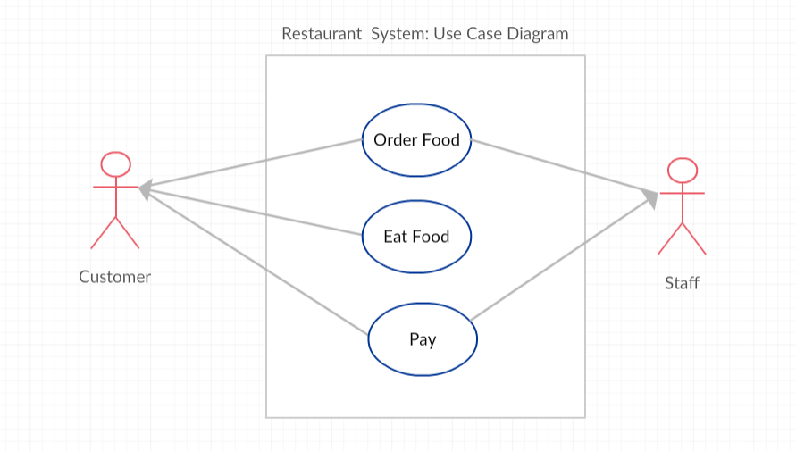

## Table of Contents
{: .no_toc .text-delta }

{: .fs-2 }
- TOC
{:toc}

---

{:.note}
📖 This page is a condensed version of [CSAwesome Topic 1.8]() 

---

## Comments

{:.important}
Comments don’t run—they _explain_. Your future self (and your teammates) will thank you.

Adding comments to your code helps to make it more readable and maintainable. In the commercial world, software development is usually a team effort where many programmers will use your code and maintain it for years. Commenting is essential in this kind of environment and a good habit to develop. Comments will also help you to remember what you were doing when you look back to your code a month or a year from now. 

Comments are written for both the original programmer and other programmers to understand the code and its functionality, but are ignored by the compiler and are not executed when the program is run. 

There are 3 types of comments in Java:

1. `//` Single line comment  
2. `/* */` Multiline block comment  
3. `/** */` Java documentation comment  

The special characters `//` are used to mark the rest of the line as a comment in many programming languages. If the comment is going to be multiple lines, we use `/*` to start the comment and `*/` to end the comment.

There is also a special version of the multi-line comment, `/** */`, called the documentation comment. Java has a tool called [javadoc](https://www.tutorialspoint.com/java/java_documentation.htm) that comes with the [Java JDK](https://www.oracle.com/technetwork/java/javase/downloads/index.html) and can generate HTML documentation from these comments — for example, see the [String class documentation](http://docs.oracle.com/javase/7/docs/api/java/lang/String.html).

Although you don’t have to use this for the AP exam, it’s good practice to write documentation comments for your classes, methods, and instance variables.

### Example: Good Commenting

```java
/**
 * MyClass.java
 * @author My Name
 * @since Date
 * This class keeps track of the max score.
 */
public class MyClass {
   private int max = 10; // this keeps track of the max score
   
   /* The print() method prints out the max */
   public void print() {  
      System.out.println(max); 
   }
}
````

Common Javadoc tags:

* `@author`
* `@since`
* `@version`
* `@param`
* `@return`

---

### **Practice: Adding Comments**

<div class="task" markdown="block">

Type this in your Codespace, press run, and add comments:

1. Add a **multi-line comment** above the class describing its purpose.
2. Add **single-line comments** before each section: reading input, calculating result, printing output.

```java
import java.util.Scanner;

Scanner scan = new Scanner(System.in);
int num1 = scan.nextInt();
int num2 = scan.nextInt();

int result = num1 * num2;

System.out.println(num1 + " x " + num2 + " = " + result); 
scan.close();
```

</div>

---

## Preconditions and Postconditions

Many methods in API libraries have **preconditions** and **postconditions** described in their comments.

* **Precondition**: A condition that must be true for the method to work properly. Example: parameters must not be `null` or out of range.
* **Postcondition**: A condition that is true after running the method — describes the outcome, such as what is returned or what state has changed.

Example: `Math.sqrt(num)`

* **Precondition**: `num >= 0`
* **Postcondition**: Returns the positive square root of `num`.

---

### **Practice: Fixing a Precondition Violation**

<div class="task" markdown="block">

Type this in your Codespace, press run. The `Math.sqrt` method has a precondition that its argument must be non-negative. Fix the value of `num` so it meets the precondition.

```java
double num = -4;
System.out.println(Math.sqrt(num));
```

</div>

---

### Example: Preconditions in API Methods

```java
/**
 * Method to move the turtle forward the given number of pixels
 * @param pixels the number of pixels to walk forward
 * Preconditions: pixels is between 0 and the width/height of the world
 * Postconditions: turtle is moved forward by pixels without going off screen
 */
public void forward(int pixels) {
    /* code to move the turtle forward */
}
```

---

### **Practice: Breaking Turtle Preconditions**

<div class="task" markdown="block">

Type this in your Codespace, press run. Try to break the precondition for the `forward` method by using:

* A value too large (larger than the world dimensions)
* A negative number

```java
World habitat = new World(300, 300);
Turtle yertle = new Turtle(habitat);

// Change 100 to a larger or negative value to test preconditions
yertle.forward(100);

yertle.turnLeft();
yertle.forward();
yertle.turnLeft();
yertle.forward();

habitat.show(true);
```

</div>

---

## Software Validity and Use-Case Diagrams

Preconditions and postconditions are also used in **software testing** and **design**.

* **Software validity**: ensuring a program does what it is supposed to do before release.
* **Use-case diagrams**: show how different users (actors) interact with a system.

Example: Restaurant System Use-Case Diagram


---

### Example: Linking Preconditions/Postconditions Between Use-Cases

**"Order Food"**

* Preconditions: Customer enters, staff is ready
* Postconditions: Food is ordered, order is taken

**"Eat Food"**

* Preconditions: Food has been ordered and delivered
* Postconditions: Customer eats food

---

## Agile Software Development

Two models:

* **Waterfall**: Step-by-step, less adaptable.
* **Agile**: Iterative, adaptable, frequent feedback.


### Video: Scrum Overview

<iframe width="600" height="400" src="https://www.youtube.com/embed/TRcReyRYIMg" frameborder="0" allowfullscreen></iframe>

---

## Group Challenge: Preconditions in Algorithms

**In groups**:
Come up with 4 steps for purchasing a product in an online store.
For each step, list the preconditions and postconditions.

(Optional: Draw a use-case diagram in [Creately.com](https://creately.com))

---

## Summary

* **Comments** explain code for humans, not machines.
* Three comment types: `/* */`, `//`, `/** */` (Javadoc).
* **Preconditions**: must be true before execution.
* **Postconditions**: must be true after execution.

---

<div class="warn" markdown="block">

🛑 When class ends, don't forget to **SAVE YOUR WORK**!

1. Navigate to the `Source Control` menu on the _LEFT_ sidebar
2. Type a brief **commit message** in the box, for example: `updated Main.java`
3. Click the <button type="button" name="button" class="btn btn-green">commit changes</button> button on the _LEFT_ menu
4. Click the <button type="button" name="button" class="btn btn-green">sync changes</button> button on the _LEFT_ menu
5. _Finally you can close your Codespace!_

</div>

---

#### Acknowledgement
{: .no_toc }

Content on this page is adapted from [Runestone Academy - Barb Ericson, Beryl Hoffman, Peter Seibel](https://runestone.academy/ns/books/published/csawesome2/csawesome2.html).
{: .fs-2 }
