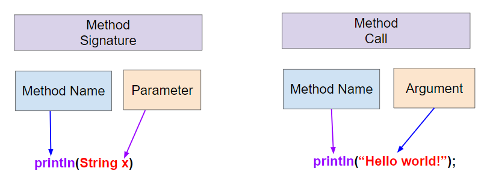

## Table of Contents
{: .no_toc .text-delta }

{: .fs-2 }
- TOC
{:toc}

---

{:.note}
📖 This page is a condensed version of [CSAwesome Topic 1.9](https://runestone.academy/ns/books/published/csawesome2/topic-1-9-method-signatures.html) 

---

<!--
"Have you ever had to tell two people with the same first name apart? How did you do it?"
Relate this to how Java tells methods apart using their signatures.

-->

## Methods and Procedural Abstraction

Up until now, all of our code has been written as line-by-line **statements** in the `main` method, executed like step-by-step instructions, but complex programs are made up of many **methods**. We divide a program into methods to organize the code and avoid repetition. 

<html>
    <dl>
        <dt>Method</dt>
        <dd>A named block of code that performs a task/process when it is called.</dd>
    </dl>
</html>

A **block** of code is any section enclosed in `{ }`. These _named blocks of code_ go by many names in different programming languages: _functions_, _procedures_, _subroutines_, etc. In Java they are called **methods**, as in a method of doing something. 
> In this unit, you will learn how to use methods written by other programmers. In latter units, you will learn how to write your own methods.

<html>
    <dl>
        <dt>Procedural Abstraction</dt>
        <dd>Allowing a programmer to use a method without knowing exactly how it works, i.e. "abstracting away" the details.</dd>
    </dl>
</html>

**Procedural abstraction** means we can use a method that someone else wrote without knowing exactly how it works. We just need to know the method's name to call it and what it needs to do its job.
> For example, we don't need to know how a car exactly works in order to drive. 🚗 We know that if we hit the brakes, the car will stop; we can still use the brakes even if we don't really know how they exactly work. 

### Method Calls

<div class="imp" markdown="block">
📣 A **method call** is when the code "calls out" a method's name to activate/run it. It always includes parentheses `()` and may include data inside.
```java
methodName();
```
</div>
> For example, when we write the statement ``System.out.println("Hello World");``, we are _calling_ the ``println()`` _method_ to print out the text "Hello World".

Every method call is followed by **parentheses**. The parentheses ``()`` after method names are there in case you need to give the method some **parameters/data** to do its job, which we will see in the next lesson.

#### Example: Old MacDonald Song
{:.no_toc}

This program in the <a href="https://pythontutor.com/render.html#code=public%20class%20OldMacDonaldSong%0A%7B%0A%20%20%20%20public%20static%20void%20intro%28%29%0A%20%20%20%20%7B%0A%20%20%20%20%20%20%20%20System.out.println%28%22Old%20MacDonald%20had%20a%20farm%22%29%3B%0A%20%20%20%20%20%20%20%20chorus%28%29%3B%0A%20%20%20%20%7D%0A%0A%20%20%20%20public%20static%20void%20chorus%28%29%0A%20%20%20%20%7B%0A%20%20%20%20%20%20%20%20System.out.println%28%22E-I-E-I-O%22%29%3B%0A%20%20%20%20%7D%0A%0A%20%20%20%20public%20static%20void%20main%28String%5B%5D%20args%29%0A%20%20%20%20%7B%0A%20%20%20%20%20%20%20%20intro%28%29%3B%0A%20%20%20%20%20%20%20%20System.out.print%28%22And%20on%20that%20farm%20they%20had%20a%20cow.%22%29%3B%0A%20%20%20%20%20%20%20%20chorus%28%29%3B%0A%20%20%20%20%20%20%20%20System.out.print%28%22With%20a%20moo%20moo%20here%20and%20a%20moo%20moo%20there%22%29%3B%0A%20%20%20%20%20%20%20%20System.out.print%28%22Here%20a%20moo,%20there%20a%20moo,%20everywhere%20moo%20moo%22%29%3B%0A%20%20%20%20%20%20%20%20intro%28%29%3B%0A%20%20%20%20%7D%0A%7D&cumulative=false&curInstr=0&heapPrimitives=nevernest&mode=display&origin=opt-frontend.js&py=java&rawInputLstJSON=%5B%5D&textReferences=false"><button class="btn btn-primary">Java Code Visualizer</button></a> shows how a song can be divided up into methods. Click on the **next** button below the code to "step through" the code line-by-line, and watch the red arrow jump to the method that is being run. 
> 👉 Execution of Java code always begins in the ``main`` method in the current class. Then, the **flow of control** skips from method to method as they are called. Notice that when a method ends, it returns to the line right after the method call. 

<div class="task" markdown="block">

Go into edit mode in the **Visualizer** and scroll down to the `main()` method. Add lines of code to the main method to print the second verse of the Old MacDonald Song:
1. Call the method `intro()`
2. Print out the line "And on that farm..." with a duck or another animal
3. Call the method `chorus()`
4. Print out the lines with the appropriate animal sounds
5. Call the method `intro()` again

</div>

{:.highlight}
✋ A method call **interrupts** the _sequential execution_ of statements, causing the program to first execute the statements in the method before continuing. Once the last statement in the method has been executed or a `return` statement is executed, the **flow of control** is returned to the point immediately following where the method was called.

### Method Signature/Header

When using methods in a library or API, we can look up the **method signature/header**) in its documentation.

A **method header** is the first line of a method that defines:
* **Method name**
* **Return type** (e.g., `void` means no return value)
* **Parameter list** (variables and data types in parentheses; may be empty, but parentheses are required)

#### Example: `PrintStream` `println` Methods
{:.no_toc}

From [Oracle - Java Documentation](https://docs.oracle.com/javase/8/docs/api/java/io/PrintStream.html):

* `println()` – no parameters, just prints a new line
* `println(String x)` – prints a `String`
* `println(int x)` – prints an `int`

We can call these methods with the appropriate arguments to print out the value we want. The **argument** is the actual value that is passed to the method when it is called. Here are the **method calls** that correspond to the method signatures above:

* `System.out.println();`
* `System.out.println("Hello World");` 
* `System.out.println(42);`



### Parameters vs. Arguments

We can make methods even more powerful and more abstract by giving them **parameters** for data that they need to do their job. This allows values, or **arguments**, to be passed and used by a method. 

* A **parameter** ("formal parameter") is a _placeholder_ variable declared in the method header.
* An **argument** ("actual parameter") is the _value_ passed into the method when called.
    * The argument must be compatible with the parameter’s data type.

_Example:_
* Signature: `println(String x)` → **parameter** is `String x`
* Call: `println("Hello World");` → **argument** is `"Hello World"`

{:.highlight}
Many people use the terms interchangeably, but technically the **parameter** is the _placeholder_ and the **argument** is the _value_.

#### EXAMPLE: Old MacDonald Improved
{:.no_toc}

Let's take another look at the Old MacDonald Song and see if we can replace more repeated code with methods with _parameters_. 

Notice that each verse of the song is similar, except it is about a different _animal_ and the _sound_ it makes. We can make a method called ``verse`` that takes the animal and its sound to print out any verse! The parameter variables ``animal`` and ``sound`` will hold different **values** when the method is called.

Step through this new version of the Old MacDonald program in the <a href="https://pythontutor.com/render.html#code=%20%20%20%20public%20class%20OldMacDonaldSong%0A%20%20%20%20%7B%0A%20%20%20%20%20%20public%20static%20void%20intro%28%29%0A%20%20%20%20%20%20%7B%0A%20%20%20%20%20%20%20%20System.out.println%28%22Old%20MacDonald%20had%20a%20farm%22%29%3B%0A%20%20%20%20%20%20%20%20chorus%28%29%3B%0A%20%20%20%20%20%20%7D%0A%0A%20%20%20%20%20%20public%20static%20void%20chorus%28%29%0A%20%20%20%20%20%20%7B%0A%20%20%20%20%20%20%20%20System.out.println%28%22E-I-E-I-O%22%29%3B%0A%20%20%20%20%20%20%7D%0A%20%20%20%20%20%20%0A%20%20%20%20%20%20public%20static%20void%20verse%28String%20animal,%20String%20sound%29%0A%20%20%20%20%20%20%7B%0A%20%20%20%20%20%20%20%20System.out.println%28%22And%20on%20this%20farm,%20they%20had%20a%20%22%20%2B%20animal%29%3B%0A%20%20%20%20%20%20%20%20chorus%28%29%3B%0A%20%20%20%20%20%20%20%20System.out.println%28%22With%20a%20%22%20%2B%20sound%20%2B%20%22%20%22%20%2B%20sound%20%0A%20%20%20%20%20%20%20%20%20%20%20%20%20%20%20%20%20%20%20%20%20%20%20%2B%20%22%20here%20and%20a%20%22%20%2B%20sound%20%2B%20%22%20%22%20%2B%20sound%20%2B%20%22%20there%22%29%3B%0A%20%20%20%20%20%20%20%20System.out.println%28%22Here%20a%20%22%20%2B%20sound%20%0A%20%20%20%20%20%20%20%20%20%20%20%20%20%20%20%20%20%20%20%20%20%20%20%2B%20%22,%20there%20a%20%22%20%2B%20sound%20%0A%20%20%20%20%20%20%20%20%20%20%20%20%20%20%20%20%20%20%20%20%20%20%20%2B%20%22,%20everywhere%20a%20%22%20%2B%20sound%20%2B%20%22%20%22%20%2B%20sound%29%3B%0A%20%20%20%20%20%20%7D%0A%0A%20%20%20%20%20%20public%20static%20void%20main%28String%5B%5D%20args%29%0A%20%20%20%20%20%20%7B%0A%20%20%20%20%20%20%20%20intro%28%29%3B%0A%20%20%20%20%20%20%20%20verse%28%22cow%22,%20%22moo%22%29%3B%0A%20%20%20%20%20%20%20%20intro%28%29%3B%0A%20%20%20%20%20%20%20%20verse%28%22duck%22,%20%22quack%22%29%3B%0A%20%20%20%20%20%20%20%20intro%28%29%3B%0A%20%20%20%20%20%20%7D%0A%20%20%20%20%7D&cumulative=false&curInstr=34&heapPrimitives=nevernest&mode=display&origin=opt-frontend.js&py=java&rawInputLstJSON=%5B%5D&textReferences=false"><button class="btn btn-primary">Java Code Visualizer</button></a> and watch how the argument are saved in the parameter variables with each call to the ``verse`` method.

<div class="task" markdown="block">

Go into edit mode in the **Visualizer** and scroll down to the `main()` method. Add on to the song by calling methods as needed:

1. Print another verse with the animal `"goose"` and the sound `"honk"` by calling the `verse()` method with the appropriate arguments.
2. Then call `intro()` again.
3. Repeat with another animal and sound of your choice.

</div>

{:.highlight}
Note that the **main method** can now just consist of calls to the `intro()` and `verse()` methods. Main methods often look like an *outline* for the program, calling methods to do the work.

When a method is **called**, the correct method definition (_set of code instructions_) is found by checking the **method signature** or **header** at the top of the method definition to match the method name, the number of arguments, the data types for the arguments and the return type. 

```java
// Method signature (parameters)
public static void verse(String animal, String sound) { }

// Method call (arguments)
verse("cow", "moo");
```


> Here's what that looks like with the two method calls above. The arguments like "cow" and "moo" are saved into the parameter variables ``animal`` and ``sound`` with each method call.

{:.highlight}
Java uses **call by value** when it passes arguments to methods. This means that a copy of the value in the argument is saved in the parameter variable. Call by value initializes the parameters with copies of the arguments. If the parameter variable changes its value inside the method, the original value outside the method is not changed.

### Overloading Methods

Methods are **overloaded** when they share the same name but have different **parameter** lists. The compiler determines which method to call based on the number and types of **arguments** passed to the method. 

_Example:_ 

* `println()` → prints newline
* `println(String x)` → prints a string
* `println(int x)` → prints an integer


## Writing Methods

Up until this unit, you wrote all your code in the main method, but now we are using lots of methods. Why have multiple methods instead of just one? 

{:.highlight}
**Procedural Abstraction** allows us to name a block of code as a **method** and call it whenever we need it, _abstracting_ away the details of how it works. 
> This serves to _organize_ our code by function and _reduce repetition_ of code. In addition, it helps with debugging and maintenance since changes to that block of code only need to happen in one place!

Here are some of the main reasons to use multiple methods in your programs:

- **Organization and Reducing Complexity:** organize your program into small sections of code by function to reduce its complexity. Divide a problem into subproblems to solve it a piece at a time.
- **Reusing Code:** avoid repetition of code. Reuse code by putting it in a method and calling it whenever needed.
- **Maintainability and Debugging:** smaller methods are easier to debug and understand than searching through a large main method.

### How to Write a Method

<div class="imp" markdown="block">

There are three steps to creating and calling a custom **method**:

3. **Method Definition**: Write the method's **header/signature** and **body** code _inside the class_ that defines the object.
```java
// Step 1: Define the method in the class
// Method HEADER/SIGNATURE
public void methodName() {
    // Method BODY for the repeatable code
}
```
2. **Object Instance**: Declare an object of your class type in the main method or _from outside the class._
```java
// Step 2: Declare an object
ClassName objectName = new ClassName();
```
3. **Method Call**: Whenever you want to use the method, call it on the object by using the dot `.` operator
```java
// Step 3: Call the object's method
objectName.methodName(); 
```
> * 📥 If the method requires any *INPUT* to work, provide those values in the parenthesis. These are known as **arguments**, or **actual parameters**.
> * 📤 If the method provides any _OUTPUT_, meaning it has a **return** value, store it in a variable of the appropriate type (see below for more details on using methods that return values).

</div>

🎶 Let's look at an example with lots of repetition of code and create methods to reduce the repetition of code. You can sing along here: [This Old Man Song](https://www.youtube.com/watch?v=Di23O5cN4ZU&ab_channel=Rock%27NLearn).

You may have noticed that the chorus is repeated _"With a knick knack paddy whack, give a dog a bone. This old man came rolling home."_ When you see **repeated code**, that is a signal for you to make a new method!

For example, here is a `chorus()` method definition that we could write for the "This Old Man Song":

```java
public void chorus() {
    System.out.println("With a knick knack paddy whack, give a dog a bone.");
    System.out.println("This old man came rolling home.");
}
```
> Run the tester code in the [Java visualizer](http://www.pythontutor.com/visualize.html#code=public%20class%20Song%20%0A%20%20%7B%20%0A%20%20%20%20//%20The%20chorus%20method%0A%20%20%20%20public%20void%20chorus%28%29%20%0A%20%20%20%20%7B%0A%20%20%20%20%20%20%20System.out.println%28%22With%20a%20knick%20knack%20paddy%20whack,%20give%20a%20dog%20a%20bone.%22%29%3B%0A%20%20%20%20%20%20%20System.out.println%28%22This%20old%20man%20came%20rolling%20home.%22%29%3B%0A%20%20%20%20%7D%0A%20%20%20%20%0A%20%20%20%20public%20static%20void%20main%28String%20args%5B%5D%29%20%0A%20%20%20%20%7B%0A%20%20%20%20%20%20Song%20mySong%20%3D%20new%20Song%28%29%3B%0A%20%20%20%20%20%20System.out.println%28%22This%20old%20man,%20he%20played%20one.%22%29%3B%0A%20%20%20%20%20%20System.out.println%28%22He%20played%20knick%20knack%20on%20my%20thumb.%20%22%29%3B%0A%20%20%20%20%20%20mySong.chorus%28%29%3B%0A%0A%20%20%20%20%20%20System.out.println%28%22This%20old%20man,%20he%20played%20two.%22%29%3B%0A%20%20%20%20%20%20System.out.println%28%22He%20played%20knick%20knack%20on%20my%20shoe.%20%22%29%3B%0A%20%20%20%20%20%20mySong.chorus%28%29%3B%0A%20%20%20%20%7D%0A%20%20%7D&cumulative=false&curInstr=22&heapPrimitives=nevernest&mode=display&origin=opt-frontend.js&py=java&rawInputLstJSON=%5B%5D&textReferences=false&curInstr=0) to see the song This Old Man print out. Can you replace the last two lines in the second verse in the main method with a call the `chorus()` method instead?

### Method Input: Formal Parameters

You may have noticed even more repetition in the song above. What about the lines of each _verse_? Notice that every word is repeated except the last ones that include a number and a rhyme such as one/thumb and two/shoe.

```java
    System.out.println("This old man, he played one.");
    System.out.println("He played knick knack on my thumb.");
    ...
    System.out.println("This old man, he played two.");
    System.out.println("He played knick knack on my shoe.");
```

We can make methods even more powerful and more abstract by giving them **parameters** for data that they need to do their job - think of it like taking _INPUT_ before the process. We can make a method called verse that takes the number and the rhyme to print out any verse!

```java
public void verse(String number, String rhyme) {
       System.out.println("This old man, he played " + number);
       System.out.println("He played knick knack on my " + rhyme);
}
```
> Run the tester code in the [Java visualizer](http://www.pythontutor.com/visualize.html#code=public%20class%20Song%20%0A%20%20%7B%20%0A%20%20%20%20%0A%20%20%20%20/**%20Verse%0A%20%20%20%20%20*%20%40param%20number%20-%20a%20String%20like%20%22one%22,%20%22two%22,%20etc.%0A%20%20%20%20%20*%20%40param%20rhyme%20-%20a%20String%20like%20%22thumb%22,%20%22shoe%22,%20etc.%0A%20%20%20%20%20*/%0A%20%20%20%20%20public%20void%20verse%28String%20number,%20String%20rhyme%29%0A%20%20%20%20%20%7B%0A%20%20%20%20%20%20%20System.out.println%28%22This%20old%20man,%20he%20played%20%22%20%2B%20number%29%3B%0A%20%20%20%20%20%20%20System.out.println%28%22He%20played%20knick%20knack%20on%20my%20%22%20%2B%20rhyme%29%3B%0A%20%20%20%20%20%7D%0A%20%20%20%20%20%0A%20%20%20%20//%20The%20chorus%20method%0A%20%20%20%20public%20void%20chorus%28%29%20%0A%20%20%20%20%7B%0A%20%20%20%20%20%20%20System.out.println%28%22With%20a%20knick%20knack%20paddy%20whack,%20give%20a%20dog%20a%20bone.%22%29%3B%0A%20%20%20%20%20%20%20System.out.println%28%22This%20old%20man%20came%20rolling%20home.%22%29%3B%0A%20%20%20%20%7D%0A%20%20%20%20%0A%20%20%20%20%0A%20%20%20%20public%20static%20void%20main%28String%20args%5B%5D%29%20%0A%20%20%20%20%7B%0A%20%20%20%20%20%20Song%20mySong%20%3D%20new%20Song%28%29%3B%0A%20%20%20%20%20%20mySong.verse%28%22one%22,%20%22thumb%22%29%3B%0A%20%20%20%20%20%20mySong.chorus%28%29%3B%0A%20%20%20%20%20%20mySong.verse%28%22two%22,%20%22shoe%22%29%3B%0A%20%20%20%20%20%20mySong.chorus%28%29%3B%0A%20%20%20%20%7D%0A%20%20%7D&cumulative=false&curInstr=24&heapPrimitives=nevernest&mode=display&origin=opt-frontend.js&py=java&rawInputLstJSON=%5B%5D&textReferences=false&curInstr=0) to see the song This Old Man print out using the `verse` and `chorus` methods. Can you add verse three with the rhyme "knee"? Can you add verse four with the rhyme "door"? How many verses do you know?

<div class="imp" markdown="block">

🤵‍♀️🤵🤵‍♂️ When you **define** your own method, the variables you specify for it in the method header are called **formal parameters**. 

📣 When you **call** the method to do its job, you give or pass in **arguments** or **actual parameters** to it that are then saved in these local parameter variables.

</div>

When a method is called, the right method definition is found by checking the **method signature** or **header** at the top of the method definition to *match* the following:

1. The method **name**
2. The **number** of arguments
3. The **data types** for the arguments
4. The `return` type (either `void` or a data type like `int`, `String`, etc.)

For example, imagine we are calling the methods for the This Old Man song:
```java
Song mySong = new Song();
mySong.verse("one", "thumb");
mySong.chorus();
mySong.verse("two", "shoe");
mySong.chorus();
```

Here's what that looks like with the 2 method calls above. Notice how the parameter variables get new values with every method call.


{:.warning}
Java uses **Call by Value** when it passes arguments to methods. This means that a _copy_ of the value in the argument is saved in the parameter variable. If the parameter variable changes its value inside the method, the original value outside the method is not changed.

If you pass in an argument that holds a **reference** to an **object**, like a `String` or `Person` or `Turtle` object, a _copy_ of this reference is passed in and saved in the parameter variable. The formal parameter and the actual parameter (argument) are then **aliases**, both refering to the same object. 
> Java was designed this way to avoid copying large objects from method to method. Remember when we discussed **reference aliases** with `Turtle` objects who are set equal to one another.


### Method Output: Return Values

📤  Methods can also **return** values of any type back to the calling method, which can be considered _OUTPUT_. Recall that **non-void** methods, like we saw when writing **getter/accessor** methods, `return` a value of a specific data type. 

{:.highlight}
If a certain method returns a value, the calling method should then _do something_ with this `return` value, like printing it out or assigning it to a variable (of the same type).

```java
// Printing a value returned from a method call
System.out.print("The student's name is " + student.getName() );
// Storing a return value in a new variable
String studentName = student.getName();
```


---

## Summary

- (AP 1.9.A.1) A **method** is a named block of code that only runs when it is called. A block of code is any section of code that is enclosed in braces.

- (AP 1.9.A.1) **Procedural abstraction** allows a programmer to use a method by knowing what the method does even if they do not know how the method was written.

- (AP 1.9.B.5) A method call interrupts the sequential execution of statements, causing the program to first execute the statements in the method before continuing. Once the last statement in the method has been executed or a return statement is executed, the flow of control is returned to the point immediately following where the method was called.

- (AP 1.9.A.2) A **parameter** is a variable declared in the header of a method or constructor and can be used inside the body of the method. This allows values or arguments to be passed and used by a method or constructor. 

- (AP 1.9.A.2) A **method signature** for a method with parameters consists of the method name and the ordered list of parameter types. A method signature for a method without parameters consists of the method name and an empty parameter list.

- (AP 1.9.B.3) An **argument** is a value that is passed into a method when the method is called. The arguments passed to a method must be compatible in number and order with the types identified in the parameter list of the method signature. When calling methods, arguments are passed using call by value. 

- (AP 1.9.B.3) **Call by value** initializes the parameters with copies of the arguments.

- (AP 1.9.B.4) Methods are said to be **overloaded** when there are multiple methods with the same name but different signatures.

---

#### Acknowledgement
{: .no_toc }

Content on this page is adapted from [Runestone Academy - Barb Ericson, Beryl Hoffman, Peter Seibel](https://runestone.academy/ns/books/published/csawesome2/csawesome2.html).
{: .fs-2 }
