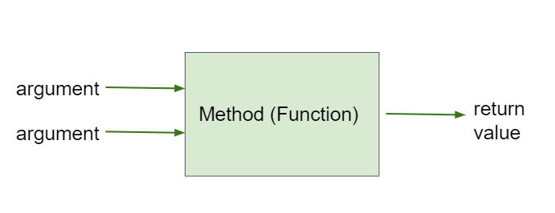

## Table of Contents
{: .no_toc .text-delta }

{: .fs-2 }
- TOC
{:toc}

---

{:.note}
📖 This page is a condensed version of [CSAwesome Topic 1.10](https://runestone.academy/ns/books/published/csawesome2/topic-1-10-calling-class-methods.html) 

---

## Static (Class) Methods

Most of the methods we’ve used so far are `static` methods, also called **class methods**. These methods are associated with the _general class_, which also means that there is **only one copy** of the method. 

{:.highlight}
🎈 A **static (class) method** is like a school-wide event or rule (e.g., the fire drill procedure). There’s only _one copy of the instructions_, and it applies to _everyone_ in the school equally. 

> In contrast, an **instance (non-static) method** is like a student’s personal schedule (e.g., “Sarah goes to math class at 10 AM”). Each student has their _own individual copy_ of that schedule, and you’d need to ask the specific student to know what it is. _More about these types of methods later!_

The `main` method is always `static`, as there can only be **one copy** per Java class.
> The main method is like the school’s opening bell: one universal event that always happens the same way to start the day, no matter which students are present.

#### Template for a Static Method Definition
{:.no_toc}

In the **method header**, the keyword `static` is included before the **return type**: 

```java
// static method header
public static returnType methodName(parameters) {
    // method body
}
```

## Non-Void Methods

Up until now, we have used the keyword `void` as the return type for methods that **do not return a value**. Think of a void method like giving an instruction without expecting anything back.
> _Example:_ If you tell your friend “Turn on the light”, they do it, but they don’t hand you anything in return. That’s a **void** method – it performs an _action_, but there’s no “output” to capture.

However, many methods are **non-void**: think of these kind of like mathematical functions that calculate and `return` a result, given some arguments. 
> _Example:_ If you ask your friend “What’s the temperature outside?”, they give you an answer (a value). That’s a **non-void** method – it _returns something_ you can use.

| ⬛️ **Void Methods** | ⬛️ **Non-Void Methods** |
| ------------------  | ----------------------- |
| DO NOT return a value  | `return` a value (output) |
| "Just do an action"  | "Do something AND give me a result" |



Example: squaring an integer.

```java
public static int square(int number) {
    int result = number * number;
    return result;
}
```

<div class="imp" markdown="block">
    
The `return` statement in a **non-void** method:

* Sends a **value** back to the caller (_output_).
* Must return a **type** that matches the return type in the method header.
* Ends method execution immediately.

</div>

You can store the return value in a variable or use it directly in an expression.

```java
int y = square(5); // store return value
System.out.println(y); // 25
System.out.println(square(4)); // use directly
```

---

### **Practice: Square of 6**

<div class="task" markdown="block">

Type this in your Codespace, press run.
Add a line in `main()` that prints the square of 6 by calling the `square()` method.

```java
public static int square(int number) {
    return number * number;
}

public static void main(String[] args) {
    System.out.println("5 squared is " + square(5));
    // TODO: Call square() to print 6 squared
}
```

</div>

---

## Common Errors with Non-void Methods

1. **Forgetting to use the return value** — If a method returns a value, assign it to a variable or use it in an expression.
2. **Mismatched types** — Ensure the type you store the return value in matches the method’s return type.
3. **Incorrect argument types/order** — Match the method signature exactly.

---

### **Practice: Fix the Method Calls**

<div class="task" markdown="block">

The `square` method returns an `int`.
The `divide` method returns a `double`.

Fix the method calls in `main()` so:

* `result1` stores 4 squared.
* `result2` stores 5 divided by 2 (as a double).

```java
public static int square(int number) {
    return number * number;
}

public static double divide(double x, double y) {
    return x / y;
}

public static void main(String[] args) {
    // TODO: Fix these calls and types
    int result1 = square(4.0, 2);
    int result2 = divide(2, 5);

    System.out.println("4 squared is " + result1);
    System.out.println("5 divided by 2 is " + result2);
}
```

</div>

---

## Calling Methods from Another Class

If calling a class method from a **different class**, include the class name:

```java
MathFunctions.square(3);
```

From within the same class, the class name is optional:

```java
square(3);
```

---

## Preview: Math Class

Some useful `Math` methods:

```java
double root = Math.sqrt(9);       // 3.0
double power = Math.pow(3, 2);    // 9.0
```

---

## Group Challenge: Ladder on Tower

You can use the **Pythagorean theorem** to calculate ladder length:

$$
c = \sqrt{a^2 + b^2}
$$

Where:

* `a` = height of the window
* `b` = width of the moat
* `c` = ladder length

### **Practice: Pythagorean Method**

<div class="task" markdown="block">

Complete the `ladderSizeNeeded` method and call it from `main()` with:

* Height = 30
* Width = 40

Expected output:
`Beloved, I need a 50.0 foot ladder!`

```java
public static double ladderSizeNeeded(double height, double width) {
    double ladderSize;
    // TODO: Calculate using Pythagorean theorem
    // Use Math.sqrt and Math.pow or *
    return ladderSize;
}

public static void main(String[] args) {
    double size;
    // TODO: Call ladderSizeNeeded with 30, 40 and store in size
    System.out.println("Beloved, I need a " + size + " foot ladder!");
}
```

</div>

---

## Summary

* **Class methods** are associated with the class, not an object instance.
* **static** keyword appears in the method header.
* **Void methods** return nothing.
* **Non-void methods** return a value matching the declared return type.
* **Use return values** — store in a variable or use in an expression.
* Match argument **types** and **order** to the method signature.
* To call a method from another class: `ClassName.methodName(args)`.


---

#### Acknowledgement
{: .no_toc }

Content on this page is adapted from [Runestone Academy - Barb Ericson, Beryl Hoffman, Peter Seibel](https://runestone.academy/ns/books/published/csawesome2/csawesome2.html).
{: .fs-2 }
