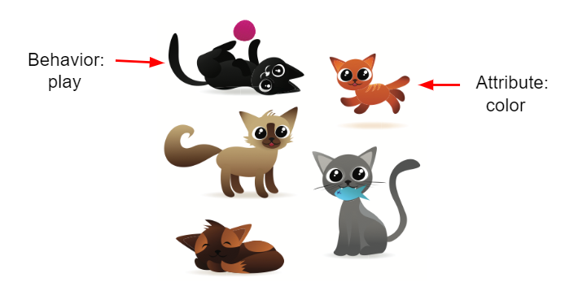
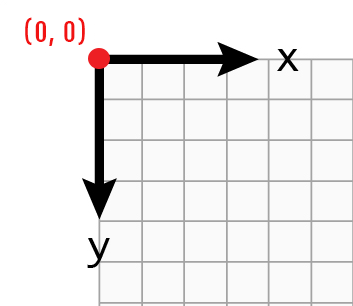

## Table of Contents
{: .no_toc .text-delta }

{: .fs-2 }
- TOC
{:toc}

---

{:.note}
📖 This page is a condensed version of [CSAwesome Topic 1.12](https://runestone.academy/ns/books/published/csawesome2/topic-1-12-objects.html) 

---

Java is an **object-oriented programming** language. That means that one of the primary ways of designing and organizing a Java program is in terms of **objects**. Objects combine data and the code that operates on that data into a single unit.

To create objects, we first define a **class** which provides a blueprint for creating the objects. In Java, all programs are built out of classes. This is why every Java program starts with `public class`.

In this unit, you will learn the vocabulary of object-oriented programming and how to create and use objects of a class written for you. In later units, you will learn to write your own classes.

---

## What are Classes and Objects?

You can think of a class as something like:

* A **blueprint** of a house used to construct houses (objects)
* A **cookie cutter** used to create cookies (objects)

The cookie cutter (class) can be used to create as many cookies (objects) as you want. The cookies are the same shape, but can have different decorations (attribute values).


*Figure 1: Using a blueprint (class) to construct houses (objects) or a cookie cutter (class) to make cookies (objects)*

A class also defines a **new data type**. In this lesson, we will use the `Turtle` class to make animated turtle objects.

Example:

```java
// Creating 2 Turtle objects called yertle and myrtle
Turtle yertle;
Turtle myrtle;
```

---

#### Video: Classes and Objects

<iframe width="650" height="415" src="https://www.youtube.com/embed/64DOwDu5SVo" frameborder="0" allowfullscreen></iframe>

---

## Attributes and Behaviors

A class defines:

* **Attributes** (data)
* **Behaviors** (methods)

**Attributes** are the data an object knows about itself (e.g., a turtle’s color).
**Behaviors** are the actions an object can perform (e.g., move forward, turn left).

Example: The `Belt` class has 3 instance variables (attributes), and each belt object can have different values for them.

<iframe width="650" height="415" src="https://www.youtube.com/embed/Y9vn6u3901Y" frameborder="0" allowfullscreen></iframe>


*Figure 2: Pictures of cats (cat objects)*

---

**Think About It:**
What are some attributes of cats? What are some behaviors?


*Figure 3: Turtle Attributes and Behaviors*

---

## Turtle Class

The `Turtle` class (provided for you) defines attributes (color, position) and behaviors (movement) for turtle objects.

<iframe width="650" height="415" src="https://www.youtube.com/embed/TFmmG4_KK8I" frameborder="0" allowfullscreen></iframe>

---

### Try It in GitHub Codespaces

<div class="task" markdown="block">

1. Open your GitHub Codespace for this course.
2. Create a file called **TurtleTest.java**.
3. Type this code and press **Run**.

```java
World habitat = new World(300, 300);
Turtle yertle = new Turtle(habitat);

yertle.forward();
yertle.turnLeft();
yertle.forward();

habitat.show(true);
```

4. Try changing `yertle.forward();` to `yertle.forward(50);` to move 50 pixels instead of the default 100.
5. Save and run your program again to see the change.

</div>

---

## Coding Exercise: Move the Turtle Twice

<div class="task" markdown="block">

1. In **TurtleTest2.java**, start with the same setup as before.
2. Change the code so that:

   * `yertle` moves forward **twice**
   * Then turns right
3. Run and confirm that the turtle moves in an “L” shape.

```java
World habitat = new World(300, 300);
Turtle yertle = new Turtle(habitat);

yertle.forward();
yertle.turnLeft();

habitat.show(true);
```

</div>

---

## Creating Multiple Turtle Objects

<div class="task" markdown="block">

1. In **TurtleTest3.java**, create **two** turtles named `yertle` and `myrtle`.
2. Have them move in different directions.
3. Run and observe both turtles.

```java
World habitat = new World(300, 300);
Turtle yertle = new Turtle(habitat);
Turtle myrtle = new Turtle(habitat);

yertle.forward();
yertle.turnLeft();
yertle.forward();

myrtle.turnRight();
myrtle.forward();

habitat.show(true);
```

</div>

---

## Class Hierarchy and Inheritance

**Inheritance** lets you create a new class (subclass) from an existing one (superclass), inheriting its attributes and behaviors.

Example: `Pet` superclass → `Dog`, `Cat`, `Turtle` subclasses.


*Figure 4: Inheritance hierarchy for Pet*

---

## Turtle Methods

The `Turtle` class diagram:


*Figure 5: Turtle Class Diagram*

Coordinates in Turtle World: (0,0) is top-left.


*Figure 6: Coordinate system*

---

## Coding Exercise: Draw a Number

### Draw a “7”

<div class="task" markdown="block">

```java
World habitat = new World(300, 300);
Turtle yertle = new Turtle(habitat);

yertle.forward();
yertle.turnLeft();
yertle.forward();

habitat.show(true);
```

</div>

---

### Draw an “8”

<div class="task" markdown="block">

Write code to draw the number “8” as two stacked squares.

```java
World habitat = new World(500, 500);
Turtle yertle = new Turtle(habitat);

// Your code here

habitat.show(true);
```

</div>

---

## Group Challenge: Draw Your Initials

<div class="task" markdown="block">

1. Create a turtle and have it draw your initials in block style (no curves).
2. Use only:

   * `forward()`
   * `turnLeft()`
   * `turnRight()`
   * `backward()`
   * `penUp()`
   * `penDown()`
3. Save and run to check your drawing.

```java
World habitat = new World(300, 300);
// Your turtle drawing code here
habitat.show(true);
```

</div>

---

## Summary

* **Class** = blueprint for objects.
* **Object** = specific instance of a class.
* **Attribute** = data about the object.
* **Behavior (method)** = actions the object can do.
* **Inheritance** = subclasses inherit attributes/behaviors from a superclass.
* All Java classes extend the `Object` class.

---

#### Acknowledgement
{: .no_toc }

Content on this page is adapted from [Runestone Academy - Barb Ericson, Beryl Hoffman, Peter Seibel](https://runestone.academy/ns/books/published/csawesome2/csawesome2.html).
{: .fs-2 }
