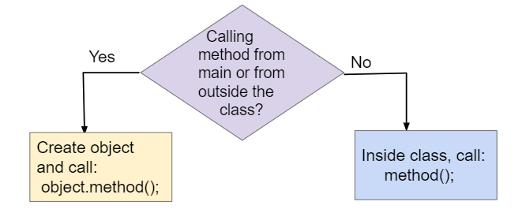

## Table of Contents
{: .no_toc .text-delta }

{: .fs-2 }
- TOC
{:toc}

---

{:.note}
📖 This page is a condensed version of [CSAwesome Topic 1.14](https://runestone.academy/ns/books/published/csawesome2/topic-1-14-calling-instance-methods.html) 

---

In object-oriented programming, **methods** define the behavior and actions that an object can perform. For example, `Turtle` objects can go forward or turn left using method calls like `yertle.forward()` and `yertle.turnRight()` to change its position. These methods are sometimes called **instance methods** or **object methods** because they are called using an instance or object of the class — in this case a specific `Turtle` object like `yertle`.

## Class Methods vs. Instance Methods

In lessons 1.9 and 1.10, we learned how to call **class methods** (also called **static methods**). Class methods are called using the class name followed by the dot (`.`) operator and the method name. For example:

```java
Math.sqrt(25);
````

calls the `sqrt` method in the `Math` class to find the square root of 25. Class methods use the keyword `static` in their method signature and do not access or change the attributes of an object.

In this lesson, we will learn more about **instance methods**, which are always called using an object of the class. They are not static methods. They access and change the attributes of the object they are called on. For example:

```java
yertle.forward();
```

changes the `Turtle` object yertle's position.


**Figure 1:** Calling static vs. instance methods

---

## Method Signatures

The **method signature** defines the method's name and the number and types of parameters it takes. In a class definition or in documentation of a library, instance methods are usually defined after the instance variables (attributes) and constructors in a class. For example, see the `Student` class below. Notice that the methods do not use the keyword `static`.


**Figure 2:** A Student class showing instance variables, constructors, and methods

---

## Method Calls

To use an object's method, you must use the object name and the dot (`.`) operator followed by the method name. For example:

```java
yertle.forward();
```

calls `yertle`'s `forward` method to move a turtle object forward 100 pixels. Object methods work with the **attributes** of the object, such as the direction the turtle is heading or its position.

Methods inside the same class can call each other using just `methodName()`. But to call instance methods in another class or from a `main` method, you must first create an object of that class and then call its methods using:

```java
object.methodName();
```



**Figure 3:** Calling instance methods from `main()` or from other methods inside the same class.

> **Note:**
> `method();` is used to call a method within the same class, but `object.method();` is necessary if you are calling the method from `main` or from a different class.

If you just declare an object reference without setting it to refer to a new object, the value will be `null`. Calling a method on a variable whose value is `null` will result in a **NullPointerException**.

---

<div class="task" markdown="block">

**Codespaces Task:**
Type this in your Codespace, press run, and observe the error. Then fix the code by creating a new `Turtle` object with `new Turtle(habitat)` before calling its methods.

```java
World habitat = new World(300, 300);
Turtle yertle = null;

// yertle is null!
yertle.forward();

habitat.show(true);
```

</div>

---

## Method Calls with Arguments

Methods like `forward()` and `turnRight()` always do the same thing unless you give them **arguments**. Arguments allow you to specify details like how far to move or how much to turn.

Example:

```java
forward(200); // move 200 pixels
turn(30);     // turn 30 degrees
```

When you define your own method, the variables in its definition are called **parameters**. When you call the method, the values you pass in are **arguments**.


**Figure 5:** Method signatures with parameters and method call arguments

---

<div class="task" markdown="block">

**Codespaces Task:**
Make yertle draw a square, changing the pen color for each side, then draw a triangle with different colors. Use `turn()` for non-90-degree turns.

```java
World world = new World(300, 300);
Turtle yertle = new Turtle(world);

yertle.forward(100);
yertle.turnLeft();
yertle.forward(75);

world.show(true);
```

</div>

---

## Methods that Return Values

So far, our `Turtle` methods have been **void methods** — they do something but don’t return a value.

**Non-void methods** return a value that can be stored or used. Methods that return information about an object are called **getters**. For example:

```java
int width = yertle.getWidth();
System.out.println(yertle.getXPos());
```

> **Note:**
> Always do something with the value a getter returns — store it in a variable, use it in a calculation, or print it.

---

<div class="task" markdown="block">

**Codespaces Task:**
Print the turtle’s current position using `getXPos()` and `getYPos()`. Move it to `(0,0)` or as close as possible.

```java
World world = new World(300, 300);
Turtle yertle = new Turtle(world);

System.out.println("Start: " + yertle.getXPos() + ", " + yertle.getYPos());
yertle.forward(100);
yertle.turn(90);
yertle.forward(50);
System.out.println("End: " + yertle.getXPos() + ", " + yertle.getYPos());

world.show(true);
```

</div>

---

<div class="task" markdown="block">

**Codespaces Task:**
Fix this code so it prints the turtle's area using `getWidth()` and `getHeight()`.

```java
World world = new World(300, 300);
Turtle yertle = new Turtle(world);

int area;
area = yertle.getWidth() * yertle.getHeight();
System.out.println("Yertle's area is: " + area);

world.show(true);
```

</div>

---

<div class="task" markdown="block">

**Codespaces Task:**
Use `getXPos()`, `getYPos()`, and `getDistance(x,y)` to find yertle's distance from `(0,0)`. Add another turtle, move both, and find the distance between them.

```java
World world = new World(300, 300);
Turtle yertle = new Turtle(world);

// Your code here

world.show(true);
```

</div>

---

## Group Challenge: Turtle House


Work in pairs to design a house drawn by a turtle. Use multiple colors, and add windows and doors. Use `penUp()`, `penDown()`, and `moveTo(x, y)` to position the turtle without drawing.

<div class="task" markdown="block">

**Codespaces Task:**
Draw your own turtle house.

```java
World world = new World(300, 300);
Turtle t = new Turtle(world);

// Draw your house here

world.show(true);
```

</div>

---

## Summary

* **Instance methods** define object behavior and are called on objects.
* The dot operator (`.`) is used to call them: `object.method();`
* Calling a method on `null` causes a `NullPointerException`.
* Arguments can be passed inside parentheses: `object.method(arg)`.
* A method signature includes its name and parameter list.
* Method call arguments must match the method signature in number, order, and type.
* **Void methods** do something but return nothing. **Non-void methods** return a value.
* Always _use_ returned values from non-void methods.
  


---

#### Acknowledgement
{: .no_toc }

Content on this page is adapted from [Runestone Academy - Barb Ericson, Beryl Hoffman, Peter Seibel](https://runestone.academy/ns/books/published/csawesome2/csawesome2.html).
{: .fs-2 }
