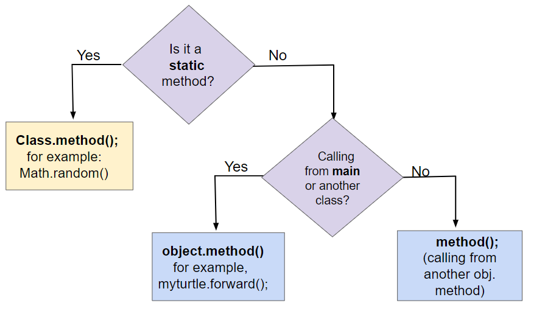

## Table of Contents
{: .no_toc .text-delta }

{: .fs-2 }
- TOC
{:toc}

---

{:.note}
📖 This page is a condensed version of [CSAwesome Topic 1.14](https://runestone.academy/ns/books/published/csawesome2/topic-1-14-calling-instance-methods.html) 

---

## Calling Instance (Object) Methods

In object-oriented programming, **methods** define the _behavior_ and _actions_ that an object can perform.

🐢 `Turtle` objects can go forward or turn left using method calls like `yertle.forward()` and `yertle.turnRight()` to change its position. These methods are sometimes called **instance methods** or **object methods** because they are called using an instance or object of the class — in this case a specific `Turtle` object like `yertle`.

<!--
Role play objects in groups or with the whole class. Here are some object roles that you could assign students, e.g. Acrobat, Whiteboard and directions on how you could lead the activity (created by David Levine). Some other objects might be animals like dogs and cats who bark and do different tricks. After assigning roles to students, call out their name and then the method you’d like them to do, and write the commands on the board. For example, acrobat1.clap(2);  whiteboard1.drawSquare(); Have groups write some commands for their group to do and simulate running the program. Have groups design a new object and a method with an argument for it. 
Remind students “methods define the behaviors or functions.”, and the vocabulary of parameters and arguments as “values that you can give to methods to help them do their job as arguments or parameters.”
-->

### Class Methods vs. Instance Methods

In earlier lessons, we learned how to call **static methods** (also called **class methods**). Class methods use the keyword `static` in their method signature and do not access or change the attributes of an object. 

📣 Class methods are **called** using the class name followed by the dot (`.`) operator and the method name. 
> _For example:_ `Math.sqrt(25);` runs the `sqrt` method defined in the `Math` **class** to find the square root of 25. 

In this lesson, we will learn more about **instance methods**, which are always called using a specific **object** of the class. _They are not static methods._ They access and change the attributes of the object they are called on. _For example:_

> _For example:_ `yertle.forward();` changes the `Turtle`-type **object** `yertle`'s position.


{:.highlight}
Traditionally, `Class` names are capitalized, and `object` variables are lowercase.

### Method Signatures

The **method signature** defines the method's name and the number and types of parameters it takes. In a class definition or in documentation of a library, instance methods are usually defined _after_ the instance variables (attributes) and constructors in a class. 
> _More on this in Unit 3 when we write our own full classes!_

For example, see the `Student` class below. Notice that the methods do not use the keyword `static`.


### Method Calls

To use an object's method, you must use the object name and the dot (`.`) operator followed by the method name. 
> _For example:_ `yertle.forward();` calls `yertle`'s `forward` method to move a turtle object forward 100 pixels.

{:.highlight}
**Object/Instance Methods** often work with the **attributes** of the object, such as the direction the turtle is heading or its current position.

Methods inside the same class can call each other using just `methodName()`. But to call instance methods in another class or from a `main()` method, you must first **construct** an **object** of that class and then call its methods like so:

```java
ClassName object = new ClassName();
object.methodName(); 
```

The following flowchart shows the difference between calling **static** (class) methods and **instance** (object) methods:



{:.highlight}
**Note:** `method();` is used to call a method within the _same_ class, but `object.method();` is necessary if you are calling the method from a _different_ class.


### Method Calls with Arguments

Methods like `forward()` and `turnRight()` always do the same thing unless you give them **arguments**. Arguments allow you to specify details like how far to move or how much to turn.

Example:

```java
forward(200); // move 200 pixels
turn(30);     // turn 30 degrees
```

When you define your own method, the variables in its definition are called **parameters**. When you call the method, the values you pass in are **arguments**.


### Methods that Return Values

So far, our `Turtle` methods have been **void methods** — they do something but don’t return a value.

**Non-void methods** return a value that can be stored or used. Methods that return information about an object are called **getters**. _For example:_

```java
int width = yertle.getWidth();
System.out.println(yertle.getXPos());
```

{:.highlight}
**Note:** Always _do something_ with the value a getter returns — **store** it in a variable, **use** it in a calculation, or **print** it.

#### CSAwesome Activities: Turtle Class

<div class="task" markdown="block">

🐢 To explore the concepts from this lesson in code, we'll play around with the `Turtle` class on the CSAwesome website instead of taking notes.  

👉 **GO TO:** <a href="https://runestone.academy/ns/books/published/csawesome2/topic-1-14-calling-instance-methods.html"><button class="btn">CSAwesome Topic 1.14</button></a>, **SIGN IN** to your account, and complete all the turtle-related **coding activities/challenges** with a partner. 

</div>

---

## Summary

- **Instance methods** define the behavior and actions that an object can perform. 

- (AP 1.14.A.1) **Instance methods** are called on objects of the class. 

- (AP 1.14.A.1) The dot operator is used along with the object name to **call** instance methods, for example **object.method();**

- (AP 1.14.A.2) A method call on a ``null`` reference will result in a ``NullPointerException``.

- Some methods take **arguments** that are placed inside the parentheses **object.method(arguments)**.

- A **method signature** is the method name followed by the parameter list which gives the type and name for each parameter. Note that methods do not have to take any parameters, but you still need the parentheses after the method name.

- The method call arguments must match the method signature in number, order, and type.

- A **method**  call interrupts the sequential execution of statements, causing the program to first execute the statements in the method or constructor before continuing. Once the last statement in the method or constructor has executed or a ``return`` statement is executed, the flow of control is returned to the point immediately following the method or constructor call.

- **Non-void methods** are methods that return values. You should do something with the return value, such as assigning it to a variable, using it in an expression, or printing it.
  


---

#### Acknowledgement
{: .no_toc }

Content on this page is adapted from [Runestone Academy - Barb Ericson, Beryl Hoffman, Peter Seibel](https://runestone.academy/ns/books/published/csawesome2/csawesome2.html).
{: .fs-2 }
