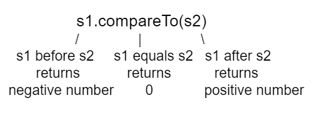

## Table of Contents
{: .no_toc .text-delta }

{: .fs-2 }
- TOC
{:toc}

---

{:.note}
📖 This page is a condensed version of [CSAwesome Topic 1.15](https://runestone.academy/ns/books/published/csawesome2/topic-1-15-strings.html) 

---

## The String Class

**Strings** in Java are _objects_ of the ``String`` _class_ that hold text, i.e. **sequences of characters** (`a`, `B`, `c`, `$`, etc). You can declare a variable to be of the type ``String``.
> Remember that a **class** (or classification) in Java defines the data that all **objects** of the class have (the _instance variables_) and the behaviors, the things that objects know how to do (the _methods_).


{:.highlight}
Class names in Java, like ``String``, begin with a _CAPITAL_ letter.  All primitive types: ``int``, ``double``, and ``boolean``, begin with a _lowercase_ letter. This is one easy way to tell the difference between primitive types and class types.


<!--
STRING BRACELET ACTIVITY?

String Methods and tell students that strings are indexed starting at 0. Bring scrabble or banagram tiles to class or have students cut out squares from paper to write letters on. Working in pairs, have students create or write down a long word like “CSAwesome” or “extraordinary” with the tiles. Ask them which index or indices substrings within the large string start and end. For example, what index does the substring “Awesome” start and end in the string “CSAwesome”?
-->

### Creating String References

In Java there are two ways to create an object of the ``String`` class. You can use the ``new`` keyword followed by a space and then the class constructor and then in parentheses you can include values used to initialize the fields of the object. 

```java
String greeting = new String("Hello World");
```
> This is the standard way to **create a `new` object of any class** in Java.

<div class="imp" markdown="block">
  
In Java you can also use just a **string literal**, which is a set of characters enclosed in double quotes (``" "``), to create a ``String`` object:

```java
String greeting = "Hello";
```

</div>

In both cases an _object_ of the ``String`` _class_ will be created in memory, and the **value** of the variable `greeting` will be set to an object **reference** (👉 a way to find that object).


### String Concatenation


Strings can be added together (**concatenated**) with `+` or `+=`:

* `+` combines values to form a new `String`.
* `+=` appends to the existing value (also creates a new String, since Strings are immutable).

<div class="task" markdown="block">

Add a last name variable and append it, then add extra exclamation points.

```java
String start = "Happy Birthday";
String name = "Jose";
String result = start + " " + name;
result += "!";
System.out.println(result);
```

</div>

{:.warning}
Note that spaces are not added between strings automatically! If you want a space between two strings then add one using `+ " " +`. If you forget to add spaces, you will get smushed output like `"HiJose"`.  And remember that variables are never put inside the quotes (`""`) since this would print the variable name out letter by letter instead of its value.

You can even add other items to a string using the ``+`` operator. Primitive
values like ``int`` and ``boolean`` will be converted to a ``String`` like what
you would type into a Java program and objects will be converted to ``String`` using the
``toString`` method discussed in the previous section.

<div class="task" markdown="block">

💬 **Discuss:** What do you think the following code will print out?

```java
String message = "12" + 4 + 3;
System.out.println(message);
```

</div>

> Since the same operators are processed from left to right this will print ``1243``.  First 4 will be turned into a string and appended to 12 and then 3 will be turned into a string and appended to 124.  If you want to do addition instead, try using parentheses!

{:.highlight}
If you are appending a number to a string it will be converted to a string _first_ before being appended.


---

## String Methods

A string holds **characters in a sequence**. Each character is at a position, or **index**, which starts with `0` as shown below.  An **index** is a number associated with a position in a string. The **length** of a string is the _number of characters_ in it including any spaces or special characters. The string below has a `length` of 14:


{:.important}
The _first_ character in a String is at **index** `0` and the _last_ character is at `length - 1`.

For the AP CSA exam, you only need to know how to use the following String **methods**.  All of the String method descriptions are included in the <a href="https://apstudents.collegeboard.org/ap/pdf/ap-computer-science-a-java-quick-reference_0.pdf" target="_blank">AP CSA Java Quick Reference Sheet</a> that you get during the exam so you don't have to memorize these.

| Method      | Output |
| ----------- | ------ |
| `int length()` | Returns the number of characters in the string, including spaces and special characters like punctuation. |
| `String substring(int from, int to)` | Returns a new string with the characters in the current string starting with the character at the ``from`` index and ending at the character *before* the ``to`` index (if the ``to`` index is specified, and if not specified it will contain the rest of the string).| 
| `int indexOf(String str)` | Searches for the string ``str`` in the current string and returns the **index** of the beginning of ``str`` in the current string, or returns `-1` if it isn't found.| 
| `int compareTo(String other)` | Returns a **negative** value if the current string is less than the ``other`` string alphabetically, **0** if they have the same characters in the same order, and a **positive** value if the current string is greater than the ``other`` string alphabetically.| 
| `boolean equals(String other)` | Returns true when the characters in the current string are the same as the ones in the ``other`` string.  This method is inherited from the Object class, but is **overridden** which means that the String class has its own version of that method.| 

### length, substring, indexOf

Test the code below to see the output from the String methods ``length``, ``substring``, and ``indexOf``. The length method returns the _number of characters_ in the string, not the last index (which is `length -1`). The ``str.substring(from,to)`` method returns the substring from the ``from`` index up to (but not including) the ``to`` index. The method ``str.indexOf(substring)`` searches for the substring in str and returns the index of where it finds substring in str or -1 if it is not there.

<div class="task" markdown="block">
           
This code shows the output from String methods `length`, `substring`, and `indexOf`. 

💬 **Discuss:** How many letters does substring(0,3) return? What does indexOf return when its argument is not found?

```java
String message1 = "This is a test";
String message2 = "Hello Class";

System.out.println(message1.length());
System.out.println(message2.length());

System.out.println(message1.substring(0, 3));
System.out.println(message1.substring(2, 3));
System.out.println(message1.substring(5));

System.out.println(message1.indexOf("is")); // This will match the is in "This"!
System.out.println(message1.indexOf("Hello"));
System.out.println(message2.indexOf("Hello"));

// lowercase and uppercase methods are not on the AP exam, but still useful
System.out.println(message2.toLowerCase());
System.out.println(message2.toUpperCase());
```
</div>

{:.highlight}
Remember that `substring(from,to)` does not include the character at the ``to`` index! To return a single character at index i, use ``str.substring(index, index + 1)``.


<div class="task" markdown="block">

🐷 **Pig Latin:** Move the first letter to the end and add `"ay"`.

Write code for a `pigLatinWord` so that:

* `"java"` → `"avajay"`
* `"pig"` → `"igpay"`

```java
String word = "pig";
// your code here
```

</div>

### CompareTo and Equals

We can compare _primitive types_ like `int` and `double` using **operators** like ``==`` and ``<`` or ``>``, which you will learn about in the next unit. However, with _reference types_ like `String`, you must use the **methods** ``equals`` and ``compareTo``, not ``==`` or ``<`` or ``>``.

The method ``compareTo`` compares two strings character by character. If they are equal, it returns 0. If the first string is alphabetically ordered before the second string (which is the argument of ``compareTo``), it returns a negative number. And if the first string is alphabetically ordered after the second string, it returns a positive number. (The actual number that it returns does not matter, but it is the distance in the first letter that is different, e.g. A is 7 letters away from H.)



The ``equals`` method compares the two strings character by character and returns ``true`` or ``false``. Both ``compareTo`` and ``equals`` are case-sensitive. There are case-insensitive versions of these methods, ``compareToIgnoreCase`` and ``equalsIgnoreCase``, which are not on the AP exam.

<div class="task" markdown="block">
  
Test the code below to see the output from ``compareTo`` and ``equals``. 

```java
String message = "Hello!";

System.out.println(message.compareTo("Hello!"));
System.out.println(message.compareTo("And"));
System.out.println(message.compareTo("Zoo"));

System.out.println(message.equals("Hello!"));
System.out.println(message.equals("hello!"));
```

</div>

> Since ``"Hello!"`` would be alphabetically ordered after ``"And"``, ``compareTo`` returns a positive number. Since ``"Hello!"`` would be alphabetically ordered before ``"Zoo"``, ``compareTo`` returns a negative number.  Notice that ``equals`` is case-sensitive.


{.highlight}
Strings are **immutable** which means that they can't change after creation. Anything that you do to **modify** a string (like creating a substring or appending strings) _returns a new string_.

### Common Mistakes with Strings

1. Thinking `substring` includes the last index.
2. Forgetting Strings are **immutable**.
3. Using invalid indices.
4. Calling methods on a `null` reference (NullPointerException).
5. Using `==` to compare Strings instead of `.equals`.
6. Assuming uppercase and lowercase are equal.

#### String Methods Game
{:.no_toc}

Try the game below written by AP CSA teacher Chandan Sarkar. Click on **Strings** and then on the letters that would be the result of the string method calls. We encourage you to work in pairs and see how high a score you can get.

<iframe height="700px" width="100%" style="margin-left:10%;max-width:80%" src="https://csa-games.netlify.app/"></iframe>

---

## Summary

- (AP 1.15.A.1) A ``String`` object represents a sequence of characters and can be created by using a string literal.

- (AP 1.15.A.2) The ``String`` class is part of the ``java.lang`` package. Classes in the ``java.lang`` package are available by default.

- String objects can be created by using string literals (String s = "hi";) or by calling the String class constructor (String t = new String("bye");).

- (AP 1.15.A.3) A String object is **immutable**, meaning once a String object is created, its attributes cannot be changed. Methods called on a String object do not change the content of the String object.

- (AP 1.15.A.4) Two String objects can be concatenated together or combined using the + or += operator, resulting in a new String object. 

- (AP 1.15.A.4) A primitive value can be concatenated with a String object. This causes the implicit conversion of the primitive value to a String object.

- (AP 1.15.A.5) A String object can be concatenated with any object, which implicitly calls the object’s ``toString`` method (a behavior which is guaranteed to exist by the inheritance relationship every class has with the Object class). An object’s ``toString`` method returns a string value representing the object. Subclasses of Object often **override** the toString method with class-specific implementation. Method overriding occurs when a public method in a subclass has the same method signature as a public method in the superclass, but the behavior of the method is specific to the subclass. Overriding the ``toString`` method of a class is outside the scope of the AP CSA exam.

- **index** - A number that represents the position of a character in a string.  The first character in a string is at index 0.
- **length** - The number of characters in a string.
- **substring** - A new string that contains a copy of part of the original string.

- (AP 1.15.B.1) A String object has index values from 0 to one less than the length of the string. Attempting to access indices outside this range will result in an ``IndexOutOfBoundsException``.

- (AP 1.15.B.2) The following String methods and constructors, including what they do and when they are used, are part of the |AP CSA Reference Sheet| that you can use during the exam:

  - **String(String str)** : Constructs a new String object that represents the same sequence of characters as str.

  - **int length()** : returns the number of characters in a String object.

  - **String substring(int from, int to)** : returns the substring beginning at index from  and ending at index (to -1).

  - **String substring(int from)** : returns substring(from, length()).

  - **int indexOf(String str)** : searches for str in the current string and returns the index of the first occurrence of str; returns -1 if not found.

  - **boolean equals(String other)** : returns true if this (the calling object) is equal to other; returns false otherwise. Using the equals method to compare one String object with an object of a type other than String is outside the scope of the AP CSA exam.

  - **int compareTo(String other)** : returns a value < 0 if this is less than other; returns zero if this is equal to other; returns a value > 0 if this is greater than other. Strings are ordered based upon the alphabet.

- ``str.substring(index, index + 1)`` returns a single character at index in string ``str``.

---

#### Acknowledgement
{: .no_toc }

Content on this page is adapted from [Runestone Academy - Barb Ericson, Beryl Hoffman, Peter Seibel](https://runestone.academy/ns/books/published/csawesome2/csawesome2.html).
{: .fs-2 }
