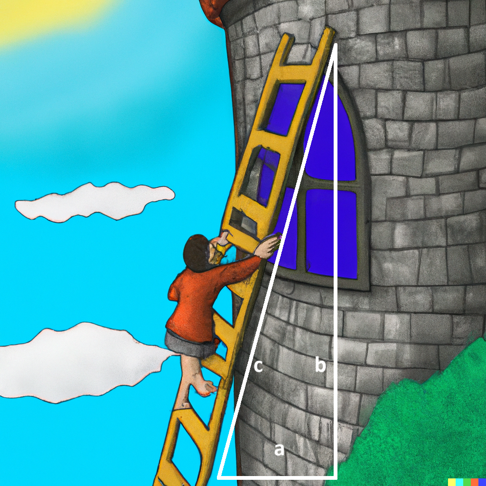

## Table of Contents
{: .no_toc .text-delta }

{: .fs-2 }
- TOC
{:toc}

---

<html>
  <details>
    <summary>💻 <strong class="text-green-200">ACTIVITY PROGRAM SETUP INSTRUCTIONS</strong></summary>
    
<div class="setup" markdown="block">

1. Go to the public template **repository** for our class: [BWL-CS Java Template](https://github.com/BWL-CS/java-template)
2. Click the <button type="button" name="button" class="btn btn-green">Use this template</button> button above the list of files then select `Create a new repository`
3. Specify the **repository name**: `CS2-Unit1-Activity#`
    > Replace `#` with the specific _activity number_.
4. Click <button type="button" name="button" class="btn btn-green">Create repository</button>
    > Now you have **your own personal copy** of this starter code that you can always access under the `Your repositories` section of GitHub! 📂
5. Now on your repository, click <button type="button" name="button" class="btn btn-green"> < > Code </button> and select the `Codespaces` tab
6. Click `Create Codespace on main` and wait for the environment to load, _then you're ready to code_!

</div>

<br>

<div class="warn" markdown="block">

🛑 When class ends, don't forget to **SAVE YOUR WORK**! **Codespaces** are TEMPORARY editing environments, so you need to COMMIT changes properly in order to update the main **repository** for your program. 

_There are multiple steps to saving in GitHub Codespaces:_

1. Navigate to the `Source Control` menu on the _LEFT_ sidebar
2. Click the <button type="button" name="button" class="btn btn-green">commit changes</button> button on the _LEFT_ menu
3. Type a brief **commit message** at the top of the file that opens, for example: `updated main.py`
4. Click the small `✔️` **checkmark** in the _TOP RIGHT_ corner
5. Click the <button type="button" name="button" class="btn btn-green">sync changes</button> button on the _LEFT_ menu
6. _Finally you can close your Codespace!_

</div>

  </details>
</html>

---

## 🤪 ACTIVITY #1: MadLibs

In this activity, you'll be creating your own **MadLibs** game using Java! A MadLibs story is a short story where certain words are left out, and players fill in the blanks with their own words (like nouns, verbs, adjectives, etc.), making the story fun and creative. You will write a story, replace some words with variables, and ask the user to fill in those blanks by gathering input using a `Scanner` object.

#### Reminders
{:.no_toc}
* Strings in Java are **objects** of the `String` class that hold _sequences of characters_.
* String objects can be created by using **string literals** (`String s = “hi”;`) or by calling the String class constructor (`String t = new String(“bye”);`).
* String objects can be **concatenated** using the `+` or `+=` operator, resulting in a new String object.
* Primitive values can be **concatenated** with a String object. _This causes implicit conversion of the values to String objects._

### PART A: Create a MadLibs Story

<div class="task" markdown="block">

1. Come up with a fun story to use for MadLibs. Yours should be long enough to include at least **10 variables**. Choose nouns, verbs, adjectives, etc., that you want the user to fill in, and decide how many blanks you’ll need.

   > *Example:* "Today, I went to the PLACE to VERB with my ADJECTIVE NOUN. It was a ADJECTIVE day, and we had lots of fun!"

2. In your `main` method, **declare variables** for the parts of the story that will be filled in. For each blank, create a variable.

   > *Example:* `String adjective1;`

3. Instead of asking the user, **manually assign values** to each variable in your code.

   > *Example:*

   ```java
   String adjective1 = "funny";
   String place1 = "park";
   String verb1 = "dance";
   ```

4. Use string **concatenation** to combine your variables with the rest of the story.

   > *Example:*

   ```java
   String sentence1 = "Today, I went to the " + place1 + " to " + verb1 +
                  " with my " + adjective1 + " friend!";
   ```

5. **Print** out your story!

   > It will be easier to separate each sentence into its own variable and/or print statement, rather than build one giant string for the whole story.

</div>  

### PART B: Interactive Story with `Scanner` Input

<div class="task" markdown="block">

1. At the **top** of your program, import the Scanner class:

   ```java
   import java.util.Scanner;
   ```

3. In your `main` method, **construct the Scanner** (only once):

   ```java
   Scanner scan = new Scanner(System.in);
   ```

4. For each variable in your story, **prompt the user for input** and store it:

   ```java
   System.out.print("Enter an adjective: ");
   String adjective1 = scan.nextLine();
   ```

5. Use string **concatenation** to build your story as before, but this time the variables contain the user’s input.

6. **Print** the completed story to the console.

7. Test it out by running your program multiple times—each time, enter different values to create unique stories!

</div>

#### Optional Challenges
{:.no_toc}

* Add more variables to make your story longer and funnier.
* Format the output to make it look like a paragraph using `\n` for new lines.
* Include emojis to make the story visually interesting!
* Take numerical input (`int` and `double`) by using the `Scanner` class methods: `scan.nextInt()` or `scan.nextDouble()`, for at least 2 of the variables in your story. 
* _ADVANCED:_ Before including those numbers in your story, run a `Math` class method on them to manipulate the numbers however you'd like. You should use at **least 2 Math class methods** total here, and possibly `Math.random()` to include a random number somewhere in the story.
  > Refer to [📓 1.11: Math Class](https://coderina.dev/javadocs/docs/unit1/notes111.html)
* _ADVANCED:_ Manipulate some of the string variables with `String` class methods such as `.substring()`. Use at least **3 String class methods** total.
  > Refer to [📓 1.15: String Class](https://coderina.dev/javadocs/docs/unit1/notes115.html)

---

## 🏗️ ACTIVITY #2: Construction Calculator

You just got a summer job shadowing a contractor on a construction site. Your boss isn't too impressed with your manual labor skills, city kid, but maybe you can shine on the engineering side of it. If you can make your initial calculations quickly, that gives you more time to struggle with the building part! 

In this activity, you'll write some Java methods to help you with various tasks on the job. 

### PART A: Unit Conversions

Contractors constantly need to convert between units: feet to inches, yards to feet, and meters to centimeters. Your boss says if you can't do this in your head, at least make the computer do it for you!

<div class="task" markdown="block">

1. Copy the **starter code** for the method below into your program (outside of the `main` method, but still inside the `Main` class):
   ```java
   public static double feetToInches(double feet) {
       double inches;
       // TODO: Convert feet to inches (1 foot = 12 inches)
       return inches;
   }
   ```
2. Complete the method body by multiplying the number of `feet` by `12` to get `inches`.
3. Call your method from the `main()` method with `feet = 8`.
   * Store the result in a variable, e.g. `double result = feetToInches(8);`
4. Print the result using **string concatenation**:
   > EXPECTED OUTPUT: `8.0 feet = 96.0 inches`
5. *Optional Challenge*:
   * Add **more conversion methods** on your own.
     * `yardsToFeet` (1 yard = 3 feet)
     * `metersToCentimeters` (1 meter = 100 centimeters)

</div>  

### PART B: Ladder on Tower



One common use for the Pythagorean theorem is to calculate the length of
ladder you will need to reach your work bestie, who got stuck standing at the top of a tower surrounded by a moat. The ladder will be the **hypotenuse** of a triangle whose legs are the height of the tower and the width of the moat (since you have to place the base of the ladder on the edge of the moat).

> The Pythagorean theorem is named for **Pythagoras**, who was also the leader of the gang of Greek mathematicians who legend has it allegedly drowned their fellow mathematician for showing that `√2` is irrational.

<div class="task" markdown="block">

1. Copy the **starter code** for the method below into your program (outside of the main method, but still inside the `Main` class):
  ```java
  public static double calcLadderSize(double height, double width) {
      double ladderSize;
      // TODO: Calculate using Pythagorean theorem
      // Use Math.sqrt and Math.pow or *
      return ladderSize;
  }
  ```
2. Complete the `calcLadderSize` method body using `Math.sqrt()` and `Math.pow()` in the Pythagorean theorem `c = √(a² + b²)`
  * `a` = height of the tower
  * `b` = width of the moat
  * `c` = ladder length

3. Call your method from the `main()` method with `height` = 30 and `width` = 40. Make sure to **store** the result in a variable.
  > HINT: `double size = ...`

4. Use **string concatenation** to print out a sentence with the calculated `size`: 
  > EXPECTED OUTPUT: `Bestie, I need a 50.0 foot ladder!`

</div>

### PART C: Random Supply Delivery

On a real construction site, supplies don’t always arrive in the exact amounts you expect. To simulate this chaos, you’ll use the `Math.random()` method to generate random numbers for a delivery of wood planks.

> Recall: `Math.random()` returns a decimal between 0.0 (inclusive) and 1.0 (exclusive). You can **multiply** it to scale the range, and **cast** to `int` if you want whole numbers.

<div class="task" markdown="block">

1. Write a method called `randomPlankDelivery` that generates a **random number of planks** between 10 and 50 (inclusive).
  ```java
   public static int randomPlankDelivery() {
       int planks;
       // TODO: Use Math.random to generate an int from 10 to 50
       return planks;
   }
  ```
2. Inside the method, use the formula:
  ```java
   planks = (int)(Math.random() * 41) + 10;
  ```
  * `Math.random() * 41` → gives a number between 0.0 and 40.999…
  * Adding `10` shifts it into the range **10–50**.
  * Casting to `(int)` gives a whole number.
3. In your `main()` method, **call the method 3 times** to simulate 3 separate deliveries.
  ```java
  int delivery1 = randomPlankDelivery();
  int delivery2 = randomPlankDelivery();
  int delivery3 = randomPlankDelivery();
  ```
4. Print the results in a clear sentence for each delivery, for example:
  ```
  First truck delivered 32 planks.
  Second truck delivered 48 planks.
  Third truck delivered 15 planks.
  ```
5. *Optional Challenge*:
  * Add all three deliveries together and print the **total number of planks delivered**.
  > EXPECTED OUTPUT: `Total planks delivered: 95`

</div>  


