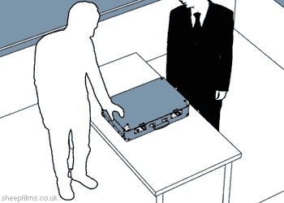
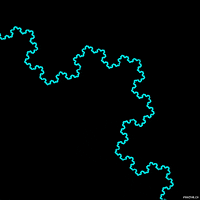

## Table of Contents
{: .no_toc .text-delta }

{: .fs-2 }
- TOC
{:toc}

---

{:.note}
📖 This page is a condensed version of [CSAwesome Topic 10.1](https://runestone.academy/ns/books/published/csawesome/Unit10-Recursion/topic-10-1-recursion.html?mode=browsing) 

<html>
<details>
<summary>📓<strong>DEMO PROGRAM SETUP INSTRUCTIONS</strong></summary>

<div class="setup" markdown="block">

1. Go to the public template **repository** for our class: [BWL-CS Java Template](https://github.com/BWL-CS/java-template)
2. Click the <button type="button" name="button" class="btn btn-green">Use this template</button> button above the list of files then select `Create a new repository`
3. Specify the **repository name**: `CS2-Unit-10-Notes`
4. Click <button type="button" name="button" class="btn btn-green">Create repository</button>
    > Now you have **your own personal copy** of this starter code that you can always access under the `Your repositories` section of GitHub! 
5. Now on your repository, click <button type="button" name="button" class="btn btn-green"> < > Code </button> and select the `Codespaces` tab
6. Click `Create Codespace on main` and wait for the environment to load, _then you're ready to code_!
7. 📝 Take notes in this Codespace during class, coding along with the instructor.

</div>
</details>
</html>

---

## What is Recursion?

**Recursion** is when a _method calls itself_. Recursion is another strategy for *repeating code* - an alternative to **loops**.



> Check out more [recursion visualizations](https://giphy.com/explore/recursion)!

The method below will print out "This is the method that never ends!" and then _call itself_, which will print out the message again, and then call itself, and so on.

```java
public static void neverEnd() {
    System.out.println("This is the method that never ends!");
    neverEnd();
}
```
> ♾️ This is called **infinite recursion**, which is a recursion that never ends. Of course, this particular method is not very useful. (Actually, in practice it *will* end, crashing with a ``StackOverFlowError`` because there is a limit on how many times you can recurse.)

{:.highlight} 
The AP CSA exam usually has about **4-6 recursion problems** in the MCQ section. You only need to know how to _trace_ recursive methods, as in, figure out what they _return_ or _print_. ✍️


#### Why Use Recursion?
{:.no_toc}

Recursion is most useful for solving problems where the structure of the problem
allows it to be **broken into smaller but similar problems**, whose _solutions can
be combined_ into the **solution to the original problem**.

For example:

* 🗂️ Suppose you wanted to find out how much space a **folder** on your computer uses? Well, if you knew how much space each of the files and sub-folders in that folder used, you could add them up and get the answer. Getting the size of a regular file is usually easy, but figuring out how much space each sub-folder takes up is the same problem we stared with, just with a different folder.
    * But that’s actually great news because we can **use the same procedure to solve this smaller problem:** find the size of all the files and sub-folders *in it* and add them up. Eventually, as we try to get the size more deeply **nested folders**, eventually we'll get to folders that only _contain plain files whose sizes we can add up_ and `return`, and eventually we work our way back up to give the answer to our question about the original top-most folder.

* Recursion can also be used to create **fractals**. 



* A simple fractal example is **Sierpinski's Triangle** in which you subdivide a triangle into 4 new triangles as shown below.
You can then do the _same procedure_ with each new triangle except the center one.


* Recursion can also be used to **traverse** ``String``s, arrays, and ``ArrayList``s just like a loop. In fact, any loop—also known as *iterative* code—can be
re-written using recursion! 
> However in most languages, including Java, there are limitations on how deeply code can recurse, which rules out using recursion for infinite or even very long loops.

<div class="important" markdown="block">

🌳 Recursion is more **powerful** than simple loops, especially when dealing with _branching structures_ like the file folder example. Computer scientists call such data structures **trees** and they are incredibly common in computer programs. Thus one way to think about recursion is as “_loops for trees_”. 

> 🔁 If you need to loop over a **simple linear data structure** like a ``String``, array, or `ArrayList`, by all mean use a ``for`` loop _instead of recursion_. And if you want to navigate a 2D array, a pair of nested ``for`` loops is the way to go. 

</div>

### Factorial Method

The following video introduces the concept of recursion and tracing recursion with the factorial method.

<iframe width="560" height="315" src="https://www.youtube.com/embed/V2S_8E_ubBY?si=GbmCun5a8pxewGLI" title="YouTube video player" frameborder="0" allow="accelerometer; autoplay; clipboard-write; encrypted-media; gyroscope; picture-in-picture; web-share" referrerpolicy="strict-origin-when-cross-origin" allowfullscreen></iframe>

See the method `factorial` below that calculates the **factorial** of a number. The **factorial** of a number is defined as `1` for 0, and ``n * factorial (n-1)`` for any other number.

```java
   public static int factorial(int n) {
       if (n == 0)
           return 1;
       else
           return n * factorial(n-1);
   }
```
> You can also play with an interactive demonstration of the recursive factorial computation at [https://gigamonkeys.com/misc/factorial/#java](https://gigamonkeys.com/misc/factorial/#java).


### Base Case

Every non-infinite recursive method must have at least one **base case** where the method can `return` an answer _without another recursive call_. 
> In other words, the base case is the smallest possible problem (or problems) that the method knows how to solve, the ones it can _answer directly_ without any more recursion.

The base case is often handled by an ``if`` statement that checks for the base
case and returns directly when the condition for the base case is met.

In the factorial method, the base case is when the argument is 0 as that is the
smallest number that the factorial method can handle since factorial isn’t
defined for negative numbers.

When we recurse through folders on our computer there are two base cases, a
simple file, whose size we can find out directly, and an empty folder whose size
is 0 (or maybe some other fixed amount, depending on the operating system). In
those two cases a method to compute the space used by a file or folder could
return immediately; in all others it would have to recurse to get the sizes of
the files and sub-folders it contains and then add them up.

The goal of every recursive call in a recursive method is to shrink the problem
in some way that gets closer to the base case. You can see that in ``factorial``
where the recursive call is passing ``n - 1``, one closer to ``0``. If you write
a recursive method (not required for the AP exam), you should make sure that
every time you recurse you are shrinking the problem so it is closer to the base
case—that’s the equivalent in recursion to incrementing your loop variable in a
``for`` loop.

<iframe width="560" height="315" src="https://www.youtube.com/embed/Q83nN97LVOU?si=F48d7kHn96smMDpG" title="YouTube video player" frameborder="0" allow="accelerometer; autoplay; clipboard-write; encrypted-media; gyroscope; picture-in-picture; web-share" referrerpolicy="strict-origin-when-cross-origin" allowfullscreen></iframe>


## Tracing Recursive Methods

In Java, the **call stack** keeps track of the _methods that you have called_ since the `main` method executes. A **stack** is a way of organizing data that _adds and removes items only from the top_ of the stack. 


> An example is a stack of cups. You can grap a cup from the top of the stack, or add more cups at the top of the stack.

When you are executing one method (`method a`) and it calls another method (`method b`), that method call is **placed on the call stack** along with information about where it was called from, which tells the run-time _where to return_ to when the current method finishes executing. When method b finishes executing the run-time pops the method b off of the call stack and returns execution to the next line to be executed in method a.

Consider the following class definition:


The code above will cause a run-time error of division by zero when it runs.  The ``main`` method calls the method ``test1`` (at line 20) which calls the method ``test2`` (at line 6) which has the divide by zero error (line 14).  This can be seen in the call stack shown below which shows the call stack from the top (most recent method) to the bottom (first method call).


When a method calls itself the new method call gets added to the top of the call stack. Execution of the current method pauses while the recursive call is being processed. Each recursive call on the stack has its own set of local variables, including the parameter variables. The parameter values progressively change in each recursive call until we reach the base case which stops the recursion.

Let's trace the execution of the factorial method defined below.

```java
  public static int factorial(int n) {
      if (n == 0) {
          return 1;
      }
      else {
          return n * factorial(n-1);
      }
  }
```
What happens when we call ``factorial(0)``?  It will return 1 (line 5) since n is equal to 0.  How about ``factorial(1)``?  It will return ``1 * factorial(0)``.  We already know that ``factorial(0)`` returns 1, but the computer won't *remember* that.  It will execute ``factorial(0)`` and return the result (1).   So  ``factorial(1)`` returns ``1 * 1 which is 1``.

How can you **show what is happening** in a recursive call? The lines below show the _call stack upside down_ (with the bottom of the stack, or the **original call** at the _top_ and the **most recent call** at the _bottom_) for a call to ``factorial(5)``.  
> ✍️ This is a handy way to _trace_ a recursive method on the exam!!!

```java
  factorial(5) returns 5 * factorial(4)
  factorial(4) returns 4 * factorial(3)
  factorial(3) returns 3 * factorial(2)
  factorial(2) returns 2 * factorial(1)
  factorial(1) returns 1 * factorial(0)
  factorial(0) returns 1
```

Once `factorial(0)` executes and returns `1`, that value can be **substituted back** into the previous method call, starting at the _top_ of the stack (_shown at the bottom here_) and working our way back to the _bottom_ of the stack (_shown at the top here_).

```
  factorial(5) returns 5 * factorial(4) = 5 * 24 = 120
  factorial(4) returns 4 * factorial(3) = 4 * 6 = 24
  factorial(3) returns 3 * factorial(2) = 3 * 2 = 6
  factorial(2) returns 2 * factorial(1) = 2 * 1 = 2
  factorial(1) returns 1 * factorial(0) = 1 * 1 = 1
  factorial(0) returns 1
```

So ``factorial(5)`` returns `120`, as the final solution to the original question.


<div class="task" markdown="block">
    
Let's trace the execution of the bunny ears method defined below:

```java
  public static int bunnyEars(int bunnies) {
     if (bunnies == 0) {
         return 0;
     }
     else if (bunnies == 1) {
         return 2;
     }
     else {
         return 2 + bunnyEars(bunnies - 1);
     }
  }
```

What happens when we call ``bunnyEars(0)``?  It will return 0 since n is equal to 0 (line 3).  How about ``bunnyEars(1)``?  It will return 2 since n is equal to 1 (line 5). What about ``bunnyEars(5)``?

```
  bunnyEars(5) returns 2 + bunnyEars(4)
  bunnyEars(4) returns 2 + bunnyEars(3)
  bunnyEars(3) returns 2 + bunnyEars(2)
  bunnyEars(2) returns 2 + bunnyEars(1)
  bunnyEars(1) returns 2
```

This approach shows the call stack from bottom to top.  Once ``bunnyEars(1)`` executes and returns 2 that value can be substituted back into the previous method call, starting at the top and working our way back toward the bottom (or beginning) of the call stack.

```
  bunnyEars(5) returns 2 + bunnyEars(4) = 2 + 8 = 10
  bunnyEars(4) returns 2 + bunnyEars(3) = 2 + 6 = 8
  bunnyEars(3) returns 2 + bunnyEars(2) = 2 + 4 = 6
  bunnyEars(2) returns 2 + bunnyEars(1) = 2 + 2 = 4
  bunnyEars(1) returns 2
```

So ``bunnyEars(5)`` returns 10.

</div>

---

## ⭐️ Summary

* **Recursive Method** - A method that contains at least one _call to itself_ inside the method.

* **Base Case** - A way to stop the recursive calls. This is a _return_ statement without a recursive call.

* **Call Stack** - The call stack keeps track of the methods that are called while the code executes. It keeps track of the local variables and where the call will return to.

<div class="warn" markdown="block">

🛑 When class ends, don't forget to **SAVE YOUR WORK**!

1. Navigate to the `Source Control` menu on the _LEFT_ sidebar
2. Type a brief **commit message** in the box, for example: `updated Main.java`
3. Click the <button type="button" name="button" class="btn btn-green">commit changes</button> button on the _LEFT_ menu
4. Click the <button type="button" name="button" class="btn btn-green">sync changes</button> button on the _LEFT_ menu
5. _Finally you can close your Codespace!_

</div>

---

#### Acknowledgement
{: .no_toc }

Content on this page is adapted from [Runestone Academy - Barb Ericson, Beryl Hoffman, Peter Seibel](https://runestone.academy/ns/books/published/csawesome/index.html?mode=browsing).
{: .fs-2 }
