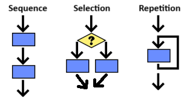

## Table of Contents
{: .no_toc .text-delta }

{: .fs-2 }
- TOC
{:toc}

---

{:.note}
📖 This page is a condensed version of [CSAwesome Topic 2.1](https://runestone.academy/ns/books/published/csawesome2/topic-2-1-algorithms.html) 

---

## Algorithms with Control Structures

Every **algorithm** consists of a _sequence of steps_. Up until now, we have been writing code instructions one line at a time, which then gets executed by the computer in that **sequential order** by default. However, we can create more complex algorithms that do not follow the default sequential order. 

{:.important}
🧱 _Control structures_ are the building blocks of all algorithms: **sequencing**, **selection/branching**, and **repetition/iteration**. 

In this unit, we will learn to:
* 🔀 _Branch_ the code into different paths using **SELECTION**
  > **Conditional** decision-making (`if`, `else if`, `else`)
* 🔁 _Repeat_ a block of code using **ITERATION**
  > **Loop** structures (`while`, `for`, `for each`) 

> In fact, it's been proven that _all algorithms_ for problems that can be solved on a computer can be constructed by using just these **three control structures**: sequence, selection, and repetition.

### Selection (Branching)

<html>
  <dl>
    <dt>Selection (Branching)</dt>
    <dd>When a <em>choice</em> of how a process will proceed is based on a <strong>true or false decision</strong>.</dd>
  </dl>
</html>

🔀 In programming, an algorithm may take different paths (_run different lines of code_) depending on certain **conditions**. 

🔎 Identify all the **selection** (decision/branching) phrases in the following algorithm:

1. Wake up.
3. Check your phone and the weather.
4. If there is a text from your bestie, answer it.
5. Brush teeth and shower.
6. If it’s below 50 degrees, wear a sweater over your polo.
7. Otherwise, pack the sweater in your bag just in case. 
8. Check if you have homework due. If so, pack it in your bag.
9. Put on your sunglasses if it's sunny.
10. Leave for school.

> **HINT:** Selections are made based on a **true or false decision**. Look out for the word `"if"`, and sometimes `"otherwise"`, to identify selections.

### Repetition (Iteration)

<html>
  <dl>
    <dt>Repetition (Iteration)</dt>
    <dd>When a process <em>repeats</em> itself until a specified <strong>condition is met</strong>.</dd>
  </dl>
</html>

🔁 In programming, repetition is achieved through **loops**, which are code blocks that execute again and again until a desired outcome is reached. 

🔎 Identify all the **repetition** (iteration) phrases in the following algorithm:

1. Wake up.
2. Snooze for 5 more minutes. Repeat waking up and snoozing for the next 15 minutes.
3. If there is a text from your friend, answer it. Do this for all of your texts.
4. Brush teeth and shower.
6. Check if you have homework due. If so, pack it in your bag.
7. Keep packing items until your bag is ready.
8. Leave for school.

> **HINT:** Repetition is when a process repeats itself until a desired outcome is reached. Look for the words `"repeat"`, `"all"`, or `"keep"` to identify repetition.

### Algorithms with Pseudocode & Flowcharts

For complex problems, it is important to _plan_ your solution before writing code. 

* **Pseudocode** is a simplified, informal way of describing the steps in an algorithm in a human language like English but following the sequence, selection, and repetition structure of a programming language. 
* **Flowcharts** are diagrams that represent the steps in an algorithm. Selection is usually represented as a triangle in a flowchart, and arrows are used to show repetition. 

{:.highlight}
The **order** in which sequencing, selection, and repetition are used contributes to the outcome of the algorithm. 

**Pseudocode:**
1. Initialize `total` amount of money.
2. Repeat while still money in `total`:
   - If `total` more than $25, buy a gift card and subtract 25 from `total`.
   - If `total` more than $10, buy a small cake and subtract 10 from `total`.
   - If `total` more than $5, buy some candy and subtract 5 from `total`.
   - If `total` more than $1, buy a card and subtract 1 from `total`.
   - Otherwise, give them the change.

💬 Decide what the **outcome** will be, based on the order of the steps and the conditions.
  > Afterwards, _switch the order_ of some of the steps and determine how the outcomes change.
- If you have $16 to spend, what will be the outcome?
- If you have $22 to spend, what will be the outcome?

#### Group Challenge: Algorithm Design
{:.no_toc}

🍫 In this group activity, design an algorithm for a common problem: **choosing a snack**! Write **pseudocode** that includes both selection and repetition, and draw a **flowchart**.

_For example:_
- If the snack today includes something salty, like Cheez-its or Goldfish, grab an extra one for Mrs. Walter. 
- If there are no Oreos in the Upper School lounge, go check the Middle School snack shelves. 
- You may want to consider every item in both snack areas, or leftover candy in your locker, before deciding.

---

## Summary

- (AP 2.1.A.1) The building blocks of algorithms include sequencing, selection, and repetition.
- (AP 2.1.A.2) Algorithms can contain selection, through decision making, and repetition, via looping.
- (AP 2.1.A.3) Selection occurs when a choice of how the execution of an algorithm will proceed is based on a true or false decision.
- (AP 2.1.A.4) Repetition is when a process repeats itself until a desired outcome is reached.
- (AP 2.1.A.5) The order in which sequencing, selection, and repetition are used contributes to the outcome of the algorithm.

---

#### Acknowledgement
{: .no_toc }

Content on this page is adapted from [Runestone Academy - Barb Ericson, Beryl Hoffman, Peter Seibel](https://runestone.academy/ns/books/published/csawesome2/csawesome2.html).
{: .fs-2 }
