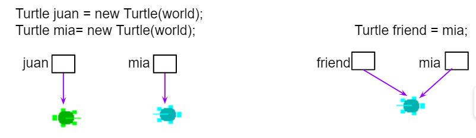

## Table of Contents
{: .no_toc .text-delta }

{: .fs-2 }
- TOC
{:toc}

---

{:.note}
📖 This page is a condensed version of [CSAwesome Topic 2.2](https://runestone.academy/ns/books/published/csawesome2/topic-2-2-booleans.html) 

<div style="text-align: center;">
<span class="highlighter-green"> 
<strong>✴✴✴ NEW UNIT/SECTION! ✴✴✴</strong><br>Create a blank Java program to take your class notes in for the next few lessons.<br><em>Click on the collapsed heading below for GitHub instructions</em> ⤵  
</span>
</div>

<html>
  <details>
    <summary>📓 <strong class="text-green-200">NOTES PROGRAM SETUP INSTRUCTIONS</strong></summary>

<div class="setup" markdown="block">

1. Go to the public template **repository** for our class: [BWL-CS Java Template](https://github.com/BWL-CS/java-template)
2. Click the <button type="button" name="button" class="btn btn-green">Use this template</button> button above the list of files then select `Create a new repository`
3. Specify the **repository name**: `CS2-Unit2PartA-Notes`
4. For the **description**, write: `Selection/Conditionals (boolean expressions, if-else statements)`
5. Click <button type="button" name="button" class="btn btn-green">Create repository</button>
    > Now you have **your own personal copy** of this starter code that you can always access under the `Your repositories` section of GitHub! 📂
6. Now on your repository, click <button type="button" name="button" class="btn btn-green"> < > Code </button> and select the `Codespaces` tab
7. Click `Create Codespace on main` and wait for the environment to load, _then you're ready to code_!
8. 📝 Take notes in this Codespace during class, writing **code** & **comments** along with the instructor.

</div>

<br>

<div class="warn" markdown="block">

🛑 When class ends, don't forget to **SAVE YOUR WORK**! **Codespaces** are TEMPORARY editing environments, so you need to COMMIT changes properly in order to update the main **repository** for your program. 

_There are multiple steps to saving in GitHub Codespaces:_

1. Navigate to the `Source Control` menu on the _LEFT_ sidebar
2. Click the <button type="button" name="button" class="btn btn-green">commit changes</button> button on the _LEFT_ menu
3. Type a brief **commit message** at the top of the file that opens, for example: `updated Main.java`
4. Click the small `✔️` **checkmark** in the _TOP RIGHT_ corner
5. Click the <button type="button" name="button" class="btn btn-green">sync changes</button> button on the _LEFT_ menu
6. _Finally you can close your Codespace!_

</div>

</details>

</html>

---

## Boolean Variables & Expressions

**Boolean** variables or expressions can only have **true** or **false** values.

### Testing Equality `==`

The operators ``==`` and ``!=`` (not equal) can be used to compare values. They return true or false boolean values.

{:.important}
One ``=`` sign changes the value of a variable. Two ``==`` equal signs are used to test if a variable holds a certain value, without changing its value!

Watch the following video which shows what happens in memory as primitive types like ``int`` and reference types like ``Dog`` are compared with ``==`` in a physical model of Java memory:

<a href="https://www.youtube.com/watch?v=bO9bejT0jwE&list=PLHqz-wcqDQIEP6p1_0wOb9l9aQ0qFijrP&ab_channel=colleenlewis" target="_blank"><button type="button" name="button" class="btn btn-purple">📺 Video: Testing Equality</button></a>

<div class="task" markdown="block">

What will the code below print out? Try to guess before you run it! Note that 1 equal sign (``=``) is used for assigning a value and 2 equal signs (``==``) for testing values.

```java
int age = 15;
int year = 14;
// Will this print true or false?
System.out.println(age == year);
year = 15;
// Will this print true or false?
System.out.println(age == year);
// Will this print true or false?
System.out.println(age != year);
```
</div>

We can also use ``==`` or ``!=`` to test if two **reference** values, like ``Turtle`` and ``String`` objects, refer to the same **object**. 

In the figure below, we are creating two separate ``Turtle`` objects called ``juan`` and ``mia``. _They do NOT refer to same object or turtle!_ Then, we create a reference variable called ``friend`` that is set to ``mia``. The turtle ``mia`` will have two ways (**references** or **aliases**) to name her -- she's both ``mia`` and ``friend``, and these variables refer to the same object (same ``Turtle``) in memory. If two reference  variables refer to the same object like the turtle on the right in the image below, the test with ``==`` will return true which you can see in the code below.



### Relational Operators `<`, `>`

The **Relational Operators** below in Java are used to compare numeric values or arithmetic expressions. Although some programming languages allow using relational operators like ``<`` to compare strings, Java only uses these operators for numbers, and uses the methods ``compareTo`` and ``equals`` for comparing ``String`` values.

| Operator | Description |
| --- | ----------- |
| ``<``  | Less than |
| ``>``  | Greater than |
| ``<=`` | Less than or equal to |
| ``>=`` | Greater than or equal to |
| ``==`` |  Equals |
| ``!=`` | Does not equal |

🐊 If you have trouble telling ``<`` and ``>`` apart, use the “hungry alligator” mnemonic beloved by elementary school teachers—think of ``<`` and ``>`` as the mouths of **hungry alligators** which always want to _eat the bigger number_; a ``<`` or ``>`` expression is only ``true`` if the alligator is in fact about to eat the bigger number.

{:.highlight}
To remember the correct order of the two characters in ``<=`` and ``>=``, just
write them in the same order you would say them in English: “less than or equal
to” not “equal to or less than”.

### Testing with remainder `%`

Here are some boolean expressions that are very useful in coding, and **remainder** is used in many of them:


```java
  // Test if a number is positive
  (number > 0)
  //Test if a number is negative
  (number < 0)
  //Test if a number is even by seeing if the remainder is 0 when divided by 2
  (number % 2 == 0)
  //Test if a number is odd by seeing if there is a remainder when divided by 2
  (number % 2 > 0)
  //Test if a number is a multiple of x (or divisible by x with no remainder)
  (number % x == 0)
```

The **remainder** operator has been used quite a bit on the AP CSA exam, so you should be familiar with it.

- Use it to check for odd or even numbers. If ``num % 2 != 0`` is true, ``num``
  is odd and if ``num % 2 == 0`` is true then ``num`` is even.

- You can also use remainder to check if any number is evenly divisible by any
  other: If ``num1 % num2 == 0`` is true then ``num1`` is evenly divisible by
  ``num2``.

- Use it to get the last digit from an integer number: ``num % 10`` gives us the
  rightmost digit of ``num``.

- Use it to get the number of minutes left when you convert a total number of minutes to hours and minutes:

```java
     int totalMinutes = 345;
     int hours = totalMinutes / 60;   // Number of whole hours, i.e. 5
     int minutes = totalMinutes % 60; // Number of minutes left over, i.e. 45
```

- Use it whenever you have limit in the value, and you need to wrap around to
  zero if the value goes over the limit: the value of ``num % limit`` will
  always be in the range from 0 (inclusive) to ``limit`` (exclusive) as long as
  ``num`` and ``limit`` are both positive.

{:.warning}
Because Java's ``%`` is a remainder operator and not a true
  mathematical modulo operator (as we discussed briefly in section 1.4) you
  can’t check if a number is odd with the expression ``num % 2 == 1``.

> That expression will be ``true`` if ``num`` is positive and odd and ``false``
  when ``num`` is even, both of which are correct. But if ``num`` is negative
  and odd, its remainder when divided by 2 is -1, not 1 and this expression will
  evaluate to ``false``. Thus you should always use ``num % 2 != 0`` to check if
  ``num`` is odd.
  
#### Relational Operators Game
{:.no_toc}

<div class="task" markdown="block">

🎲 Try the game below to practice! Click on _Relationals_, evaluate the relational expression and click on **None**, **All**, or the **numbers** that make the expression `true`. Check on _Compound_ for an added challenge. We encourage you to work in pairs and see how high a score you can get.

<a href="https://csa-games.netlify.app/" target="_blank"><button class="btn">Relational Operators Game</button></a>

</div>

<!--

## Testing Equality (`==`)

The relational operators `==` and `!=` (not equal) can be used to compare values. They return true or false boolean values.

**Note:** One `=` sign changes the value of a variable. Two `==` equal signs are used to test if a variable holds a certain value, without changing its value!

<iframe width="700" height="400" src="https://www.youtube.com/embed/bO9bejT0jwE" frameborder="0" allowfullscreen></iframe>

The following code shows how `==` is used with primitive types like `int`.

<div class="task" markdown="block">

**Coding Exercise**

Type this in your Codespace, press run, and see what happens. Then:

1. Add code that sets `year` to 15.
2. Print out whether `age` equals `year`.
3. Print out whether `age` does not equal `year`.

```java
int age = 15;
int year = 14;
// Will this print true or false?
System.out.println(age == year);
// Will this print true or false?
System.out.println(age != year);

// Your code here
```

</div>

We can also use `==` or `!=` to test if two reference values, like `Turtle` and `String` objects, refer to the same object.


<div class="task" markdown="block">

**Coding Exercise**

Type this in your Codespace, press run, and then:

1. Create another `Turtle` variable `friend2` and set it to `juan`.
2. Print whether `friend2 == juan`.
3. Print whether `friend2 == friend`.

```java
World world = new World(300, 300);
Turtle juan = new Turtle(world);
Turtle mia = new Turtle(world);

// Will these print true or false?
System.out.println(juan == mia);
Turtle friend = mia; // alias for mia
System.out.println(friend == mia);

// Your code here
```

</div>

## Relational Operators (`<`, `>`)

The **relational operators** below are used to compare numeric values or arithmetic expressions in Java:

* `<` Less than
* `>` Greater than
* `<=` Less than or equal to
* `>=` Greater than or equal to
* `==` Equals
* `!=` Does not equal

Think of `<` and `>` as arrows: the pointy end should point to the smaller value. Or use the “hungry alligator” mnemonic—they eat the bigger number.

<div class="task" markdown="block">

**Coding Exercise**

Type this in your Codespace, press run, then:

1. Set `year` to 15.
2. Print whether `age` is less than or equal to `year`.

```java
int age = 15;
int year = 14;
// Will these print true or false?
System.out.println(age < year);
System.out.println(age > year);

// Your code here
```

</div>

**Boolean** variables or expressions have **true** or **false** values. For example:

```java
// Test if a number is positive
(number > 0)
// Test if a number is negative
(number < 0)
```

<div class="task" markdown="block">

**Check Your Understanding**

Match the boolean expression to what it is testing:

* `x > 0` → x is positive
* `x == y` → x equals y
* `x < 0` → x is negative
* `x != y` → x does not equal y
* `x < y` → x is less than y
* `x > y` → x is greater than y
* `x >= y` → x is greater than or equal to y

</div>

## Testing with Remainder (`%`)

The remainder operator `%` can test whether a number is even, odd, or divisible by another number:

```java
(number % 2 == 0) // even
(number % 2 != 0) // odd
(number % x == 0) // divisible by x
```

<div class="task" markdown="block">

**Coding Exercise**

Type this in your Codespace, press run, then:

1. Add a line to check if `age1` is divisible by 3.

```java
int age1 = 15;
int age2 = 16;

System.out.println("Remainder of " + age1 + "/2 is " + (age1 % 2));
System.out.println("Remainder of " + age2 + "/2 is " + (age2 % 2));
System.out.println("Is " + age1 " even? " + (age1 % 2 == 0));
System.out.println("Is " + age2 " even? " + (age2 % 2 == 0));

// Your code here
```

</div>

**Note:** In Java, `%` is a remainder operator, not a true modulo operator. Always use `num % 2 != 0` to check for odd numbers.

## Coding Challenge: Prime Numbers

We encourage you to do this activity as a POGIL group activity or using Think-Pair-Share.

<div class="task" markdown="block">

Write methods to:

* Test if a number is positive, negative, odd, even, or divisible by another number.
* Use these methods to check if 5, 6, and 7 are prime.

```java
public static boolean isPositive(int number) {
    return (number > 0);
}

public static boolean isNegative(int number) {
    return (number < 0);
}

public static boolean isOdd(int number) {
    return (number % 2 != 0);
}

public static boolean isEven(int number) {
    return (number % 2 == 0);
}

public static boolean isDivisible(int number, int divisor) {
    return (number % divisor == 0);
}
```

</div>

**Check Your Understanding:**

* Is 5 prime? ✅ Yes.
* Is 6 prime? ❌ No.
* Is 7 prime? ✅ Yes.
* Are all odd numbers prime? ❌ No (example: 9).
* Are all even numbers not prime? ❌ No (example: 2).

Prime numbers are very useful in encryption algorithms.

## AP Practice

<details>
  <summary><strong>Question 1</strong></summary>

```java
boolean x = (5 % 3 == 0) == (3 > 5);
```

* A. `true`
* B. `false`

**Answer:** A (`true`). Explanation: `(5 % 3 == 0)` is `false` and `(3 > 5)` is `false`, so `false == false` is `true`.

</details>

<details>
  <summary><strong>Question 2</strong></summary>

When is the expression below `true`?

```java
(x >= 10) == (y < 12)
```

* A. Only when `x >= 10` and `y < 12`
* B. Only when `x < 10` and `y >= 12`
* C. When both are `true` or both are `false`
* D. Never

**Answer:** C. Both sides must have the same truth value. Example `true==true`: `x = 10, y = 11`. Example `false==false`: `x = 9, y = 12`.

</details>

## Relational Operators Practice Game

Try the [Relationals Practice Game](https://csa-games.netlify.app/). Work in pairs and see how high a score you can get.


## Summary

* Values or expressions can be compared using `==` and `!=` to determine equality.
* With primitive types, `==` compares values; with reference types, it compares references.
* Numeric values can be compared using `<`, `>`, `<=`, `>=`.
* Relational expressions evaluate to `true` or `false`.
* `%` can be used to test divisibility.
-->

---

#### Acknowledgement
{: .no_toc }

Content on this page is adapted from [Runestone Academy - Barb Ericson, Beryl Hoffman, Peter Seibel](https://runestone.academy/ns/books/published/csawesome2/csawesome2.html).
{: .fs-2 }
