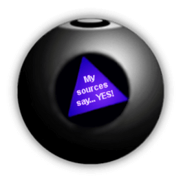

## Table of Contents
{: .no_toc .text-delta }

{: .fs-2 }
- TOC
{:toc}

---

{:.note}
📖 This page is a condensed version of [CSAwesome Topic 2.3](https://runestone.academy/ns/books/published/csawesome2/topic-2-3-ifs.html) 

---

## `if` Statements (Conditional Blocks)

The statements in a Java main method normally run or _execute one at a time_ in the order they are found, sequentially from top to bottom. **`if` statements** (also called **conditionals** or **selection**) are blocks of code that change the flow of control through the program so that some code is only run when some condition is true. 

**If statements** are found in all programming languages as a way to _make choices_. 
* In an if statement, if the condition is `true` then the next statement or a block of statements will execute.
* If the condition is `false` then the next statement or block of statements is skipped.


A **conditional** uses the keyword ``if`` followed by a **boolean expression** inside of  an open parenthesis ``(`` and a close parenthesis ``)`` and then followed by a single statement or block of statements. The open curly brace ``{`` and a close curly brace ``}`` are used to group a block of statements together.  

{:.highlight}
It is recommended to _always include the curly braces_ even if you have just one statement under the if statement! The questions you will see on the AP exam will usually use curly braces.

<div class="imp" markdown="block">

Examples of `if` statements: 

```java
// A single if statement
if (boolean expression)
  statement;

// A single if statement with {}
if (boolean expression) {
  statement;
}

// An if statement block
if (boolean expression) {
  statement1;
  statement2;
  ...
  statementN;
}
```

> Note that there is no semicolon (`;`) at the end of the **boolean expression** in an if statement, even if it is the end of that line. The semicolon goes at the end of the _whole_ if statement, often on the next line. Or `{ }` are used to mark the beginning and end of the block of code under the if condition.

</div>

Examine the example below. Imagine that your cell phone wanted to remind you to take an umbrella `if` it was currently raining in your area when it detected that you were leaving the house:

```java
boolean isRaining = true;
if (isRaining) {
  System.out.println("Take an umbrella!");
}
System.out.println("Drive carefully");
```
> The variable ``isRaining`` is a boolean variable that is either `true` or `false`. If it is true then the message ``Take an umbrella!`` will be printed and then execution will continue with the next statement which will print ``Drive carefully``.

### Relational Operators in If Statements
Most if statements have a boolean condition that uses **relational operators** like `==`, `!=`, `<`, `>`, `<=`, `>=`, as we saw in the last lesson.

{:.warning}
A common mistake in if statements is using `=` instead of `==` in the condition. You should always use `==` in the condition of an if statement to test a variable. One equal sign (`=`) _assigns_ a value to a variable, and two equal signs (`==`) _test_ if a variable has a certain value.

<!--
**If statements** are found in all programming languages as a way to choose between different paths in an algorithm. An if statement is a type of **selection** statement that changes the sequential execution. It affects the flow of control by executing different segments of code based on the value of a **Boolean expression**.

If you’ve used block programming (Scratch, App Inventor, etc.), you’ve probably seen if-blocks before. Here’s a comparison:


## One-Way Selection

A **one-way selection** (`if` statement) is used when there is a segment of code to execute under a certain condition. The body is executed only when the Boolean expression is true; otherwise, it is skipped.


**Syntax:**

```java
// Single if
if (boolean expression)
    doStatement;

// If with block
if (boolean expression) {
    statement1;
    statement2;
}
````

Always use curly braces `{ }`, even for one statement.

---

## Two-Way Selection

If you want to pick between **two possibilities**, use `if` followed by `else`:

```java
// If-else block
if (boolean expression) {
    statement1;
    statement2;
} else {
    otherStatement;
    anotherStatement;
}
```

A **two-way selection** executes the `if` body when the condition is true, and the `else` body when false.


<div class="task" markdown="block">

**Coding Exercise: Coin Flip**

Type in your Codespace, press run, and then:

1. Change `isHeads` to `false`.
2. See what prints before `"after conditional"`.

```java
boolean isHeads = true;
if (isHeads) {
    System.out.println("Let's go to the game");
} else {
    System.out.println("Let's watch a movie");
}
System.out.println("after conditional");
```

</div>

---

<div class="task" markdown="block">

**Coding Exercise: Driver's License**

Test this with two values of `age`:

* Current code allows licenses at `16`.
* Change it so licenses can be obtained at `15`.

```java
int age = 16;
if (age >= 16) {
    System.out.println("You can get a driver's license in most states!");
} else {
    System.out.println("Sorry, you need to be older.");
}
```

</div>

---

<div class="task" markdown="block">

**Coding Exercise: Score Feedback**

Add an `else` that prints `"Good job!"` if `score > 20`. Test with values above and below 20.

```java
int score = 8;
if (score <= 9) {
    System.out.println("Try for a higher score!");
}
// Your else here
```

</div>

---

## Common Errors with If Statements

* Always use `{ }` to group statements.
* Don’t put a semicolon after `if (condition);`
* Use `==` for comparison, not `=`.
* An `else` pairs with the **closest** preceding `if`.

<div class="task" markdown="block">

**Fix the Code: Missing Curly Braces**

Only print `"Wear a coat"` and `"Wear gloves"` when `isCold` is true.

```java
boolean isCold = false;
if (isCold = true);
    System.out.println("Wear a coat");
    System.out.println("Wear gloves");
```

</div>

---

## Group Challenge: Magic 8 Ball

Have the program:

1. Pick a random number from 1–8.
2. Use if statements to print a matching response.
3. Add a coin toss method that prints `"Lucky!"` or `"No Luck!"`.



---

## AP Practice

<details>
<summary><strong>AP 2-3-1</strong></summary>

```java
int speed = 35;
boolean rain = false;

if (rain) {
   speed -= 10;
}
if (rain == false) {
  speed += 5;
}
if (speed > 35) {
   speed = speed - 2;
}
System.out.println(speed);
```

**Answer:** `38` — First if is false; second and third are true.

</details>

<details>
<summary><strong>AP 2-3-2</strong></summary>

```java
int x = 5;
if (x < 5) {
   x = 3 * x;
}
if (x % 2 == 1) {
   x = x / 2;
}
System.out.print(2 * x + 1);
```

**Answer:** `5` — First if false; second if true (x becomes 2); output is `2*2+1=5`.

</details>

<details>
<summary><strong>AP 2-3-if-else</strong></summary>

```java
if (x >= 80) {
   System.out.println("High");
}
if (x >= 50) {
   System.out.println("Middle");
} else {
   System.out.println("Low");
}
```

**Answer:** `80` — Prints both `"High"` and `"Middle"`, showing a logic error.
To fix, chain with `else if`.

</details>

## Summary

* Selection statements change sequential execution.
* `if` executes a block only if a condition is true.
* `if-else` chooses between two paths.
* Always test both branches of an `if-else`.

-->

---

#### Acknowledgement
{: .no_toc }

Content on this page is adapted from [Runestone Academy - Barb Ericson, Beryl Hoffman, Peter Seibel](https://runestone.academy/ns/books/published/csawesome2/csawesome2.html).
{: .fs-2 }
