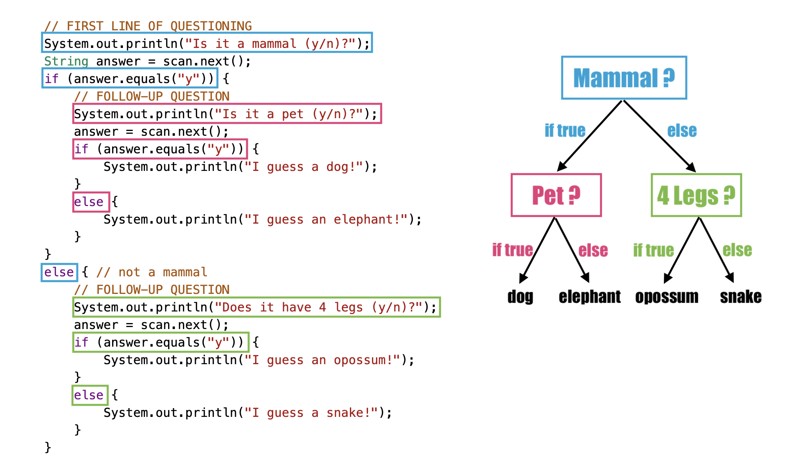

## Table of Contents
{: .no_toc .text-delta }

{: .fs-2 }
- TOC
{:toc}

---

{:.note}
📖 This page is a condensed version of [CSAwesome Topic 2.4](https://runestone.academy/ns/books/published/csawesome2/topic-2-4-nested-ifs.html) 

---

## Multiway Selection: Nested `if` Statements

If statements can be **nested** _inside_ other if statements, allowing for more possible branches in a program. 
> This is like asking a "follow-up question" _after_ passing an initial one.


```java
if (boolean expression) {
    // This "nested if" is evaluated when the outer is true
    if (boolean expression) {
        statement;
    }
}
```
> The boolean expression of the **nested** (_inner_) `if` statement is evaluated ONLY when the boolean expression of the _outer_ `if` statement evaluates to `true`.

#### Example: 20 Questions
{:.no_toc}

Have you ever played **20 Questions**? 20 Questions is a game where one person thinks of an object, and the other players ask up to 20 questions to guess what it is.

There is great online version called [Akinator](https://en.akinator.com/) that guesses whether you are thinking of a real or fictional character by asking you questions. Akinator is a simple _artificial intelligence_ algorithm that uses a **decision tree** of yes or no questions to pinpoint the answer.
> Although Akinator needs a very large decision tree, we can create a guessing game for just animals using a much smaller number of `if`-statements.

Here's a simplified version of what the code might look like, using **nested ifs**:



### "Dangling" `else` Problem

Sometimes with nested ifs we find a **"dangling else"** clause that could potentially belong to either `if` statement. This may cause unintended behavior. 

{:.warning}
The rule is that the `else` clause will always be a part of the **closest unmatched** `if` statement in the same block of code, _regardless of indentation_.

```java
// Nested if with dangling else
if (boolean expression)
    if (boolean expression)
        doThisStatement;
else  // belongs to CLOSEST if
    doThatStatement;
```

You can (_and should_) use **curly braces** (`{}`) to enclose a nested `if` like below:

```java
if (boolean expression)
{
    if (boolean expression)
        doThisStatement;
}
else  // belongs to FIRST if
    doThatStatement;
```
> Now the `else` clause belongs to the top level `if` block instead!

In fact many experienced Java programmers _always_ use curly braces, even when
they are not technically required, to avoid this kind of confusion.

---

## Multiway Selection: `else if` Blocks

With **nested if/else** structures, we can pick between 3 or more branches of code. Another type of **multi-way selection** is possible with `else if` blocks. This is convenient when there are a _series of related expressions_ to be tested, with different segments of code for each **condition**. 


Multi-way selection with `else if` is performed such that no more than one segment of code is executed based on the _first expression that evaluates to true_ in the block. If no expression evaluates to true, and there is a trailing `else` statement provided, then the body of the `else` is executed.

<div class="imp" markdown="block">
    
Syntax for **multi-way selection** with `else if`:

```java
if (boolean expression) {
  statement1;
}
else if (boolean expression) {
  statement2;
}
else {
  statement3;
}
```
> This structure can accomodate more than 3 choices easily – just add an `else if` clause for every possibility _after_ the first `if` statement, and _before_ the final `else` block. 

</div>

Here is a **flowchart** for a conditional structure with 3 options like in the code above:


Here is a code example of a conditional structure that implements `else if` to test **multiple possibilities** for a single value:

```java
int x = 2;
if (x < 0) {
  System.out.println("x is negative");
}
else if (x == 0) {
  System.out.println("x is 0");
}
else {
  System.out.println("x is positive");
}
System.out.println("after conditional block");
```
> Try changing the value of `x` to get each of the three possible lines in the conditional to print.

{:.highlight}
Another way to handle 3 or more **conditional cases** is to use the ``switch`` and ``case`` keywords, but these will not be on the exam. For a tutorial on using switch-case, see the [Java Documentation](https://docs.oracle.com/javase/tutorial/java/nutsandbolts/switch.html).

<div class="task" markdown="block">

1. Initialize a variable `battery` of type `int` that represents your phone battery percentage. 
2. Set up the structure of a conditional block with **4 possibilities**, testing the value of `battery`. 
3. Complete the code so the program prints:

* `"Unplug your phone!"` if `battery > 95`
* `"Plug in your phone!"` if `battery < 50`
* `"Low power mode!"` if `battery <= 20`
* `"All okay!"` otherwise

</div>

### Separate `if` Statements vs. `else if` Chains

The `else if` connection is necessary if you want to chain multiple conditionals together, and operates differently than having a bunch of separate `if` statements.  

<div class="task" markdown="block">

This program uses 4 separate `if` statements instead of the `if/else-if` pattern. First, trace through the code to see why it prints out the incorrect grade. Then, fix it by adding `else if` blocks to connect the conditions.

```java
import java.util.Scanner;

public class Main {
    public static void main(String[] args) {
        Scanner scan = new Scanner(System.in);
        int score = scan.nextInt();
        String grade = "";

        if (score >= 90) {
            grade = "A";
        }
        if (score >= 80) {
            grade = "B";
        }
        if (score >= 70) {
            grade = "C";
        }
        if (score >= 60) {
            grade = "D";
        }
        else {
            grade = "F";
        }

        System.out.println(grade);
    }
}
```

</div>


---

## Summary

- (AP 2.4.A.1) **Nested** if statements consist of if, if-else, or if-else-if statements within if, if-else, or if-else-if statements.
- (AP 2.4.A.2) The **boolean expression** (condition) of the _inner_ nested if statement is evaluated only if the Boolean expression of the _outer_ if statement evaluates to true.
- (AP 2.4.A.3) A **multi-way selection** (if/else-if) is used when there are a series of expressions with different segments of code for each condition. Multi-way selection is performed such that no more than one segment of code is executed based on the first expression that evaluates to true. If no expression evaluates to true and there is a trailing else statement, then the body of the else is executed.

```java
// Multiway selection with else if
if (boolean expression) {
    statement1;
}
else if (boolean expression) {
    statement2;
}
else {
    statement3;
}
```

---

#### Acknowledgement
{: .no_toc }

Content on this page is adapted from [Runestone Academy - Barb Ericson, Beryl Hoffman, Peter Seibel](https://runestone.academy/ns/books/published/csawesome2/csawesome2.html).
{: .fs-2 }
