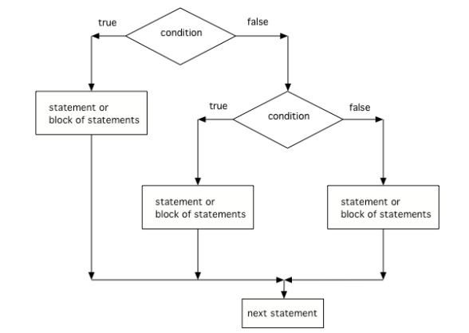

## Table of Contents
{: .no_toc .text-delta }

{: .fs-2 }
- TOC
{:toc}

---

{:.note}
📖 This page is a condensed version of [CSAwesome Topic 2.4](https://runestone.academy/ns/books/published/csawesome2/topic-2-4-nested-ifs.html) 

---

## Multiway Selection: Nested `if` Statements

If statements can be **nested** inside other if statements. This is like asking a "follow-up question" after asking passing the first one.

{:.warning}
Sometimes with _nested ifs_ we find a **"dangling else"** that could potentially belong to either `if` statement. The rule is that the `else` clause will always be a part of the **closest unmatched** `if` statement in the same block of code, regardless of indentation.

```java
    // Nested if with dangling else
    if (boolean expression)
       if (boolean expression)
          Do statement;
       else  // belongs to closest if
          Do other statement;
```

#### 💻 In-Class Activity: 20 Questions
{:.no_toc}

Have you ever played **20 Questions**? 20 Questions is a game where one person thinks of an object, and the other players ask up to 20 questions to guess what it is.

There is great online version called [Akinator](https://en.akinator.com/) that guesses whether you are thinking of a real or fictional character by asking you questions. Akinator is a simple _Artificial Intelligence_ algorithm that uses a **decision tree** of yes or no questions to pinpoint the answer.
> Although Akinator needs a very large decision tree, we can create a guessing game for just animals using a much smaller number of `if`-statements.


<div class="task" markdown="block">

1. Go to <a href="https://runestone.academy/ns/books/published/csawesome/Unit3-If-Statements/topic-3-3-if-else.html?mode=browsing"><button type="button" name="button" class="btn">CSAwesome Topic 3.3</button></a> 
2. Make sure you **SIGN IN**!
3. Complete the **Programming Challenge: 20 Questions** activity in pairs.

</div>


Using if/else statements, you can even pick between 3 or more possibilites. Just add **else if** for each possibility after the first **if**, and **else** before the last possibility.

```java
// 3 way choice with if, else if, else
if (boolean expression) {
  statement1;
}
else if (boolean expression) {
  statement2;
}
else {
  statement3;
}
```

<div class="task" markdown="block">

Run the code below and try changing the value of `x` to get each of the three possible lines in the conditional to print.
```java
int x = 2;
if (x < 0) {
  System.out.println("x is negative");
}
else if (x == 0) {
  System.out.println("x is 0");
}
else {
  System.out.println("x is positive");
}
System.out.println("after conditional");
```
</div>

Here is a flowchart for a conditional with 3 options like in the code above:



{:.highlight}
Another way to handle 3 or more conditional cases is to use the ``switch`` and ``case`` keywords, but these will not be on the exam. For a tutorial on using switch see the [Java Documentation](https://docs.oracle.com/javase/tutorial/java/nutsandbolts/switch.html).

<div class="task" markdown="block">

Finish the following code so that it prints "Plug in your phone!" if the battery is below 50, "Unplug your phone!" if it is equal to 100, and "All okay!" otherwise. Change the battery value to test all 3 conditions.

```java
int battery = 60;

System.out.println("All okay!");
```
</div>


<!--

If statements can be _nested_ inside other if statements. The Boolean expression of the inner nested if statement is evaluated only if the Boolean expression of the outer if statement evaluates to true.

```java
if (outerCondition) {
    // This nested if is executed only if outerCondition is true
    if (innerCondition) {
        statement;
    }
}
````

## Multiway Selection (else if)

A single `if-else` statement allows 2 branches of code. With nested `if-else`, we can select between 3 or more. In a multi-way selection, only the first matching condition’s body executes.

```java
// 3-way choice
if (condition1) {
    statement1;
} else if (condition2) {
    statement2;
} else {
    statement3;
}
```

---

<div class="task" markdown="block">

**Coding Exercise: Try Else If**

Type this in your Codespace and try changing `x` to get each of the three lines to print.

```java
public class TryElseIf {
    public static void main(String[] args) {
        double x = 0.8;
        if (x < 0.25) {
            System.out.println("first quartile");
        } else if (x < 0.5) {
            System.out.println("second quartile");
        } else if (x < 0.75) {
            System.out.println("third quartile");
        } else {
            System.out.println("fourth quartile");
        }
    }
}
```

</div>

---

<div class="task" markdown="block">

**Debug Exercise: Fix the Else-If Chain**

This program uses separate `if` statements instead of `if-else-if`. Fix it by adding `else` to connect the conditions.

```java
import java.util.Scanner;

public class IfDebug {
    public static void main(String[] args) {
        Scanner scan = new Scanner(System.in);
        int score = scan.nextInt();
        String grade = "";

        if (score >= 90) {
            grade = "A";
        }
        if (score >= 80) {
            grade = "B";
        }
        if (score >= 70) {
            grade = "C";
        }
        if (score >= 60) {
            grade = "D";
        } else {
            grade = "F";
        }

        System.out.println(grade);
    }
}
```

</div>

---

<div class="task" markdown="block">

**Coding Exercise: Battery Test**

Complete the code so it prints:

* `"Plug in your phone!"` if `battery < 50`
* `"Unplug your phone!"` if `battery > 100`
* `"All okay!"` otherwise

```java
import java.util.Scanner;

public class BatteryTest {
    public static void main(String[] args) {
        Scanner scan = new Scanner(System.in);
        int battery = scan.nextInt();

        // Your if-else-if code here
    }
}
```

</div>

---

## Dangling Else Statements

With nested ifs, an `else` always attaches to the **closest unmatched** `if` in the same block, regardless of indentation.

```java
// Dangling else example
if (condition1)
    if (condition2)
        doThis();
    else
        doThat(); // Belongs to inner if
```

To attach the `else` to the outer `if`, use curly braces:

```java
if (condition1) {
    if (condition2)
        doThis();
} else {
    doThat(); // Belongs to outer if
}
```

---

<div class="task" markdown="block">

**Coding Exercise: Dangling Else**

Run and observe which `if` the `else` attaches to.

```java
import java.util.Scanner;

public class DanglingElseTest {
    public static void main(String[] args) {
        Scanner in = new Scanner(System.in);
        boolean sunny = in.nextBoolean();
        boolean hot = in.nextBoolean();

        if (sunny)
            if (hot)
                System.out.println("Head for the beach!");
            else
                System.out.println("Bring your umbrella!");
    }
}
```

</div>

---

## Group Challenge: Adventure Game

One of the first text adventure games was [Colossal Cave Adventure](https://en.wikipedia.org/wiki/Colossal_Cave_Adventure). Let’s build a mini version.

<div class="task" markdown="block">

Add `else if` branches for `"s"`, `"e"`, and `"w"`, and an `else` for invalid input. Write static methods for each location.

```java
import java.util.Scanner;

public class Adventure {
    private static Scanner scan = new Scanner(System.in);

    public static void main(String[] args) {
        System.out.println("You are on an island surrounded by water.");
        System.out.println("There is a path north to the forest, south to the sea, ? to the east, and ? to the west.");
        System.out.println("Which way do you want to go (n,e,s,w)?");
        String command = scan.next();

        if (command.equals("n")) {
            System.out.println("You go north.");
            forest();
        }
        // Add else if branches for s, e, w
        // Add an else message for invalid input

        System.out.println("End of adventure!");
    }

    public static void forest() {
        System.out.println("You enter a dark forest and see ?");
        System.out.println("Do you want to walk e or w?");
        String command = scan.next();
        if (command.equals("e")) {
            System.out.println("You move east and reach the sea");
            sea();
        }
    }

    public static void sea() {
        // Describe sea location and add movement logic
    }
}
```

</div>

---

## Summary

* Nested if statements: if, if-else, or if-else-if within other if structures.
* Inner conditions only evaluate if the outer condition is true.
* Multi-way selection (`if-else-if`) checks each condition in order until one matches.
* Use `{ }` to avoid dangling else confusion.

---

## AP Practice

<details>
<summary><strong>AP Nested If-Else</strong></summary>

**Question:** Which code prints `"High"` if `x >= 66`, `"Medium"` if `33 <= x <= 65`, and `"Low"` if `x < 33`?

**Correct Answer:** **II only**

Reason: II checks `x < 33` first, then `x < 66`, else `"High"`. I has off-by-one logic for 66, and III prints more than one output for some values.

</details>

-->

---

## Summary

- (AP 2.4.A.1) **Nested** if statements consist of if, if-else, or if-else-if statements within if, if-else, or if-else-if statements.
- (AP 2.4.A.2) The **boolean expression** (condition) of the _inner_ nested if statement is evaluated only if the Boolean expression of the _outer_ if statement evaluates to true.
- (AP 2.4.A.3) A **multi-way selection** (if-else-if) is used when there are a series of expressions with different segments of code for each condition. Multi-way selection is performed such that no more than one segment of code is executed based on the first expression that evaluates to true. If no expression evaluates to true and there is a trailing else statement, then the body of the else is executed.

```java
// 3 way choice with else if
if (boolean expression) {
    statement1;
}
else if (boolean expression) {
    statement2;
}
else {
    statement3;
}
```

---

#### Acknowledgement
{: .no_toc }

Content on this page is adapted from [Runestone Academy - Barb Ericson, Beryl Hoffman, Peter Seibel](https://runestone.academy/ns/books/published/csawesome2/csawesome2.html).
{: .fs-2 }
