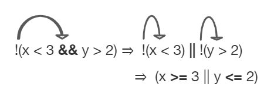

## Table of Contents
{: .no_toc .text-delta }

{: .fs-2 }
- TOC
{:toc}

---

{:.note}
📖 This page is a condensed version of [CSAwesome Topic 2.6](https://runestone.academy/ns/books/published/csawesome2/topic-2-6-comparing-booleans.html) 

---

## Equivalent Boolean Expressions

What if you heard a rumor about a senior at your high school? And then you heard that the rumor wasn't true - it wasn't a senior at your high school. Which part of "a senior at your high school" wasn't true? Maybe they weren't a senior? Or maybe they didn't go to your high school? 

You could write this as a logic statement like below using **negation** (``!``) and the **and** (``&&``) operator since both parts have to be true for the whole statement to be true: 

```
a = "senior"
b = "at our high school"

!(a && b)
```
> This expression means it is **NOT** true that `a` it is a senior and `b` someone at our high school.

{: .highlight } 
⚖️ Two Boolean expressions are **equivalent** if they _evaluate to the same value_ in all cases. **Truth tables** can be used to prove Boolean expressions are equivalent.

In this lesson, you will learn about De Morgan's Laws which simplify statements like this. We know that !(a senior at our high school) could mean !(a senior) or !(at our high school). Let's learn more about De Morgan's Laws.

### De Morgan's Laws

De Morgan's Laws were developed by Augustus De Morgan in the 1800s.  They show how to _simplify_ the **negation of a complex boolean expression**, which is when there are multiple expressions joined by an **and** (``&&``) or **or** (``||``), such as ``(x < 3) && (y > 2)``. When you _negate_ one of these complex expressions, you can simplify it by flipping the operators and end up with an **equivalent expression**. 

<div class="imp" markdown="block">
        
In Java, **De Morgan's Laws** are written with the following operators:
-  ``!(a && b)`` is equivalent to ``!a || !b``
-  ``!(a || b)`` is equivalent to ``!a && !b``


> Here's an easy way to remember De Morgan's Laws: **move the NOT inside, AND becomes OR** and **move the NOT inside, OR becomes AND**.

</div>

Going back to our example above, `not(a senior AND at our high school)` is **equivalent** to `not(a senior) OR not(at our high school)` using De Morgan's Laws:

```
a = "senior"
b = "at our high school"

!(a && b) is equivalent to !a || !b
```
        
You can also _simplify_ negated boolean expressions that have **relational operators** like ``<``, ``>``, ``==``. You can move the negation inside the parentheses by flipping the relational operator to its opposite sign. 
> For example, _not (c equals d)_ is the same as saying _c does not equal d_.

{: .highlight } 
An easy way to remember this kind of _distribution_ is to **move the NOT, flip the sign**. 
> Notice that ``==`` becomes ``!=``, but ``<`` becomes ``>=``,  ``>`` becomes ``<=``, ``<=`` becomes ``>``, and ``>=`` becomes ``<`` where the sign is flipped and an equal sign may also be added or removed.

  - ``!(c == d)`` is equivalent to ``c != d``
  - ``!(c != d)`` is equivalent to ``c == d``
  - ``!(c < d)`` is equivalent to ``c >= d``
  - ``!(c > d)`` is equivalent to ``c <= d``
  - ``!(c <= d)`` is equivalent to ``c > d``
  - ``!(c >= d)`` is equivalent to ``c < d``

### Truth Tables

Although you do not have to memorize De Morgan's Laws for the CSA Exam, you should be able to show that two boolean expressions are equivalent. One way to do this is by using **truth tables**. 

For example, we can show that ``!(a && b)`` is equivalent to ``!a || !b`` by constructing the truth table below and seeing that they give identical results for the 2 expressions (the last 2 columns in the table below are identical!).

| a     | b     | `!(a && b)` | `!a \|\| !b` |
|-------|-------|-----------|----------|
| true  | true  | false     | false    |
| false | true  | true      | true     |
| true  | false | true      | true     |
| false | false | true      | true     |

### Simplifying Boolean Expressions

Often, you can _simplify_ boolean expressions to **create equivalent expressions**. 

For example, applying De Morgan's Laws to ``!(x < 3 && y > 2)`` yields ``!(x < 3) || !(y > 2)`` as seen in the figure below. This can then be simplified further by flipping the relational operators to remove the not.  So, ``!(x < 3) || !(y > 2)`` is simplified to ``(x >= 3 || y <= 2)`` where the relational operators are flipped and the negation is removed.



#### Truth Tables Practice
{:.no_toc}

<div class="task" markdown="block">
        
📝 Explore the following problems with your group on the worksheet. 

Assume that ``x`` is an _integer_ value, for example -1, 0, or 1.

1. Complete a **truth table** for the boolean expression: ``!(x == 0 || x >= 1)``.
   > * Is this the set of positive or negative numbers?
   > * Is the expression true when ``x`` is positive?
   > * Or is it true when ``x`` is negative?
   > * You can test out the values when ``x`` is 1, -1, or 0. _Note that 0 is not considered positive or negative._ 

3. Complete a truth table for the boolean expression: ``!(x == 0) && !(x >= 1)``.
   > * Is this the set of positive or negative numbers?

5. Complete a truth table for the boolean expression: ``(x != 0) && (x < 1)``.
   > * Is this the set of positive or negative numbers?

7. Are the 3 boolean expressions equivalent? Why or why not?

</div>

---

## Summary

- (AP 2.6.A.1)	Two Boolean expressions are _equivalent_ if they evaluate to the same value in all cases. Truth tables can be used to prove Boolean expressions are equivalent.
- (AP 2.6.A.2) De Morgan’s Laws can be applied to Boolean expressions to create equivalent ones:

  - ``!(a && b)`` is equivalent to ``!a || !b``
  - ``!(a || b)`` is equivalent to ``!a && !b``

- A negated expression with a relational operator can be simplified by flipping the relational operator to its opposite sign.

  - ``!(c == d)`` is equivalent to ``c != d``
  - ``!(c != d)`` is equivalent to ``c == d``
  - ``!(c < d)`` is equivalent to ``c >= d``
  - ``!(c > d)`` is equivalent to ``c <= d``
  - ``!(c <= d)`` is equivalent to ``c > d``
  - ``!(c >= d)`` is equivalent to ``c < d``

- (AP 2.6.B.1)	Two different variables can hold references to the same object. Object references can be compared using ``==`` and ``!=``. (Two object references are considered **aliases** when they both reference the same object.)
- (AP 2.6.B.2)	An object reference can be compared with ``null``, using ``==`` or ``!=``, to determine if the reference actually references an object.
- (AP 2.6.B.3)	Classes often define their own equals method, which can be used to specify the criteria for equivalency for two objects of the class. The equivalency of two objects is most often determined using attributes from the two objects. 

<!--
## Comparing Booleans

You can compare booleans directly with `==` and `!=`.  
- `==` checks if two boolean values are equal.  
- `!=` checks if they are not equal.

<div class="task" markdown="block">

**Coding Exercise: Boolean Comparison**

Test both `true` and `false` values for `isSunny` and `isWarm`.

```java
boolean isSunny = true;
boolean isWarm = false;

if (isSunny == true) {
    System.out.println("It's sunny");
}

if (isWarm != true) {
    System.out.println("It's not warm");
}
````

</div>

---

## Logical Equivalences

Certain boolean expressions can be rewritten without changing their meaning. This is useful for simplifying logic and avoiding common mistakes.

Example:

```java
!(x < 5)
```

is equivalent to:

```java
x >= 5
```

---

## De Morgan’s Laws

De Morgan’s Laws show how to distribute `!` (NOT) over `&&` (AND) and `||` (OR):

1. `!(A && B)` is the same as `!A || !B`
2. `!(A || B)` is the same as `!A && !B`

**Mnemonic:** Negating flips the operator and negates each condition.

---

### Example 1

```java
!(x > 0 && y > 0)
```

is equivalent to:

```java
x <= 0 || y <= 0
```

---

### Example 2

```java
!(x > 0 || y > 0)
```

is equivalent to:

```java
x <= 0 && y <= 0
```

---

## Practice with De Morgan’s Laws

<div class="task" markdown="block">

**Coding Exercise: Applying De Morgan**

Rewrite each condition using De Morgan’s Laws.

```java
boolean raining = true;
boolean cold = false;

if (!(raining && cold)) {
    System.out.println("Nice weather");
}

if (!(raining || cold)) {
    System.out.println("Perfect weather");
}
```

* First if: `!raining || !cold`
* Second if: `!raining && !cold`

</div>

---

## Summary

* Use `==` and `!=` to compare booleans directly.
* Negating a compound condition flips the operator (`&&` ↔ `||`) and negates each part.
* De Morgan’s Laws are helpful for simplifying conditions and avoiding logic errors.

---

## AP Practice

<details>
<summary><strong>Question 1</strong></summary>

Which of the following is equivalent to `!(a && b)`?

A. `!a || !b`
B. `!a && !b`
C. `a || b`

**Answer:** **A** — De Morgan’s Law: `!(A && B)` ≡ `!A || !B`.

</details>

<details>
<summary><strong>Question 2</strong></summary>

Which of the following is equivalent to `!(a || b)`?

A. `!a || !b`
B. `!a && !b`
C. `a && b`

**Answer:** **B** — De Morgan’s Law: `!(A || B)` ≡ `!A && !B`.

</details>

-->

---

#### Acknowledgement
{: .no_toc }

Content on this page is adapted from [Runestone Academy - Barb Ericson, Beryl Hoffman, Peter Seibel](https://runestone.academy/ns/books/published/csawesome2/csawesome2.html).
{: .fs-2 }
