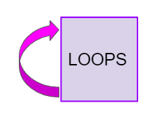
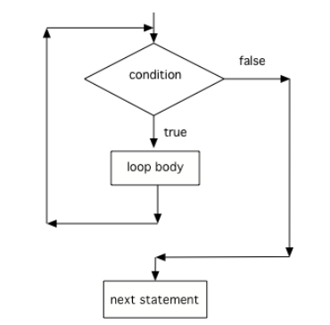

## Table of Contents
{: .no_toc .text-delta }

{: .fs-2 }
- TOC
{:toc}

---

{:.note}
📖 This page is a condensed version of [CSAwesome Topic 2.7](https://runestone.academy/ns/books/published/csawesome2/topic-2-7-while-loops.html) 

<div style="text-align: center;">
<span class="highlighter-green"> 
<strong>✴✴✴ NEW UNIT/SECTION! ✴✴✴</strong><br>Create a blank Java program to take your class notes in for the next few lessons.<br><em>Click on the collapsed heading below for GitHub instructions</em> ⤵  
</span>
</div>

<html>
  <details>
    <summary>📓 <strong class="text-green-200">NOTES PROGRAM SETUP INSTRUCTIONS</strong></summary>

<div class="setup" markdown="block">

1. Go to the public template **repository** for our class: [BWL-CS Java Template](https://github.com/BWL-CS/java-template)
2. Click the <button type="button" name="button" class="btn btn-green">Use this template</button> button above the list of files then select `Create a new repository`
3. Specify the **repository name**: `CS2-Unit-2-B-Notes`
4. For the **description**, write: `Iteration/repetition (while loops, for loops)`
5. Click <button type="button" name="button" class="btn btn-green">Create repository</button>
    > Now you have **your own personal copy** of this starter code that you can always access under the `Your repositories` section of GitHub! 📂
6. Now on your repository, click <button type="button" name="button" class="btn btn-green"> < > Code </button> and select the `Codespaces` tab
7. Click `Create Codespace on main` and wait for the environment to load, _then you're ready to code_!
8. 📝 Take notes in this Codespace during class, writing **code** & **comments** along with the instructor.

</div>

<br>

<div class="warn" markdown="block">

🛑 When class ends, don't forget to **SAVE YOUR WORK**! **Codespaces** are TEMPORARY editing environments, so you need to COMMIT changes properly in order to update the main **repository** for your program. 

_There are multiple steps to saving in GitHub Codespaces:_

1. Navigate to the `Source Control` menu on the _LEFT_ sidebar
2. Click the <button type="button" name="button" class="btn btn-green">commit changes</button> button on the _LEFT_ menu
3. Type a brief **commit message** at the top of the file that opens, for example: `updated Main.java`
4. Click the small `✔️` **checkmark** in the _TOP RIGHT_ corner
5. Click the <button type="button" name="button" class="btn btn-green">sync changes</button> button on the _LEFT_ menu
6. _Finally you can close your Codespace!_

</div>

</details>

</html>

---

## While Loops



When you play a song on Spotify, you can set it to **loop**, which means that when it reaches
the end, it starts over at the beginning. 

🔁 A **loop** in programming, also called **iteration** or **repetition**, is a way to repeat one or more statements. If
you didn't have loops to allow you to repeat code, your programs would get very
long very quickly! Using a sequence of code, selection (ifs), and repetition
(loops), the **control structures** in programming, you can construct an
algorithm to solve almost any programming problem!

A ``while`` loop executes the body of the loop as long as (or while) a ``boolean``
condition is true. When the condition is false, we exit the loop and continue
with the statements that are after the body of the ``while`` loop. If the
condition is false the first time you check it, the body of the loop will not
execute.

Notice the ``while`` statement looks a lot like an ``if`` statement, but it runs
more than once. The curly braces (``{}``) are optional when there is just 1
statement following the condition, but required if there are more than 1
statement in the loop. In the AP exam, they will always use curly braces, which
is a good practice to follow.

```java

    // The statements in an if run one time if the condition is
    // is true and zero times if it is false.
    if (condition) {
        statements;
    }

    // The statements in a while loop run zero or more times,
    // determined by how many times the condition is true
    while (condition) {
        statements;
    }
```

Here's what the flow of control looks like in a Java while loop. Notice that while the condition is true, the loop body is repeated.



### Three Steps to Writing a Loop

The simplest loops are **counter-controlled loops** like below, where the **loop control variable** is a counter that controls how many times to repeat the loop. There are 3 steps to writing a loop using this loop control variable as seen below in a loop that counts from 1 to 10.


<div class="imp" markdown="block">

🔄 Remember these 3 steps to writing a loop:

1. **Initialize** the loop variable (before the ``while`` loop)
2. **Test** the loop variable (in the loop header)
3. **Change** the loop variable (in the while loop body at the end)

</div>

### Tracing Loops

A really important skill to develop is the ability to trace the values of variables and how they change during each iteration of a loop. 

You can create a **tracing table** that keeps track of the variable values each time through the loop as shown below.  This is very helpful on the exam. Studies have shown that students who create tables like this do much better on code tracing problems on multiple choice exams.


> A trace table shows the values of all of the **variables** each time through the loop. `Iteration 0` means **before** the loop. When you are tracing through code, pretend to be the computer running the code line by line, repeating the code in the loop, and keeping track of the variable values and output.

<a href="https://www.youtube.com/watch?v=TZss5ukwN8s" target="_blank"><button type="button" name="button" class="btn">📺 VIDEO: Loop Tracing</button></a>

### Common Errors with Loops

One common error with loops is to accidentally create an ♾️ **infinite loop** ♾️. An
infinite loop is one that never stops because the _condition is always true_.

Sometimes we will write an infinite loop on purpose like this:

```java
   while (true) {
       System.out.println("This is a loop that never ends");
   }
```

But if we create an infinite loop by accident, our program may seem to get
stuck. For example look at this loop:

```java

   int i = 0;
   while (i < 10) {
       System.out.println(i);
   }
```
> That loop looks a lot like loops earlier in this chapter but it is actually an
infinite loop. Can you see why?

{:.warning}
The problem in this loop—and a common way to **accidentally create an infinite
``while`` loop**—is that although it includes steps 1 and 2 (_initializing the loop
variable and testing it_) it forgot step 3 and never changes the loop variable.
The loop variable, ``i``, starts at ``0`` and the loop loops as long as ``i <
10`` which will always be true because there’s no code in the loop that changes
``i``. The simple fix is to add a line that increments ``i``:

```java
   int i = 0;
   while (i < 10) {
       System.out.println(i);
       i++;
   }
```

{:.warning}
Another common error with loops is an **off-by-one error** where the loop runs
one too many or one too few times. This is usually a problem with step 2 (the
test condition) and using the incorrect relational operator ``<`` or ``<=``.


### Input-Controlled Loops

You can use a ``while`` loop to repeat the body of the loop a certain number of times as shown above. 

{:.highlight}
However, a ``while`` loop is typically used _when you do NOT know how many times_ the loop will execute. It is often used for a **input-controlled loop** where the user's input indicates when to stop. 

For example, in the <a href="https://firewalledreplit.com/@BerylHoffman/Magpie-ChatBot-Lab-v2#Main.java" target="_blank">Magpie chatbot lab on replit.com</a> below, the while loop stops when you type in "Bye". The stopping value is often called the **sentinel value** for the loop. Notice that if you type in "Bye" right away, the loop will never run. If the loop condition evaluates to false initially, the loop body is not executed at all. Another way to stop the loop prematurely is to put in a ``return`` statement that makes it immediately return from the method.

<html>
<iframe height="700px" width="100%" style="max-width:90%; margin-left:5%" src="https://firewalledreplit.com/@BerylHoffman/Magpie-ChatBot-Lab-v2?lite=true#Main.java" scrolling="no" frameborder="no" allowtransparency="true" allowfullscreen="true" sandbox="allow-forms allow-pointer-lock allow-popups allow-same-origin allow-scripts allow-modals"></iframe> 
</html>


#### 💻 In-Class Activity: Guessing Game
{:.no_toc}

<div class="task" markdown="block">

1. Go to <a href="https://runestone.academy/ns/books/published/csawesome/Unit4-Iteration/topic-4-1-while-loops.html?mode=browsing"><button type="button" name="button" class="btn">CSAwesome Topic 4.1</button></a> 
2. Make sure you **SIGN IN**!
3. Complete the **Programming Challenge: Guessing Game** activity in pairs.

</div>

<!--

## While Loops

When you play a song, you can set it to loop — meaning when it reaches the end, it starts over from the beginning. A **loop** in programming, also called **iteration** or **repetition**, repeats one or more statements. Without loops, your programs would quickly become very long because you’d have to repeat code manually.

Programming uses three main control structures to build algorithms:  
1. **Sequence** – running code in order.  
2. **Selection** – using `if` statements to choose between paths.  
3. **Repetition** – using loops to repeat code.

A `while` loop executes its body **as long as** a boolean condition is true. When the condition becomes false, the loop exits and the program continues after the loop.

---

## Example: While Loop

<div class="task" markdown="block">

**Coding Exercise: Countdown**

Type this in your Codespace, run it, and observe the output.

```java
int count = 5;

while (count > 0) {
    System.out.println(count);
    count = count - 1;
}

System.out.println("Blastoff!");
````

</div>

---

## Infinite Loops

If the loop’s condition never becomes false, you get an **infinite loop**.

<div class="task" markdown="block">

**Debug Exercise: Stop the Infinite Loop**

This loop never ends. Fix it so it counts down to 0.

```java
int count = 5;

while (count > 0) {
    System.out.println(count);
    // missing update statement!
}

System.out.println("Done");
```

</div>

---

## Sentinel Loops

A **sentinel loop** runs until a special value (sentinel) is entered.

<div class="task" markdown="block">

**Coding Exercise: Sentinel Loop**

This program reads integers until the user enters `-1`.

```java
import java.util.Scanner;

public class SentinelExample {
    public static void main(String[] args) {
        Scanner scan = new Scanner(System.in);
        int number = 0;

        while (number != -1) {
            System.out.print("Enter a number (-1 to quit): ");
            number = scan.nextInt();
        }

        System.out.println("Done");
    }
}
```

</div>

---

## Summary

* A `while` loop repeats code while its condition is true.
* Without an update to make the condition false, you get an infinite loop.
* A sentinel loop stops when a special value is entered.

---

## AP Practice

<details>
<summary><strong>Question 1</strong></summary>

What will this print?

```java
int x = 0;
while (x < 3) {
    System.out.print(x + " ");
    x++;
}
```

**Answer:** `0 1 2` — the loop runs while `x` is 0, 1, and 2.

</details>

<details>
<summary><strong>Question 2</strong></summary>

What’s wrong with this loop?

```java
int x = 0;
while (x < 3) {
    System.out.println("Hello");
}
```

**Answer:** It’s an infinite loop because `x` never changes inside the loop.

</details>

-->

---

#### Acknowledgement
{: .no_toc }

Content on this page is adapted from [Runestone Academy - Barb Ericson, Beryl Hoffman, Peter Seibel](https://runestone.academy/ns/books/published/csawesome2/csawesome2.html).
{: .fs-2 }
