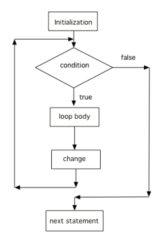

## Table of Contents
{: .no_toc .text-delta }

{: .fs-2 }
- TOC
{:toc}

---

{:.note}
📖 This page is a condensed version of [CSAwesome Topic 2.8](https://runestone.academy/ns/books/published/csawesome2/topic-2-8-for-loops.html) 

---

## For Loops

Another type of loop in Java is a **for loop**. This is usually used when _you know how many times_ you want the loop to execute. It is often a simple **counter-controlled loop** to do the loop body a set number of times.

### Three Parts of a For Loop

<div class="imp" markdown="block">
  
A `for`-loop combines all 3 parts of writing a loop in one line to **initialize**, **test condition**, and **change** the loop control variable. The 3 parts are separated by **semicolons** (``;``):
```java
// LOOP HEADER
for (initialize; test condition; change) {
     // LOOP BODY
}
```
</div>

> The `for`-loop is like a **shortcut** way to write a `while` loop, with **all three steps** that you need in one line.


Watch the following <a href="https://www.youtube.com/watch?v=SEDnzXeb2hU&list=PLHqz-wcqDQIEP6p1_0wOb9l9aQ0qFijrP&index=9&ab_channel=colleenlewis"><button class="btn">📺 VIDEO</button></a> which **compares** a while loop and for loop line by line.

Here is a **control flow diagram** for a `for` loop:


> * The code in the **initialization** area is executed only _one time_ before the loop begins
> * The **test condition** is _checked each time_ through the loop and the loop continues as long as the condition is `true`
> * The **loop control variable change** is done at the _end_ of each execution of the body of the loop, just like a `while` loop.
> * When the loop condition becomes `false`, execution will continue at the next statement _after_ the body of the loop.

{:.highlight}
Two common _patterns_ in `for`-loops are to **count from `0` up to an number** (using `<`) or **count from `1` to a number** including the number (using `<=`). Remember that if you start at 0 use `<`, and if you start at 1, use `<=`. 

The two loops below using these two patterns both run 10 times: 
```java
// These loops both run 10 times
// If you start at 0, use <
for(int i = 0; i < 10; i++) {
    System.out.println(i);
}
// If you start at 1, use <=
for(int i = 1; i <= 10; i++) {
    System.out.println(i);
}
```
> The variable `i` (stands for **index**) is often used as a **counter** in `for`-loops.

### Decrementing Loops

You can also count **backwards** in a loop _starting from the last number_ and **decrementing** the loop counter down to 0 or 1. All 3 parts of the loop must change to count backwards including the test of when to stop. 
> For example, ``for (int i=5; i > 0; i--)`` counts from 5 down to 1.

<div class="task" markdown="block">

💬 **DISCUSS:** What do you think will happen when you run the code below? How would it change if you changed line 11 to initialize `i`'s value to 3? 

```java
String line1 = " bottles of pop on the wall";
String line2 = " bottles of pop";
String line3 = "Take one down and pass it around";

// loop 5 times (5, 4, 3, 2, 1)
for (int i = 5; i > 0; i--) {
    System.out.println(i + line1);
    System.out.println(i + line2);
    System.out.println(line3);
    System.out.println((i - 1) + line1);
    System.out.println();
}
```

</div>

#### 💻 In-Class Activity: Turtle Loops
{:.no_toc}

<div class="task" markdown="block">

1. Go to <a href="https://runestone.academy/ns/books/published/csawesome/Unit4-Iteration/topic-4-2-for-loops.html?mode=browsing"><button type="button" name="button" class="btn">CSAwesome Topic 4.2</button></a> 
2. Make sure you **SIGN IN**!
3. Complete the **Programming Challenge: Turtles Drawing Shapes** activity in pairs.

</div>

<!--
## For Loops

A `for` loop is a **count-controlled loop** — it runs a set number of times. In Java, a `for` loop has three parts inside parentheses:

```java
for (initialization; condition; update) {
    // loop body
}
````

1. **Initialization** – runs once at the start (e.g., `int i = 0`)
2. **Condition** – checked before each iteration; if false, the loop stops
3. **Update** – changes the loop control variable each time

---

## Example: Counting Up

<div class="task" markdown="block">

**Coding Exercise: Count from 1 to 5**

Type this in your Codespace and run it.

```java
for (int i = 1; i <= 5; i++) {
    System.out.println(i);
}
```

</div>

---

## Example: Counting Down

<div class="task" markdown="block">

**Coding Exercise: Countdown**

```java
for (int i = 5; i > 0; i--) {
    System.out.println(i);
}
System.out.println("Blastoff!");
```

</div>

---

## Using Loops with Arrays

<div class="task" markdown="block">

**Coding Exercise: Print an Array**

```java
int[] nums = {2, 4, 6, 8};

for (int i = 0; i < nums.length; i++) {
    System.out.println(nums[i]);
}
```

</div>

---

## Choosing While vs. For

* Use a `for` loop when you know exactly how many times to repeat.
* Use a `while` loop when repetition depends on a condition.

---

## Summary

* `for` loops combine initialization, condition, and update in one line.
* Ideal for counting a fixed number of times.
* Loop variable changes each iteration until the condition is false.

---

## AP Practice

<details>
<summary><strong>Question 1</strong></summary>

What does this loop print?

```java
for (int i = 0; i < 3; i++) {
    System.out.print(i + " ");
}
```

**Answer:** `0 1 2` — i starts at 0, increments to 2, stops at 3.

</details>

<details>
<summary><strong>Question 2</strong></summary>

Which loop is equivalent to:

```java
for (int i = 0; i < 5; i++) {
    System.out.println(i);
}
```

**Answer:**

```java
int i = 0;
while (i < 5) {
    System.out.println(i);
    i++;
}
```

</details>

-->

---

#### Acknowledgement
{: .no_toc }

Content on this page is adapted from [Runestone Academy - Barb Ericson, Beryl Hoffman, Peter Seibel](https://runestone.academy/ns/books/published/csawesome2/csawesome2.html).
{: .fs-2 }
