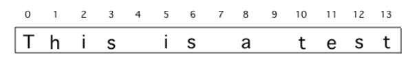

## Table of Contents
{: .no_toc .text-delta }

{: .fs-2 }
- TOC
{:toc}

---

{:.note}
📖 This page is a condensed version of [CSAwesome Topic 2.10](https://runestone.academy/ns/books/published/csawesome2/topic-2-10-strings-loops.html) 

---

## Loops & Strings

Loops are often used for **String Traversals** or **String Processing** where the code steps through a string character by character. We previously learned to use `String` **objects** and built-in string **methods** to process strings. In this lesson, we will write our own **loops** to process strings.

<div class="imp" markdown="block">

Remember that `String` objects are a **sequence of characters** where each character is stored at an **index** (_position_) starting from `0`:



🔄 **Loops** that process Strings should initialize the **loop control variable** (_counter_) at `0`... recall that the _first_ character in a Java `String` is located at **index** `0` and the _last_ character is at `length() - 1`.

</div>

The **String methods** (covered in [📓1.15 Notes](https://coderina.dev/javadocs/docs/unit1/notes115.html) lesson and given in the [AP CSA Reference Sheet](https://apstudents.collegeboard.org/ap/pdf/ap-computer-science-a-java-quick-reference_0.pdf)) that are most often used to process strings are:

- **`int length()`** : returns the **number of characters** in a String object.

- **`int indexOf(String str)`** : returns the **index** of the first occurrence of ``str`` or **-1** if ``str`` is not found.

- **`String substring(int from, int to)`** : returns the **substring** beginning at index `from` and ending at index `(to – 1)`.
  > - Note that  `s.substring(i,i+1)` returns the single character at index `i`.

- **`String substring(int from)`** : returns `substring(from, length())`.

### While Loops: Find and Replace

A `while` loop can be used with the ``String`` ``indexOf`` method to find certain characters in a string and process them, usually using the ``substring`` method:

```java
String s = "example";
int i = 0;
// Loop while there is still an 'a' in s
while (s.indexOf("a") >= 0)
{
     // Find and save the next index for an a
     i = s.indexOf("a");
     // Process the string at that index
     String ithLetter = s.substring(i,i+1);
     ...
}
```

📚 Google has been scanning old books and then using software to read the scanned text. But, the software can get things mixed up like using the number 1 for the letter l. 

<div class="task" markdown="block">
  
🔍 The following code loops through a string _finding and replacing_ all `1`'s with `l`'s: 

```java
String message = "Have a 1ong and happy 1ife";
int index = 0;

while (message.indexOf("1") >= 0)
{
    // Find the next index for 1
    index = message.indexOf("1");
    System.out.println("Found a 1 at index: " + index);
    // Replace the 1 with a l at index by concatenating substring up to
    // index and then the rest of the string.
    String firstpart = message.substring(0, index);
    String lastpart = message.substring(index + 1);
    message = firstpart + "l" + lastpart;
    System.out.println("Replaced 1 with l at index " + index);
    System.out.println("The message is currently " + message + " but we aren't done looping yet!");
}
System.out.println("Cleaned text: " + message);
```

1. Trace through the code below with a partner and explain how it works on the given message. You can run it line by line in the [Java visualizer](http://www.pythontutor.com/visualize.html#code=public%20class%20Test%0A%20%20%20%7B%0A%20%20%20%20%20%20public%20static%20void%20main%28String%5B%5D%20args%29%0A%20%20%20%20%20%20%7B%0A%20%20%20%20%20%20%20%20String%20message%20%3D%20%22Have%20a%201ong%20and%20happy%201ife%22%3B%20%0A%20%20%20%20%20%20%20%20int%20index%20%3D%200%3B%0A%20%20%20%20%20%20%20%20%0A%20%20%20%20%20%20%20%20//%20while%20more%201s%20in%20the%20message%0A%20%20%20%20%20%20%20%20while%20%28message.indexOf%28%221%22%29%20%3E%3D%200%29%0A%20%20%20%20%20%20%20%20%7B%0A%20%20%20%20%20%20%20%20%20%20%20//%20Find%20the%20next%20index%20for%201%0A%20%20%20%20%20%20%20%20%20%20%20index%20%3D%20message.indexOf%28%221%22%29%3B%0A%20%20%20%20%20%20%20%20%20%20%20System.out.println%28%22Found%20a%201%20at%20index%3A%20%22%20%2B%20index%29%3B%0A%20%20%20%20%20%20%20%20%20%20%20//%20Replace%20the%201%20with%20a%20l%20at%20index%20by%20concatenating%20substring%20up%20to%20index%20and%20then%20the%20rest%20of%20the%20string.%0A%20%20%20%20%20%20%20%20%20%20%20String%20firstpart%20%3D%20message.substring%280,index%29%3B%0A%20%20%20%20%20%20%20%20%20%20%20String%20lastpart%20%3D%20message.substring%28index%2B1%29%3B%0A%20%20%20%20%20%20%20%20%20%20%20message%20%3D%20firstpart%20%2B%20%22l%22%20%2B%20lastpart%3B%0A%20%20%20%20%20%20%20%20%20%20%20System.out.println%28%22Replaced%201%20with%20l%20at%20index%20%22%20%2B%20index%29%3B%20%20%20%20%20%20%20%0A%20%20%20%20%20%20%20%20%7D%0A%20%20%20%20%20%20%20%20System.out.println%28%22Cleaned%20text%3A%20%22%20%2B%20message%29%3B%0A%20%20%20%20%20%20%7D%0A%20%20%20%7D&cumulative=false&curInstr=21&heapPrimitives=nevernest&mode=display&origin=opt-frontend.js&py=java&rawInputLstJSON=%5B%5D&textReferences=false&curInstr=0). 
  > Note that ``indexOf`` here can work repeatedly to find the next occurrence of a 1 because they are replaced as soon as they are found.
2. Add code for a `counter` variable to count the number of 1's replaced in the message and print it out.
3. Change the `message` to have more mistakes with 1's to test it.

</div>

### For Loops: Reversing Strings

``for`` loops can also be used to process strings, especially in situations where you know you will visit every character.

{:.highlight} 
``while`` loops are often used with strings when you are looking for a certain character or substring in a string and **do not know how many times** the loop needs to run. ``for`` loops are used when **you know you want to visit every character**.

``for`` loops with strings usually start at `0` and use the string's `length()` for the **ending condition** to _step through the string_, character by character.

```java
String s = "example";
// loop through the string from 0 to length
for(int i=0; i < s.length(); i++)
{
      String ithLetter = s.substring(i,i+1);
      // Process the string at that index
      ...
}
```

Here is a ``for`` loop that creates a new string that **reverses** the string ``s``.  We start with a blank string ``sReversed`` and _build up_ our reversed string in that variable by copying in characters from the string ``s``. You can also run this code in this [Java visualizer link](http://www.pythontutor.com/visualize.html#code=%20%20%20public%20class%20ReverseString%0A%20%20%20%7B%0A%20%20%20%20%20%20public%20static%20void%20main%28String%5B%5D%20args%29%0A%20%20%20%20%20%20%7B%0A%20%20%20%20%20%20%20%20String%20s%20%3D%20%22Hello%22%3B%0A%20%20%20%20%20%20%20%20String%20sReversed%20%3D%20%22%22%3B%0A%20%20%20%20%20%20%20%20String%20ithLetter%3B%0A%20%20%20%20%20%20%20%20%0A%20%20%20%20%20%20%20%20for%28int%20i%3D0%3B%20i%20%3C%20s.length%28%29%3B%20i%2B%2B%29%20%7B%0A%20%20%20%20%20%20%20%20%20%20%20%20ithLetter%20%3D%20s.substring%28i,i%2B1%29%3B%0A%20%20%20%20%20%20%20%20%20%20%20%20//%20add%20the%20letter%20at%20index%20i%20to%20what%20is%20already%20reversed.%0A%20%20%20%20%20%20%20%20%20%20%20%20sReversed%20%3D%20ithLetter%20%2B%20sReversed%3B%0A%20%20%20%20%20%20%20%20%7D%0A%20%20%20%20%20%20%20%20System.out.println%28s%20%2B%20%22%20reversed%20is%20%22%20%2B%20sReversed%29%3B%0A%20%20%20%20%20%20%7D%0A%20%20%20%20%7D&cumulative=false&curInstr=25&heapPrimitives=nevernest&mode=display&origin=opt-frontend.js&py=java&rawInputLstJSON=%5B%5D&textReferences=false&curInstr=0).


```java
String s = "Hello";
String sReversed = "";
String ithLetter;

for (int i = 0; i < s.length(); i++)
{
    ithLetter = s.substring(i, i + 1);
    // add the letter at index i to what's already reversed.
    sReversed = ithLetter + sReversed;
}

System.out.println(s + " reversed is " + sReversed);
```
> 💬 **DISCUSS:**
> * What would happen if you started the loop at 1 instead?
> * What would happen if you used the `<=` operator instead of `<`?
> * What would happen if you changed the **order** in which you added the `ithLetter`?

---

## Summary

- Loops can be used to **traverse** or **process** a string.

- (AP 2.10.A.1) There are standard **string algorithms** to:

    * Find if one or more substrings has a particular property
    * Determine the number of substrings that meet specific criteria
    * Create a new string with the characters reversed

{:.highlight}
For more practice with string processing, see the **Free Response Question** in the "Practice and Summary" section of this unit on [CSAwesome](https://runestone.academy/ns/books/published/csawesome2) .

<!--

Loops are often used for **String Traversals** or **String Processing** algorithms where the code steps through a string character by character. In previous lessons, we learned to use `String` objects and built-in string methods to process strings. In this lesson, we will write our own loops to process strings.

There are standard string algorithms to:

- Find if one or more substrings has a particular property
- Determine the number of substrings that meet specific criteria
- Create a new string with the characters reversed

Remember that strings are a sequence of characters where each character has an index starting from 0.

---

## Traversing a String

To loop through a string:

```java
String str = "hello";
for (int i = 0; i < str.length(); i++) {
    char c = str.charAt(i);
    System.out.println(c);
}
````

---

## Example: Counting Vowels

<div class="task" markdown="block">

**Coding Exercise: Count the vowels in a string**

```java
String str = "hello world";
int count = 0;

for (int i = 0; i < str.length(); i++) {
    char c = str.charAt(i);
    if ("aeiou".indexOf(c) != -1) {
        count++;
    }
}

System.out.println("Number of vowels: " + count);
```

</div>

---

## Example: Reversing a String

<div class="task" markdown="block">

**Coding Exercise: Reverse a string**

```java
String str = "Java";
String reversed = "";

for (int i = str.length() - 1; i >= 0; i--) {
    reversed += str.charAt(i);
}

System.out.println("Reversed: " + reversed);
```

</div>

---

## Summary

* Strings can be traversed with loops, accessing each character with `charAt()`.
* Common algorithms: search, count, and reverse.
* Remember that string indices start at 0 and go to `length() - 1`.

---

## AP Practice

<details>
<summary><strong>Question 1</strong></summary>

What is printed by:

```java
String s = "abc";
for (int i = 0; i < s.length(); i++) {
    System.out.print(s.charAt(i) + " ");
}
```

**Answer:** `a b c`

</details>

<details>
<summary><strong>Question 2</strong></summary>

Write a loop that counts the number of uppercase letters in a string `str`.

**Answer:**

```java
int count = 0;
for (int i = 0; i < str.length(); i++) {
    if (Character.isUpperCase(str.charAt(i))) {
        count++;
    }
}
```

</details>

-->
---

#### Acknowledgement
{: .no_toc }

Content on this page is adapted from [Runestone Academy - Barb Ericson, Beryl Hoffman, Peter Seibel](https://runestone.academy/ns/books/published/csawesome2/csawesome2.html).
{: .fs-2 }
