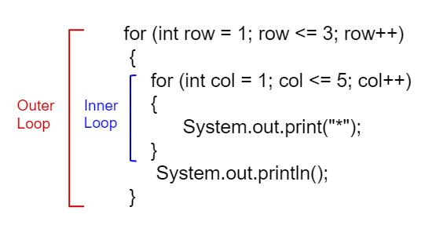

## Table of Contents
{: .no_toc .text-delta }

{: .fs-2 }
- TOC
{:toc}

---

{:.note}
📖 This page is a condensed version of [CSAwesome Topic 2.11](https://runestone.academy/ns/books/published/csawesome2/topic-2-11-nested-loops.html) 

---

## Nested For Loops

A **nested loop** has _one loop inside of another_. These are typically used for working with two dimensions such as printing stars in rows and columns as shown below:



When a loop is _nested inside_ another loop, the inner loop runs many times inside the outer loop. In each iteration of the **outer loop**, the **inner loop** will be _re-started_. 

{:.highlight}
The **inner loop** must finish all of its iterations _before_ the **outer loop** can continue to its next iteration!

### Nested Loop Practice

💬 **DISCUSS:** What does the following code print out? Watch the code run in the [Java visualizer](http://www.pythontutor.com/visualize.html#code=public%20class%20NestedLoops%0A%7B%0A%20%20%20public%20static%20void%20main%28String%5B%5D%20args%29%0A%20%20%20%7B%0A%20%20%20%20%20%20%20for%20%28int%20row%20%3D%201%3B%20row%20%3C%3D%203%3B%20row%2B%2B%29%0A%20%20%20%20%20%20%20%7B%0A%20%20%20%20%20%20%20%20%20%20%20for%20%28int%20col%20%3D%201%3B%20col%20%3C%3D%205%3B%20col%2B%2B%29%0A%20%20%20%20%20%20%20%20%20%20%20%7B%0A%20%20%20%20%20%20%20%20%20%20%20%20%20%20%20System.out.print%28%22*%22%29%3B%0A%20%20%20%20%20%20%20%20%20%20%20%7D%0A%20%20%20%20%20%20%20%20%20%20%20System.out.println%28%29%3B%0A%20%20%20%20%20%20%20%7D%0A%20%20%20%7D%0A%7D&cumulative=false&heapPrimitives=nevernest&mode=display&origin=opt-frontend.js&py=java&rawInputLstJSON=%5B%5D&textReferences=false&curInstr=0). 
> Notice how the **inner loop is started over** for each `row`. Can you predict how many rows and columns of stars there will be?

```java
for (int row = 1; row <= 3; row++) {
    for (int col = 1; col <= 5; col++) {
        System.out.print("*");
    }
    System.out.println();
}
```
> Can you change the code to print a rectangle with 10 rows and 8 columns of stars? You can also try replacing line 10 with this print statement to see the rows and columns: ``System.out.print(row + "-" + col + " ");``

#### 🐢 Coding Practice: Turtle Snowflakes
{:.no_toc}

Try nested loops with `Turtle` objects to create a snowflake design! ❄️

<div class="task" markdown="block">

1. Go to <a href="https://runestone.academy/ns/books/published/csawesome2/topic-2-11-nested-loops.html"><button type="button" name="button" class="btn">CSAwesome Topic 2.11</button></a> 
2. Make sure you **SIGN IN**!
3. Complete the **Programming Challenge: Turtle Snowflake** activity in pairs.

</div>

--- 

## Summary

- **Nested** iteration statements are iteration statements that appear _inside the body of another_ iteration statement.

- When a loop is nested inside another loop, the **inner** loop must complete all its iterations _before_ the **outer** loop can continue.

<!--

## Nested Loops

A **nested loop** is a loop inside another loop. The inner loop will run completely every time the outer loop runs once.


### Example: Multiplication Table

<div class="task" markdown="block">

**Coding Exercise: Print a multiplication table**

```java
for (int row = 1; row <= 3; row++) {
    for (int col = 1; col <= 3; col++) {
        System.out.print((row * col) + "\t");
    }
    System.out.println();
}
````

</div>

---

## Understanding Execution

* The **outer loop** controls the rows.
* The **inner loop** controls the columns.
* For each row, the inner loop runs all its iterations before the next row starts.

---

## Example: Pattern Printing

<div class="task" markdown="block">

**Coding Exercise: Print a triangle of `*`**

```java
for (int i = 1; i <= 5; i++) {
    for (int j = 1; j <= i; j++) {
        System.out.print("*");
    }
    System.out.println();
}
```

</div>

---

## Example: Nested While Loops

<div class="task" markdown="block">

**Coding Exercise: Coordinate Pairs**

```java
int i = 1;
while (i <= 2) {
    int j = 1;
    while (j <= 3) {
        System.out.println("(" + i + ", " + j + ")");
        j++;
    }
    i++;
}
```

</div>

---

## Summary

* The inner loop runs completely for each iteration of the outer loop.
* Nested loops are useful for working with grids, patterns, or multi-dimensional data.
* Be careful — nested loops can increase run time quickly.

---

## AP Practice

<details>
<summary><strong>Question 1</strong></summary>

How many times will `System.out.println("*")` execute?

```java
for (int i = 0; i < 4; i++) {
    for (int j = 0; j < 3; j++) {
        System.out.println("*");
    }
}
```

**Answer:** `12` — 4 outer loop iterations × 3 inner loop iterations.

</details>

<details>
<summary><strong>Question 2</strong></summary>

What does this print?

```java
for (int i = 1; i <= 3; i++) {
    for (int j = 1; j <= 2; j++) {
        System.out.print(i + "-" + j + " ");
    }
}
```

**Answer:** `1-1 1-2 2-1 2-2 3-1 3-2`

</details>

-->

---

#### Acknowledgement
{: .no_toc }

Content on this page is adapted from [Runestone Academy - Barb Ericson, Beryl Hoffman, Peter Seibel](https://runestone.academy/ns/books/published/csawesome2/csawesome2.html).
{: .fs-2 }
