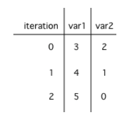

## Table of Contents
{: .no_toc .text-delta }

{: .fs-2 }
- TOC
{:toc}

---

{:.note}
📖 This page is a condensed version of [CSAwesome Topic 2.12](https://runestone.academy/ns/books/published/csawesome2/topic-2-12-loop-analysis.html) 

---

## Loop Runtime Analysis

In this lesson, you will practice **tracing through code with loops** and analyzing loops to determine how many times they run.

### Tracing Loops

Let's practice tracing through loops with many variables. Remember to make a **tracing table** to keep track of all the variables, the iterations, and the output.

Here is a complex loop.  See if you can trace the code on paper by making a tracing table to predict what the code will do when you run it. Click on the this [Java visualizer](https://goo.gl/qEHnpg) link to help you step through the code.

<div class="task" markdown="block">
  
✏️ Can you trace through this code? Write your **tracing table** on paper first, then test the code.
> Add in output statements ``System.out.println("var1: " + var1 + " var2: " + var2);`` before the loop and inside the loop at the end to keep track of the variables and run. 

```java
int var1 = 3;
int var2 = 2;

while ((var2 != 0) && ((var1 / var2) >= 0))
{
    var1 = var1 + 1;
    var2 = var2 - 1;
}
```
</div>

<html>
<details>

<summary>✅ CHECK: Did your trace table look like the following?</summary>

<div markdown="block">



</div>

</details>
</html>

### Counting Loop Iterations

Loops can be also analyzed to determine how many times they run. This is called **run-time analysis** or a **statement execution count**.

<div class="task" markdown="block">
  
✏️ How many stars are printed out in this loop? How many times does the loop run? Figure it out on paper before you run the code.

```java
for (int i = 3; i < 7; i++)
{
    System.out.print("*");
}
```
</div>

> If you made a trace table, you would know that the loop runs when i = 3, 4, 5, 6 but finishes as soon as i becomes 7 since that is not less than 7. So, the loop runs 4 times. Or you can use the shortcut formula in the note below.

<div class="imp" markdown="block">

💡 The **number of times** a loop executes can be calculated by: `(largestValue - smallestValue + 1)`

- If the loop uses `counter <= limit` as the condition, `limit` is the **largest** value.
- If the loop uses `counter < limit`, `limit-1` is the **largest** value that allows the loop to run.
  
</div>

> In the code above the **largest** value that allows the loop to run is 6 (which is the largest value < 7) and the **smallest** value that allows the loop to execute is 3 so this loop executes (6 - 3 + 1 = 4 times).

<div class="task" markdown="block">
  
✏️ How many stars are printed out in this loop? How many times does the loop run? Figure it out on paper before you run the code.

```java
for (int row = 0; row < 5; row++)
{
    for (int col = 0; col < 10; col++)
    {
        System.out.print("*");
    }
    System.out.println();
}
```
</div>

{:.highlight}
The **number of times a nested for loop body is executed** is equal to the number of times the outer loop runs multiplied by the number of times the inner loop runs (`OuterLoopRuns * InnerLoopRuns`).

> For the example above, the outer loop executes 4 - 0 + 1 = 5 times and the inner 9 - 0 + 1 = 10 times so the total is 5 * 10 = 50.


#### Loop Analysis Game
{:.no_toc}

🎲 Try the game below to practice loop analysis. Click on **Loops** and click on the number of times the loop runs. For an added challenge, try the check boxes for `Backwards` and `Nested`. We encourage you to work in pairs and see how high a score you can get.

<iframe height="700px" width="100%" style="margin-left:10%;max-width:80%" src="https://csa-games.netlify.app/"></iframe>


<!--

## Informal Runtime Analysis of Loops

When we analyze loops informally, we focus on two skills:

* **Tracing**: Step through a loop and keep track of variable values as they change.
* **Counting iterations**: Determine how many times a loop (or nested loops) will execute its body.

These skills help you predict output, find bugs, and reason about runtime at a high level.

**Note:** A **trace table** is a simple table where each column is a variable and each row shows the values after each pass through the loop.

---

## Example 1: Trace a `while` Loop

Consider the following code. Trace it and record the values of `var1` and `var2` each time through the loop.

```java
int var1 = 0;
int var2 = 2;

while ((var2 != 0) && ((var1 / var2) >= 0)) {
    var1 = var1 + 1;
    var2 = var2 - 1;
}
```


<div class="task" markdown="block">

**Check Your Understanding**

What are the values of `var1` and `var2` when the code finishes executing?

* A. `var1 = 1, var2 = 1`
* B. `var1 = 2, var2 = 0` ✅
* C. `var1 = 3, var2 = -1`
* D. `var1 = 0, var2 = 2`
* E. Division-by-zero runtime error

**Why:** The loop stops when `var2 == 0` (short-circuiting prevents the division from evaluating when `var2` is 0), so the final state is `var1 = 2`, `var2 = 0`.

</div>

---

## Example 2: Build a Trace Table

You can make tracing easier by drawing a table:

|    Pass # | var1 | var2 |
| --------: | ---: | ---: |
| 0 (start) |    0 |    2 |
|         1 |    1 |    1 |
|         2 |    2 |    0 |

Stop when the loop condition becomes `false`.

---

## Counting Loop Iterations

### Single `for` or `while`

* A loop like `for (int i = 0; i < N; i++)` runs **N** times.
* A loop like `while (x > 0) { x--; }` runs once per decrement until `x == 0`.

### Nested Loops

Multiply the number of iterations of each loop if the inner loop runs fully for each outer iteration.

```java
int i = 0;
while (i <= 4) {
  for (int j = 0; j < 3; j++) {
    System.out.println("Hi!");
  }
  i++;
}
```

* Outer loop: `i = 0, 1, 2, 3, 4` → **5** iterations
* Inner loop: `j = 0, 1, 2` → **3** iterations each time
* Total prints: **5 × 3 = 15**

<div class="task" markdown="block">

**Check Your Understanding**

How many times is `"Hi!"` printed by the program above?

* A. 3
* B. 5
* C. 8
* D. 12
* E. 15 ✅

</div>

---

## Tips for Informal Analysis

* **Initialization, condition, update**: Check all three—off-by-one errors often hide here.
* **Short-circuit logic**: For `&&` and `||`, later subexpressions may not evaluate—this can prevent errors (like division by zero) or change counts.
* **Early exits**: `break`, `return`, or condition changes inside the loop alter iteration counts.
* **State changes**: Make sure the loop variable actually changes so you don’t create an infinite loop.

---

## Practice: Write and Trace

<div class="task" markdown="block">

1. Write a loop that prints the first `N` multiples of 7 on one line.
2. Create a trace table for `sum` and `i` in the loop below. Predict and then run.

```java
int sum = 0;
for (int i = 1; i <= 4; i++) {
    sum += i;       // add i to sum
}
System.out.println(sum);
```

</div>

---

## Summary

* Use **trace tables** to follow variable changes through loop iterations.
* Count iterations by examining **initialization**, **condition**, and **update**.
* For **nested loops**, multiply iteration counts when appropriate.
* Be mindful of **short-circuit evaluation** and **early exits** that affect execution.
-->

---

#### Acknowledgement
{: .no_toc }

Content on this page is adapted from [Runestone Academy - Barb Ericson, Beryl Hoffman, Peter Seibel](https://runestone.academy/ns/books/published/csawesome2/csawesome2.html).
{: .fs-2 }
