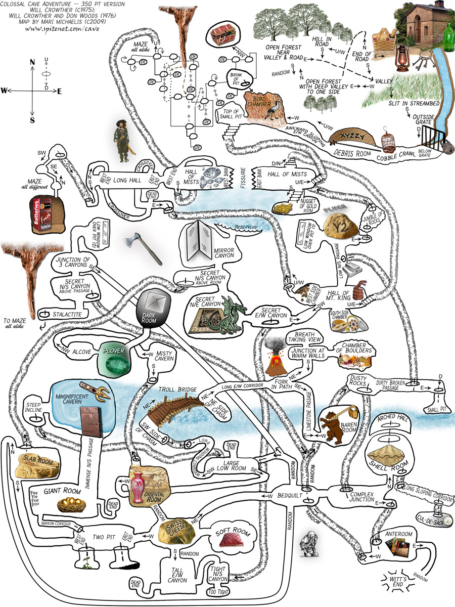

### Overview

<html>
<details>
<summary>📥 <strong class="text-green-200">PROJECT SETUP & SUBMISSION INSTRUCTIONS</strong></summary>
  
<div class="setup" markdown="block">

1. Go to the `CS2 Unit 2 Project` assignment on **Blackbaud** and follow the provided **GitHub Classroom** link.
  > 📁 Clicking the link generates a **private repository** for your project with the appropriate starter code. Note that **projects** are stored within the [BWL-CS Organization](https://github.com/BWL-CS), so you _cannot_ access it from the "Your Repositories" page!
2. Open the repository in a **Codespace** whenever you spend time working on the program, in class or at home. 
  > ⚠️ Always remember to `commit changes` after every coding session!
3. When your project is complete, **submit the link to your repository** in the `CS2 Unit 2 Project` assignment on Blackbaud.

</div>

</details>
</html>

One of the first games coded for early computers in the 1970s was called [Colossal Cave Adventure](https://en.wikipedia.org/wiki/Colossal_Cave_Adventure). It was a **text-based interactive fiction game** where you had to make your way through an elaborate cave. The program only understood one word or phrase commands like north, south, enter, take, etc. 

You can try [playing adventure](http://www.web-adventures.org/cgi-bin/webfrotz?s=Adventure) recreated online following some of the commands in this [walkthrough](https://adventuregamers.com/walkthrough/full/colossal-cave). Part of the challenge is finding the commands that the code will understand.

In a game like Adventure, `if`, `else if`, and `else` statements can be used to respond to commands from the user like `n`, `s`, `e`, `w`.



---

### Part A: 

#### 1. Section
<div class="task" markdown="block">

1. Steps

</div> 

<!--

### Instructions & Requirements

Copy in the **starter code** below and run the program. This is a very simple adventure game that lets the user move in 4 different directions. Right now, it only lets the user move north.
```java
import java.util.Scanner;
public class Main {
  public static void main(String[] args) {
    Scanner scan = new Scanner(System.in);

    // SCENARIO #1
    System.out.println("\n\n You are on an island surrounded by water.\n There is a path to the woods to the NORTH, the sea to the SOUTH, and a beach shack to the EAST. \n Which way do you want to go (n,e,s,w)?");
    String command = scan.nextLine();
    if (command.equals("n")) {
        System.out.println("You enter the forest and hear some rustling. \nThere may be tigers here or maybe it's just monkeys.");
    }
    // Add else-ifs for s, e, w, and an else for any other input. Be creative!
    
  }
}
```

<div class="task" markdown="block">

1. Add in `else if` statements to go in the directions of `"s"` for south, `"e"` for east, `"w"` for west, and an `else` statement that says "You can't go in that direction". Be creative and come up with different situations in each direction!
3. How many **test-cases** are needed to _test all branches_ of your code at this point? 💬 Write your answer in a `//comment`, and try out your test-cases.
4. Next, come up with a **unique location** for your adventure and replace the deserted island theme with scenarios for your location.
> * Your adventure could be set anywhere – a place you are familiar with (like BWL or Manhattan), a place you'd like to visit, or even a fantasy/fictional world.
> * 📝 **PLAN & DRAW OUT YOUR MAP** on paper before coding!!! 
6. Expand the gameplay by adding more branches (**nesting** conditional blocks).
> * You do not need to keep the commands as `n`, `s`, `e`, `w` every time. Just make sure you tell the user what the options are!
> * Don't forget to take **input** (`scan.nextLine()`) for the user's command before your next conditional block.
> * Follow your map (or flowchart) as you write code for the paths you designed.

</div> 

### Extension

{:.highlight}
Turn your **text-based** adventure into a visual one with a **GUI** (Graphical User Interface)! See my `Java Swing` demo: [GitHub Swing GUI](https://github.com/katerinanavab/JavaGUI-Demo)

-->
