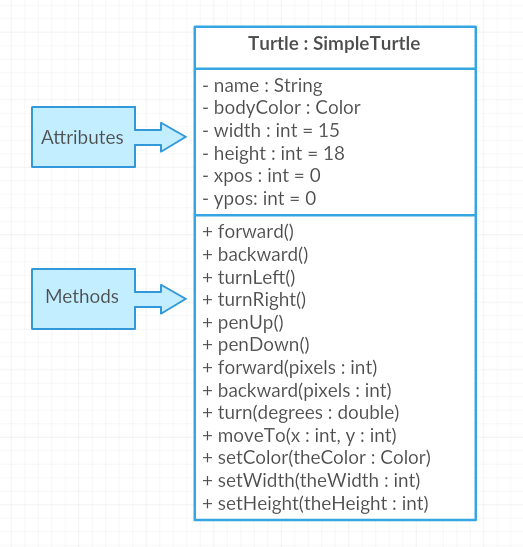

## Table of Contents
{: .no_toc .text-delta }

{: .fs-2 }
- TOC
{:toc}

---

{:.note}
📖 This page is a condensed version of [CSAwesome Topic 3.1](https://runestone.academy/ns/books/published/csawesome2/topic-3-1-abstraction.html) 

---

## Abstraction and Program Design

In Unit 1, we learned to use **classes** and **objects** that are built-in to Java or written by other programmers, for example the ``Turtle`` class. In this unit, you will learn to _write your own classes and make your own objects!_ 
> Think of **classes** like _custom data types_, and **objects** as specific variables of that data type. 

🎨 Prior to implementing a class, it is helpful to take time to **design** each class including its _attributes_ and _behaviors_. This design can be represented using natural language or diagrams. In this lesson, you will learn about **abstraction** and how it can be used to design a program.

### Object-Oriented Design

In **object-oriented design** (OOD), programmers often start by deciding which **classes** are needed to solve a problem, and then figure out the **data** and **methods** are necessary in each class.

    
When you are given a problem specification, you can identify:
* **Classes** you’ll need by looking for the **NOUNS** in the specification.
* **Methods** that should exist in classes by looking for **VERBS** in the specification.

🐢 For instance, the specification for the `Turtle` class probably contained a sentence that said something like, _“make turtles that can exist on a
2-dimensional world and can draw lines by moving around the world”_. The main **nouns** in that description are “turtle” and “world” and indeed the **classes** in the system are ``Turtle`` and ``World``.
> The one noun that was **not** turned into a class was “line”. Do you think it would have made sense to create a ``Line`` class? Why or why not?

💬 **DISCUSS:** You've been hired by your school to create a program that keeps track of _"students at your school and the courses they are taking"_. 
* Name 2 **classes** that you would create in your program.
* Name 2 **attributes** (_data/information_) for each class.
* Name 2 **methods** (_processes/actions_) for each class.

The two **nouns** in the problem description above, `Student` and `Course` would make good class names! Then, you can think about what **data** you need to keep track of for students and courses and what methods your object needs.
> * For example, for the `Student` class, you might need to keep track of the student's `name` and `gradeLevel`.
> * For the `Course` class, you might need to keep track of the `courseName` and the `teacherName`. 

### UML Class Diagrams

Sometimes it’s useful, when designing a complex system with lots of classes, to
make **diagrams** of the classes that show you at a glance what instance variables
and methods they have. Often these can just be sketches in your notebook or on a
whiteboard but there are also more formal systems such as the [Unified Modeling
Language (UML)](https://en.wikipedia.org/wiki/Unified_Modeling_Language) for drawing these diagrams.

{:.important}
Here is a [tutorial on class diagrams](https://medium.com/@smagid_allThings/uml-class-diagrams-tutorial-step-by-step-520fd83b300b) that explains it in more detail if you are curious (_drawing class diagrams is not tested on the AP CSA exam_). If you want to draw your own, [app diagrams](https://app.diagrams.net/) or [Creately.com](https://creately.com) are good free online drawing tools for UML class diagrams.

For example, here is a UML class diagram for the ``Turtle`` class. The ``-`` in
front of the attributes indicate that they are private, and the ``+`` in front
of the methods indicate that they are public. 

#### 🧠 Check Your Understanding
{:.no_toc}

    
🎲 Say you wanted to make a _digital_ computer game from a _physical_ board game. First, you'll need to think about what physical **objects** are in the game. 

For example, here is the description for **Monopoly** (trademark Hasbro games):
> "Buy, sell, dream and scheme your way to riches. Players buy, sell and trade to win. Build houses and hotels on your properties and bankrupt your opponents to win it all. Chance and Community Chest cards can change everything." 

1. What **classes** would you need to create a computer version of this game? (Remember to look for the _nouns_).
2. Take one of the classes you listed, and try to come up with 2 pieces of _data_ in that class that will be the **instance variables**.
3. Repeat this design process for another board game of your choice. 

### Abstraction

**Abstraction** is the process of reducing complexity by focusing on the main idea. By hiding details irrelevant to the question at hand and bringing together related and useful details, abstraction reduces complexity and allows one to focus on the idea.

> The **class diagram** above is an example of abstraction. It shows the main idea of the `Turtle class` without showing all the details of the class. The diagram shows only the key info about the **attributes** and **methods** of the class, but it does not show the details of how the methods are implemented.

#### Data Abstraction

**Data abstraction** provides a separation between the abstract properties of a data type and the concrete details of its representation. **Data** can take the form of a single variable or a collection of data, such as the``Turtle`` class.
> For example, we can use the ``Turtle`` class as a **data type** without needed to know _how_ it is implemented. Data abstraction manages complexity by giving data a **name** without referencing the specific details of the representation. 

* An **attribute** is a type of data abstraction that is defined in a `class`.
    > For example the `width` or `height` of a `Turtle` object.  
* An **instance variable** is an attribute whose value is _unique_ to each **instance** of the class. 
    > For example, each turtle **object** could have different width or height values.
* A **class variable** is an attribute shared by _all_ instances of the class.
    > For example, we could keep a count of how many turtles have been created in a class variable. We will see more examples of these in the next lesson.

#### Procedural Abstraction

**Procedural abstraction** provides a name for a _process_ and allows a method to be used only knowing what it does, not how it does it. Through **method decomposition**, a programmer _breaks down larger behaviors_ of the class into smaller behaviors by creating methods to represent each individual smaller behavior.
> For example, in the Turtle class, the ``forward()`` method is a procedural abstraction that allows the turtle to move forward without needing to know exactly how the turtle is animated to move forward.  

    
Here are some of the main reasons to use procedural abstraction and multiple methods in your programs:

- **Organization and Reducing Complexity:** organize your program into small sections of code by function to reduce its complexity. Divide a problem into subproblems to solve it a piece at a time.
- **Reusing Code:** avoid repetition of code. Reuse code by putting it in a method and calling it whenever needed.
- **Maintainability and Debugging:** smaller methods are easier to debug and understand than searching through a large main method.

Using procedural abstraction in a program allows programmers to change the internal workings of a method (_to make the process faster, more efficient, use less storage, etc._) without needing to notify the method **users** of the change as long as the method signature and what the method does is preserved. 
> For example, we could change the way the `Turtle` class is implemented to make it faster without needing to change the way the ``forward()`` method is _called_.

{: .highlight }
Adding **parameters** to methods allows for even more abstraction and flexibility in code. Parameters allow procedures to be _generalized_, enabling the procedures to be _reused_ with a range of **input** values or **arguments**.

#### 💻 Coding Practice: Riddle Class
{:.no_toc}

1. Go to <a href="https://runestone.academy/ns/books/published/csawesome2/topic-3-1-abstraction.html"><button type="button" name="button" class="btn">CSAwesome Topic 3.1</button></a> 
2. Make sure you **SIGN IN**!
3. Complete the **Programming Challenge: Riddle Class** activity in pairs.

---

## Summary

- (AP 3.1.A.1) **Abstraction** is the process of reducing complexity by focusing on the main idea. By hiding details irrelevant to the question at hand and bringing together related and useful details, abstraction reduces complexity and allows one to focus on the idea.

- (AP 3.1.A.2) **Data abstraction** provides a separation between the abstract properties of a data type and the concrete details of its representation. Data abstraction manages complexity by giving data a name without referencing the specific details of the representation. Data can take the form of a single variable or a collection of data, such as in a class or a set of data.

- (AP 3.1.A.3) An **attribute** is a type of data abstraction that is defined in a class outside any method or constructor. An **instance variable** is an attribute whose value is unique to each instance of the class. A **class variable** is an attribute shared by all instances of the class.

- (AP 3.1.A.4) **Procedural abstraction** provides a name for a process and allows a method to be used only knowing what it does, not how it does it. Through **method decomposition**, a programmer breaks down larger behaviors of the class into smaller behaviors by creating methods to represent each individual smaller behavior. A procedural abstraction may extract shared features to generalize functionality instead of duplicating code. This allows for code reuse, which helps manage complexity.

- (AP 3.1.A.5) Using parameters allows procedures to be generalized, enabling the procedures to be reused with a range of input values or arguments.

- (AP 3.1.A.6) Using procedural abstraction in a program allows programmers to change the internals of a method (to make it faster, more efficient, use less storage, etc.) without needing to notify method users of the change as long as the method signature and what the method does is preserved.

- (AP 3.1.A.7) Prior to implementing a class, it is helpful to take time to design each class including its attributes and behaviors. This design can be represented using natural language or diagrams.

---

#### Acknowledgement
{: .no_toc }

Content on this page is adapted from [Runestone Academy - Barb Ericson, Beryl Hoffman, Peter Seibel](https://runestone.academy/ns/books/published/csawesome2/csawesome2.html).
{: .fs-2 }
