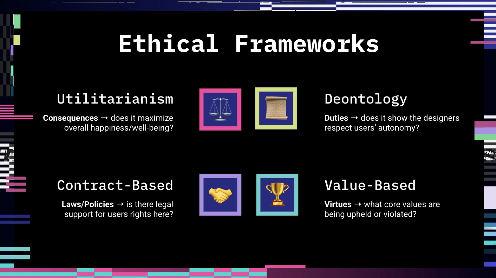

## Table of Contents
{: .no_toc .text-delta }

{: .fs-2 }
- TOC
{:toc}

---

{:.note}
📖 This page is an adapted & expanded version of [CSAwesome Topic 3.2](https://runestone.academy/ns/books/published/csawesome2/topic-3-2-impacts.html) 

---

## Impact of Program Design

We are living in an age of rapid development in technology and automation. Software and hardware developers increasingly have real **impacts** on people's lives. In computer science, we follow the following [ACM Professional Code of Ethics](https://ethics.acm.org/) which includes guidelines such as _"avoid harm"_ and _"respect privacy"_.
> However, sometimes programs have _unintended consequences_. It can be difficult to ensure **system reliability**, which refers to a program being able to perform its tasks as expected under stated conditions without failure. Programmers should make an effort to maximize system reliability by **testing** the program with a variety of conditions.

{:.highlight}
The design and creation of software has **impacts** on _society_, the _economy_, and _culture_. These impacts can be both beneficial and harmful. Programs meant to fill a need or solve a problem can have _unintended harmful effects_ beyond their intended use.

⚖️ Legal issues and **intellectual property (IP)** concerns can also arise when creating programs. Programmers often _reuse_ code written by others and published as **open source** which is free to use. Incorporation of code that is _not_ published as open source requires the programmer to obtain **permission** for (and often purchase) the code before integrating it into their program. 
> 💬 **DISCUSS:** Do you see IP addressed anywhere on my website? 

🧠 The fields of **Artificial Intelligence (AI)** and **Machine Learning (ML)** increasingly pose ethical questions in our world. 

#### EXAMPLES
{:.no_toc}

* Facial recognition software
* Deepfake photos and videos
* Insurance data analysis for pricing
* Automated resume-scanning and hiring algorithms
* Autonomous vehicles (*self-driving cars*) use machine learning to learn to follow lanes and avoid collisions, which could make our world much safer.
  * Self-driving cars do not get distracted by text messages, they don't drink and drive...
  * However, what if the car needs to make an **moral decision** about avoiding a collision with a pedestrian by causing an accident that may also lead to the loss of life?

### Ethical Design of Technology

*Who is responsible for these decisions around ethical issues?* 
* Software? 
* Programmers? 
* Companies? 
* Governments?
* Users? 

Watch the following video to explore the ethical dilemmas of self-driving cars:
> 💬 **DISCUSS:** If you were a programmer for autonomous vehicle software, how would *you* approach such decisions? 

<iframe width="560" height="315" src="https://www.youtube.com/embed/ixIoDYVfKA0?si=q62KFv-lYsw-IGVQ" title="YouTube video player" frameborder="0" allow="accelerometer; autoplay; clipboard-write; encrypted-media; gyroscope; picture-in-picture; web-share" referrerpolicy="strict-origin-when-cross-origin" allowfullscreen></iframe>

🎮 Interested in exploring the **trolley problem** more? Check out this [Neal.fun](https://neal.fun/) game to develop your intuition for decision-making: <a href="https://neal.fun/absurd-trolley-problems/"><button class="btn btn-primary">Absurd Trolley Problems</button></a>

📺 Here are some other interesting videos about the impacts of AI in different domains:

- AI in **Healthcare**: [Using artificial intelligence in radiology clinical practice](https://www.youtube.com/watch?v=dCDuMyzWS8Q)
- AI in **Agriculture**: [New farm machines to kill weeds and harvest crops](https://www.youtube.com/watch?v=DjHGG7eQevY)

### Technology is Not Neutral

Historian [Melvin Kranzberg](https://en.wikipedia.org/wiki/Melvin_Kranzberg)’s famous first law of technology argues that “technology is neither good nor bad; _nor is it neutral._” For more information on this topic, see Stephanie Hare's presentation [Technology is Not Neutral](https://indico.cern.ch/event/1214023/attachments/2556457/4405409/Hare_CERN%20_28-29Nov2022.pdf), which also examines strong counterpoints. 

{: .highlight }
"As we’re designing the system, we’re designing society. Ethical rules that we choose to put into that design [impact society]… Nothing is self-evident." ~ **Tim Berners-Lee**, Creator of the World Wide Web

🎮 Try this game about **non-neutrality** in software design: <a href="https://survivalofthebestfit.com"><button class="btn btn-primary">Survival of the Best Fit</button></a>

> From the creators: "*Survival of the Best Fit* is an educational game about hiring bias in AI. We aim to explain how the misuse of AI can make machines inherit human **biases** and further inequality. Much of the public debate on AI has presented it as a threat imposed on us, rather than one that we have **agency** over. We want to change that by helping people understand the technology, and demand more **accountability** from those building increasingly pervasive software systems."

#### In-Class Activity: Ethics Exploration

💻 In small groups, choose a modern **software application** that has social and ethical implications. 
> Pick a _specific_ website or app feature!

<html>
  

    
<strong><em>IDEAS:</em></strong>

* Social media algorithms (pick a specific one to look into, like TikTok or Instagram)
* Deceptive UI/UX patterns (disguised ads, trick wording, fake scarcity, "confirmshaming")
* Gig economy apps (Uber, DoorDash, etc.)
* Deepfakes: realistic AI-generated media (Sora, Dall-E, etc.)
* Facial recognition software
* Health tracking apps
* Mental health chatbots

    
  

</html>

💬 **DISCUSS:**
* the **beneficial** and possible **harmful** effects of this software application
* the **ethical issues** that may arise while making **design choices** and how programmers can try to avoid them

🗣️ Prepare a short **presentation** (either make it visual on Google Slides/Canva, or write a script/notes for a speech) for your class.
> Use one or more of the **ethical frameworks** below to structure your arguments.

{:.highlight}
This graphic is from a lesson about [Deceptive Patterns in UI/UX Design](https://docs.google.com/presentation/d/1jBcJP9cxtTC6OXv3xFz9hhdh1MwTX7pLsSpyCkoi128/present) that I gave in one of my graduate school courses. The topic relates to what we learned last year in our **Intro to Web Development** course, check it out 😊

---

## ⭐️ Summary

- (AP 3.2.A.1) **System reliability** refers to the program being able to perform its tasks as expected under stated conditions without failure. Programmers should make an effort to maximize system reliability by testing the program with a variety of conditions.

- (AP 3.2.A.2) The creation of programs has impacts on society, the economy, and culture. These impacts can be both beneficial and harmful. Programs meant to fill a need or solve a problem can have unintended harmful effects beyond their intended use.

- (AP 3.1.A.3) Legal issues and intellectual property concerns arise when creating programs. Programmers often reuse code written by others and published as **open source** and free to use. Incorporation of code that is not published as open source requires the programmer to obtain permission and often purchase the code before integrating it into their program.

---

#### Acknowledgement
{: .no_toc }

Content on this page is adapted from [Runestone Academy - Barb Ericson, Beryl Hoffman, Peter Seibel](https://runestone.academy/ns/books/published/csawesome2/csawesome2.html).
{: .fs-2 }
