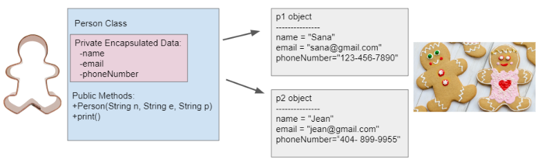

## Table of Contents
{: .no_toc .text-delta }

{: .fs-2 }
- TOC
{:toc}

---

{:.note}
📖 This page is a condensed version of [CSAwesome Topic 3.3](https://runestone.academy/ns/books/published/csawesome2/topic-3-3-anatomy-of-class.html) 

<div style="text-align: center;">
<span class="highlighter-green"> 
<strong>✴✴✴ NEW UNIT/SECTION! ✴✴✴</strong><br>Create a blank Java program to take your class notes in for the next few lessons.<br><em>Click on the collapsed heading below for GitHub instructions</em> ⤵  
</span>
</div>

<html>
  <details>
    <summary>📓 <strong class="text-green-200">NOTES PROGRAM SETUP INSTRUCTIONS</strong></summary>

<div class="setup" markdown="block">

1. Go to the public template **repository** for our class: [BWL-CS Java Template](https://github.com/BWL-CS/java-template)
2. Click the <button type="button" name="button" class="btn btn-green">Use this template</button> button above the list of files then select `Create a new repository`
3. Specify the **repository name**: `CS2-Unit-3-Notes`
4. For the **description**, write: `Class creation for objects`
5. Click <button type="button" name="button" class="btn btn-green">Create repository</button>
    > Now you have **your own personal copy** of this starter code that you can always access under the `Your repositories` section of GitHub! 📂
6. Now on your repository, click <button type="button" name="button" class="btn btn-green"> < > Code </button> and select the `Codespaces` tab
7. Click `Create Codespace on main` and wait for the environment to load, _then you're ready to code_!
8. 📝 Take notes in this Codespace during class, writing **code** & **comments** along with the instructor.

</div>

<br>

<div class="warn" markdown="block">

🛑 When class ends, don't forget to **SAVE YOUR WORK**! **Codespaces** are TEMPORARY editing environments, so you need to COMMIT changes properly in order to update the main **repository** for your program. 

_There are multiple steps to saving in GitHub Codespaces:_

1. Navigate to the `Source Control` menu on the _LEFT_ sidebar
2. Click the <button type="button" name="button" class="btn btn-green">commit changes</button> button on the _LEFT_ menu
3. Type a brief **commit message** at the top of the file that opens, for example: `updated Main.java`
4. Click the small `✔️` **checkmark** in the _TOP RIGHT_ corner
5. Click the <button type="button" name="button" class="btn btn-green">sync changes</button> button on the _LEFT_ menu
6. _Finally you can close your Codespace!_

</div>

</details>

</html>


---

## Anatomy of a Java Class

In Unit 1, we learned to use **classes** and **objects** that are built-in to
Java or written by other programmers. In this unit, you will learn to _write your
own classes_ and make your own objects! 

Watch this video to review the concept of **Object-Oriented Programming**:
<iframe width="560" height="315" src="https://www.youtube.com/embed/X3cFiJnxUBY?si=PpKXf20AdOCvpYLi" title="YouTube video player" frameborder="0" allow="accelerometer; autoplay; clipboard-write; encrypted-media; gyroscope; picture-in-picture; web-share" referrerpolicy="strict-origin-when-cross-origin" allowfullscreen></iframe>

{:.highlight}
💡 Remember that a **class** in Java defines a _blueprint_ for creating objects. When
you create **objects**, you create new **instances** of that class and what you
can do with those instances is determined by what methods are defined in the
class.
> For example in Unit 2, we created ``yertle`` and ``myrtle``, 2 ``Turtle``
variables and assigned them references to objects created from the class
``Turtle`` and we used instances of Java’s ``String`` class to assign values to
different ``String`` variables.

### Creating a Class

Most classes you write will have the keyword ``public`` before them though it is
not required. The **class definition** itself always starts with the **keyword** ``class``
followed by the **name** of the class. Then the rest of the class, called the **body**,
is defined inside a pair of ``{ }``s.

Since we’re talking about anatomy, let’s create a class called ``Person``.
Classes are almost always named with _capitalized names_ though this is a matter
of style, not a rule of the language. Here is the basic skeleton of a ``Person``
class:

```java
public class Person
{
    // define class here - also called the “body” of the class

}
```

You can create **instances** of the ``Person`` class with ``new`` as in ``new
Person()`` And you can declare variables that can hold a reference to a
``Person`` object with ``Person variableName``. Put it altogether to **declare some variables** and **initialize** each one with a reference to a new ``Person`` object as shown here:

```java
// Create OBJECTS - instances of the class
Person ada = new Person();
Person charles = new Person();
```

So what makes up the **body** of the class—the stuff between the ``{}``s?

{:.highlight}
Remember that `objects` have both _attributes_ and _behaviors_. These correspond to
**instance variables** and **methods** in the `class` definition.

🧠📚 The first things we define in a class are usually the **instance variables**. They
are called that because each _instance_ of the class (each _object_) has its own set
of variables that aren’t shared with other instances. 
> This is what allowed ``yertle`` and ``myrtle`` from Unit 2 to be at different positions at the same
time; they each had their own x position and y position instance variables.

🏗️🧱 The next thing we define in a class is usually its **constructors**. We’ll talk
about writing constructors in more detail in the next section but a
constructor’s job is to _initialize the instance variables_ when the object is
created. Usually that will mean they need to take **arguments**. 

💃🕺 The real meat of a class is in the **methods** which define the _behaviors_ of the
objects of that class. 
> Recall from Unit 2 that most methods either do things
(like the ``Turtle`` methods that moved the turtle on the screen) or return
values like the ``getXPos`` and ``getYPos`` on ``Turtle``.

The methods of the class **share access to the object’s instance variables** and
when a method is called on an object it uses the instance variables for that
object. 
> For example in the ``Turtle`` class the ``forward`` method changes an
instance variable ``xPos``. When you call ``forward`` on ``yertle`` it changes
``xPos`` on the ``yertle`` object and when you call it on ``myrtle`` it changes
the ``xPos`` on the ``myrtle`` object.

<div class="imp" markdown="block">
    
_Putting it all together, the three main anatomical features of a class are:_

1. The **instance variables** which hold values (_attributes_) associated with each object
2. The **constructors** whose job is to initialize the instance variables for an object
3. The **methods** who contain the code that gives the objects their _behavior_ and which
can use the instance variables defined in the class

```java
public class Person
{
    // 1. INSTANCE VARIABLES

    // 2. CONSTRUCTORS

    // 3. METHODS

}
```

</div>

> ADDITIONALLY, any Java class can have a ``main`` method which can be used to run that class as a
program either to **test** that one class, or sometimes act as the **entry point** to a whole
program made up of many classes and objects.

{:.highlight}
One important question we have to ask when designing a class is, **what data does
it represent**? In this case we can ask, what would we want to _know_ about a
person? Our answer will depend on what problem we are trying to solve. 

> In one program, perhaps an address book, we might want to know the person's name and
phone number and email. In another program, such as a medical application, we
might need to know their vital signs such as their blood pressure, temperature,
and pulse rate.

### Instance Variables

As we’ve said, **instance variables** hold the data for an object. They record what an object _needs to know_ to play its role in the program. 
> Instance variables are also sometimes called **attributes**, **fields**, or **properties**.

🔐 In general and definitely on the AP CSA exam, instance variables should be
declared **private**. Think of ``private`` as like your diary. Only you should
have direct access to it. Similarly, in Java a ``private`` instance variable can
only be accessed by code in the class that declares the variable.

{:.highlight}
**Instance variables** are declared right after the class declaration. They usually start with ``private`` then the *type* of the variable and then a *name* for the variable. Private means only the code in this class has access to it.

The ``Person`` class declares 3 private instance variables: ``name``, ``email``,
and ``phoneNumber``. These are things that you might want to know about a
person. They are declared at the top of the class and they exist inside the ``{
}`` of the class.

Once we have created a class like ``Person``, we can create many **instances**
(_objects_) of the class. The class is like a _blueprint_ or _cookie cutter_ that
defines the variables and methods for that class. Each object will have their
own copies of the _same instance variables_ but with _possibly different values_ in
them (as seen in the cookie decorations below):



> * 💊 Good Java coding style stresses **data encapsulation** where the data (_instance
variables_) and the code acting on the data (_methods_) are wrapped together into a
single unit and the implementation details are **hidden**.
> * Why?? Because only code in the class can access or change the values of ``private`` instance variables, it is a
lot easier to keep track of how your program works than if you had to worry that
any code anywhere in a much larger program could possibly change the values of
the variables.
> * Code in other classes can only interact with the ``public`` methods you provide
and cannot directly access the ``private`` instance variables (_shown in the pink
box above_).
> * When designing a class you get to decide what data to make **accessible** or
**modifiable** from other classes by what ``public`` methods you provide. 

### Methods

Now to **methods** which define what we can actually do with an object. The most
important methods in a class are the ``public`` methods since they can be
accessed from outside the class. You may also write ``private`` methods that are
not accessible outside of the class and therefore can only be used by other
methods inside the same class. As you’ve probably figured out, the ``public``
and ``private`` keywords determine the external access and visibility of
classes, instance variables, constructors, and methods.

{:.important}
**Methods** define what the _object can do_. They typically start with the ``public`` keyword 
then a return type, then the name of the method followed by parentheses for optional parameters. Methods defined for an object can access and use its instance variables!

The ``Person`` class above has a ``print`` method that prints out all the data
stored for a person object. Here is what that **method definition** inside the class file (like peeking into the hood of a car) might look like: 

```java
public void print()
{
    System.out.println("Name: " + name);
    System.out.println("Email: " + email);
    System.out.println("Phone Number: " + phoneNumber);
}
```
> * Notice that this method is marked as ``public``, and after the keyword
``public`` comes the **return type**. The ``void`` return type, as you may recall from Unit 2, is used to indicate that the method does not return anything but has some _effect_ such as printing to the screen.
> * After the return type comes the method **name** followed by parentheses containing the list of **parameters**. In this
case there are no parameters (no _input_ needed for the process) but we still need the ``( )``s.
> * The **body** of the method is in ``{ }``s.
> * As we’ve discussed, the method can access and use the instance variables defined in the class: ``name``, ``email``, and
``phoneNumber`` but will get the values specific to the object we called ``print`` on.

<div class="important" markdown="block">

📣 To **call** (_activate/run/use_) a method, we need to create an object that is an instance of the class such as we
get by calling its constructor. Then we use the **dot** (``.``) **operator** to call its
``public`` methods, for example ``p1.print()`` means call the ``print`` method
on the object ``p1``.

```java
// call the constructor to create a new person
Person p1 = new Person("Sana", "sana@gmail.com", "123-456-7890");
// call p1's print method
p1.print();
```
</div>


---

## Summary

- (AP 3.3.A.1) **Data encapsulation** is a technique in which the implementation details of a class are kept hidden from external classes. 
- (AP 3.3.A.1) The keywords ``public`` and ``private`` affect the access of classes, data, constructors, and methods. The keyword ``private`` restricts access to the declaring class, while the keyword ``public`` allows access from classes outside the declaring class. 
- (AP 3.3.A.2) In this course, classes are always designated ``public`` and are declared with the keyword ``class``.
- (AP 3.3.A.3) In this course, constructors are always designated ``public``.
- (AP 3.3.A.4) **Instance variables** belong to the object, and each object has its own copy of the variables.
- (AP 3.3.A.5) Access to attributes should be kept internal to the class in order to accomplish encapsulation. Therefore, it is good programming practice to designate the instance variables for these attributes as ``private`` unless the class specification states otherwise.
- **Instance Variables** define the attributes or data needed for objects, and
  **methods** define the behaviors or functions of the object.

---

#### Acknowledgement
{: .no_toc }

Content on this page is adapted from [Runestone Academy - Barb Ericson, Beryl Hoffman, Peter Seibel](https://runestone.academy/ns/books/published/csawesome2/csawesome2.html).
{: .fs-2 }
