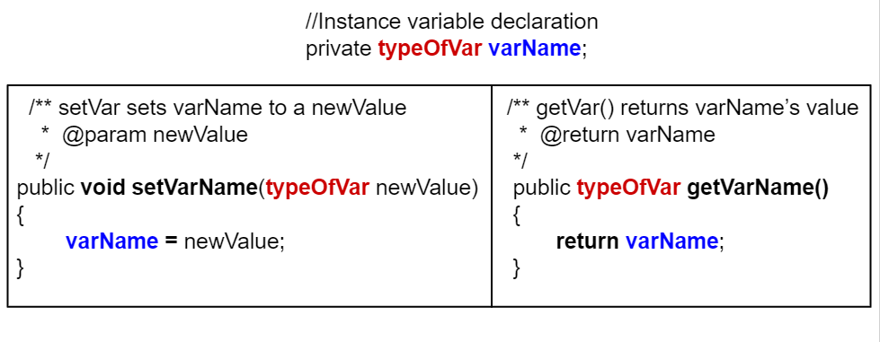

## Table of Contents
{: .no_toc .text-delta }

{: .fs-2 }
- TOC
{:toc}

---

{:.note}
📖 This page is a condensed version of [CSAwesome Topic 3.5](https://runestone.academy/ns/books/published/csawesome2/topic-3-5-methods.html) 

---

## Accessor Methods (_Getters_)

Since the instance variables in a class are usually marked as ``private`` to the
class, if you want code outside the class to be able to access the value of an
instance variable, you need to write what is formally called an **accessor
methods** but which everyone actually just calls a **getter**. 

<div class="imp" markdown="block"> 
  
👉 A **getter** is a ``public`` method that _takes no arguments_ and _returns the value_ of the
``private`` instance variable. 

```java
class ExampleTemplate
{
  // Instance variable declaration
  private typeOfVar varName;

  // Accessor (getter) method template
  public typeOfVar getVarName()
  {
    return varName;
  }
}
```
> Notice that the getter’s return type is the **same as the type of the instance
variable** and all the body of the getter does is return the value of the variable
using a ``return`` statement.

</div>

Here's an example of an accessor method called ``getName`` for the ``Student``
class which also demonstrates how to call ``getName`` using a ``Student``
object:

```java
public class Student
{
  //Instance variable name
  private String name;

  /** getName() example
  *  @return name */
  public String getName()
  {
    return name;
  }

  public static void main(String[] args)
  {
    // To call a get method, use objectName.getVarName()
    Student s = new Student();
    System.out.println("Name: " + s.getName() );
  }
}
```

> Note that getters only return the **value** of the variable. In other words, the
code that called the getter and which receives that value has _no ability to
change the object's instance variable_ - they just get a **copy** of the value. 

However if the instance variable is a **reference (object) type** like ``String`` or``Person`` the value that is copied is the value of the reference. That means the caller receives a new copy of the reference that points to the same object as is stored in the instance variable. 
> In the next section, when we talk about **mutation**, you'll see how that means that the caller might be able to change the object even though it can't change the reference.

<div class="warn" markdown="block">
  
Some common errors when _writing_ and _using_ getters are:

- Forgetting a **return type** like ``int`` before the method name.
- Forgetting to use the ``return`` **keyword** to return a value at the end of the method.
- Forgetting to **do something** with the value returned from a method, like assigning it to a variable or printing it out.

</div>


### The ``toString`` Method

📜 While not strictly speaking a getter, another important method that returns a
value is the ``toString`` method. This method is called automatically by Java in
a number of situations when it needs to convert an object to a ``String``. 

{:.highlight} 
Most notably the methods ``System.out.print`` and ``System.out.println`` use an object's `toString` method to convert a object argument into a ``String`` to be printed.

Here is the ``Student`` class again, but this time with a ``toString`` method:

```java
  public class Student {
      private String name;
      private String email;
      private int id;

      public Student(String initName, String initEmail, int initId) {
          name = initName;
          email = initEmail;
          id = initId;
      }

      // toString() method
      public String toString() {
          return id + ": " + name + ", " + email;
      }
  }
```

Note that when we call ``System.out.println(s1)`` in the tester class below, it will automatically call the
``toString`` method within the `Student` class to get a ``String`` representation of the ``Student``
object:
```java
  public class TesterClass {
      // main method for testing
      public static void main(String[] args) {
          Student s1 = new Student("Skyler", "skyler@sky.com", 123456);
          System.out.println(s1);
      }
  }
```
> The ``toString`` method will return a ``String`` that is then printed out.

#### 💻 In-Class Activity: Class Pet
{:.no_toc}


<div class="task" markdown="block">

1. Go to <a href="https://runestone.academy/ns/books/published/csawesome/Unit5-Writing-Classes/topic-5-4-accessor-methods.html?mode=browsing"><button type="button" name="button" class="btn">CSAwesome Topic 5.4</button></a> 
2. Make sure you **SIGN IN**!
3. Complete the **Programming Challenge: Class Pet** activity in pairs.

</div>

---

## Mutator Methods (_Setters_)

As we saw in the last section, since we typically make instance variables
``private``, we have to define getters if we want to allow code outside the
class to access the value of particular instance variables.

{:.highlight} 
By the same token, if we want to allow code outside the class to `change` the value of an instance variable we have to provide what is formally called a
**mutator method** but which everyone actually calls a **setter**. A setter is a `void` method with a name that starts with ``set`` and that takes a single
argument of the same type as the instance variable to be set. 
> The **effect** of a setter, as you would probably expect, is to assign the provided value to the instance variable.

Just as you shouldn't reflexively write a getter for every instance variable,
you should think even harder about whether you want to write a setter. Not all
instance variables are meant to be **manipulated directly** by code outside the
class.
> For example, consider the ``Turtle`` class. It provides getters ``getXPos`` and
``getYPos`` but it _does not provide corresponding setters_. There are, however,
methods that change a ``Turtle``\ ’s position like ``forward`` and ``moveTo``.
But they do more than just changing the values of instance variables; they also
take care of drawing lines on the screen if the pen is down. 

### How to Define a Setter

<div class="imp" markdown="block">

🪄 A setter is a `void` method with a name that starts with ``set`` and that takes a **single
argument** of the same type as the instance variable to be set.

```java
public class ExampleTemplate
{
     // Instance variable declaration
     private typeOfVar varName;

     // Setter method template
     public void setVarName(typeOfVar newValue)
     {
          varName = newValue;
     }
}
```
> The effect of a setter is to *assign the new provided value* to the object's **instance variable**. 

</div>

Here's an example of the ``Student`` class with a setter for the ``name`` variable:

```java
public class Student
{
     // Instance variable name
     private String name;

     /**
     * setName sets name to newName
     * @param newName
     */
     public void setName(String newName)
     {
          name = newName;
     }

     public static void main(String[] args)
     {
          // To call a set method, use objectName.setVar(newValue)
          Student s = new Student();
          s.setName("Ayanna");
     }
}
```

Compare the **difference** between setters and getters in the following figure.
* Getters `return` an instance variable's **value** and have the same return type as this variable and **no parameters**. 
* Setters have a `void` return type and **take a new value as a parameter** to change the value of the instance variable.



#### 💻 In-Class Activity: Class Pet
{:.no_toc}


<div class="task" markdown="block">

1. Go to <a href="https://runestone.academy/ns/books/published/csawesome/Unit5-Writing-Classes/topic-5-5-mutator-methods.html?mode=browsing"><button type="button" name="button" class="btn">CSAwesome Topic 5.5</button></a> 
2. Make sure you **SIGN IN**!
3. Complete the **Programming Challenge: Class Pet** activity in pairs.

</div>

---

## ⭐️ Summary

- An **accessor method**, or **getter**, allows other objects to _obtain the value_ of instance variables or
  static variables.

- A non-void method returns a single value. Its header includes the **return type**
  in place of the keyword `void`.
  - A getter is a non-void method that returns the value of an instance variable.
  - Its return type matches the type of the instance variable.

- Methods "return by value" where a copy of the value is returned. When the
  value is a primitive type, the value is copied. When the value is a reference
  to an object, the reference is copied, not the object.

- The ``return`` keyword is used to return the flow of control to the point
  immediately following where the method or constructor was called.

- The ``toString`` method is an overridden method that is included in classes to
  provide a description of a specific object. It generally includes what values
  are stored in the instance data of the object.

- If ``System.out.print`` or ``System.out.println`` is passed an object, that
  object’s ``toString`` method is called, and the returned ``String`` is
  printed.

- An object’s ``toString`` method is also used to get the ``String``
  representation used when concatenating the object to a ``String`` with the
  ``+`` operator.

- A void method does not return a value. Its header contains the keyword ``void`` before the method name.

- A **mutator method** or **setter** is a void method that _changes the values_ of an instance or static
  variable.
  

---

#### Acknowledgement
{: .no_toc }

Content on this page is adapted from [Runestone Academy - Barb Ericson, Beryl Hoffman, Peter Seibel](https://runestone.academy/ns/books/published/csawesome2/csawesome2.html).
{: .fs-2 }
