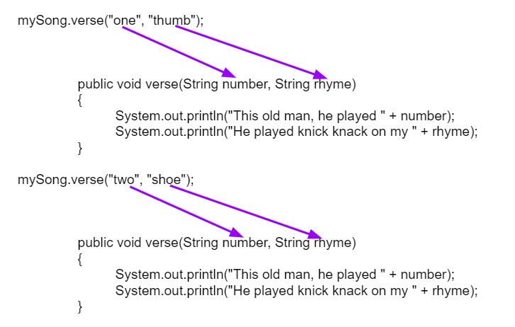

## Table of Contents
{: .no_toc .text-delta }

{: .fs-2 }
- TOC
{:toc}

---

{:.note}
📖 This page is a condensed version of [CSAwesome Topic 3.6](https://runestone.academy/ns/books/published/csawesome2/topic-3-6-methods-references.html) 

---

## Passing & Returning References of an Object


### Method Input: Formal Parameters

You may have noticed even more repetition in the song above. What about the lines of each _verse_? Notice that every word is repeated except the last ones that include a number and a rhyme such as one/thumb and two/shoe.

```java
    System.out.println("This old man, he played one.");
    System.out.println("He played knick knack on my thumb.");
    ...
    System.out.println("This old man, he played two.");
    System.out.println("He played knick knack on my shoe.");
```

We can make methods even more powerful and more abstract by giving them **parameters** for data that they need to do their job - think of it like taking _INPUT_ before the process. We can make a method called verse that takes the number and the rhyme to print out any verse!

```java
public void verse(String number, String rhyme) {
       System.out.println("This old man, he played " + number);
       System.out.println("He played knick knack on my " + rhyme);
}
```
> Run the tester code in the [Java visualizer](http://www.pythontutor.com/visualize.html#code=public%20class%20Song%20%0A%20%20%7B%20%0A%20%20%20%20%0A%20%20%20%20/**%20Verse%0A%20%20%20%20%20*%20%40param%20number%20-%20a%20String%20like%20%22one%22,%20%22two%22,%20etc.%0A%20%20%20%20%20*%20%40param%20rhyme%20-%20a%20String%20like%20%22thumb%22,%20%22shoe%22,%20etc.%0A%20%20%20%20%20*/%0A%20%20%20%20%20public%20void%20verse%28String%20number,%20String%20rhyme%29%0A%20%20%20%20%20%7B%0A%20%20%20%20%20%20%20System.out.println%28%22This%20old%20man,%20he%20played%20%22%20%2B%20number%29%3B%0A%20%20%20%20%20%20%20System.out.println%28%22He%20played%20knick%20knack%20on%20my%20%22%20%2B%20rhyme%29%3B%0A%20%20%20%20%20%7D%0A%20%20%20%20%20%0A%20%20%20%20//%20The%20chorus%20method%0A%20%20%20%20public%20void%20chorus%28%29%20%0A%20%20%20%20%7B%0A%20%20%20%20%20%20%20System.out.println%28%22With%20a%20knick%20knack%20paddy%20whack,%20give%20a%20dog%20a%20bone.%22%29%3B%0A%20%20%20%20%20%20%20System.out.println%28%22This%20old%20man%20came%20rolling%20home.%22%29%3B%0A%20%20%20%20%7D%0A%20%20%20%20%0A%20%20%20%20%0A%20%20%20%20public%20static%20void%20main%28String%20args%5B%5D%29%20%0A%20%20%20%20%7B%0A%20%20%20%20%20%20Song%20mySong%20%3D%20new%20Song%28%29%3B%0A%20%20%20%20%20%20mySong.verse%28%22one%22,%20%22thumb%22%29%3B%0A%20%20%20%20%20%20mySong.chorus%28%29%3B%0A%20%20%20%20%20%20mySong.verse%28%22two%22,%20%22shoe%22%29%3B%0A%20%20%20%20%20%20mySong.chorus%28%29%3B%0A%20%20%20%20%7D%0A%20%20%7D&cumulative=false&curInstr=24&heapPrimitives=nevernest&mode=display&origin=opt-frontend.js&py=java&rawInputLstJSON=%5B%5D&textReferences=false&curInstr=0) to see the song This Old Man print out using the `verse` and `chorus` methods. Can you add verse three with the rhyme "knee"? Can you add verse four with the rhyme "door"? How many verses do you know?

<div class="imp" markdown="block">

🤵‍♀️🤵🤵‍♂️ When you **define** your own method, the variables you specify for it in the method header are called **formal parameters**. 

📣 When you **call** the method to do its job, you give or pass in **arguments** or **actual parameters** to it that are then saved in these local parameter variables.

</div>

When a method is called, the right method definition is found by checking the **method signature** or **header** at the top of the method definition to *match* the following:

1. The method **name**
2. The **number** of arguments
3. The **data types** for the arguments
4. The `return` type (either `void` or a data type like `int`, `String`, etc.)

For example, imagine we are calling the methods for the This Old Man song:
```java
Song mySong = new Song();
mySong.verse("one", "thumb");
mySong.chorus();
mySong.verse("two", "shoe");
mySong.chorus();
```

Here's what that looks like with the 2 method calls above. Notice how the parameter variables get new values with every method call.



{:.warning}
Java uses **Call by Value** when it passes arguments to methods. This means that a _copy_ of the value in the argument is saved in the parameter variable. If the parameter variable changes its value inside the method, the original value outside the method is not changed.

If you pass in an argument that holds a **reference** to an **object**, like a `String` or `Person` or `Turtle` object, a _copy_ of this reference is passed in and saved in the parameter variable. The formal parameter and the actual parameter (argument) are then **aliases**, both refering to the same object. 
> Java was designed this way to avoid copying large objects from method to method. Remember when we discussed **reference aliases** with `Turtle` objects who are set equal to one another.


### Method Output: Return Values

📤  Methods can also **return** values of any type back to the calling method, which can be considered _OUTPUT_. Recall that **non-void** methods, like we saw when writing **getter/accessor** methods, `return` a value of a specific data type. 

{:.highlight}
If a certain method returns a value, the calling method should then _do something_ with this `return` value, like printing it out or assigning it to a variable (of the same type).

```java
// Printing a value returned from a method call
System.out.print("The student's name is " + student.getName() );
// Storing a return value in a new variable
String studentName = student.getName();
```

---

## ⭐️ Summary

- (AP 3.4.A.3) When a mutable object is a constructor parameter, the instance variable should be initialized with a copy of the referenced object. In this way, the instance variable does not hold a reference to the original object, and methods are prevented from modifying the state of the original object.

- (AP 3.6.A.1) When an argument is an object reference, the parameter is initialized with a copy of that reference; it does not create a new independent copy of the object. If the parameter refers to a mutable object, the method or constructor can use this reference to alter the state of the object. It is good programming practice to not modify mutable objects that are passed as parameters unless required in the specification.
- (AP 3.6.A.2) When the return expression evaluates to an object reference, the reference is returned, not a reference to a new copy of the object.
- (AP 3.6.A.3) Methods cannot access the private data and methods of a parameter that holds a reference to an object unless the parameter is the same type as the method’s enclosing class.

---

#### Acknowledgement
{: .no_toc }

Content on this page is adapted from [Runestone Academy - Barb Ericson, Beryl Hoffman, Peter Seibel](https://runestone.academy/ns/books/published/csawesome2/csawesome2.html).
{: .fs-2 }
