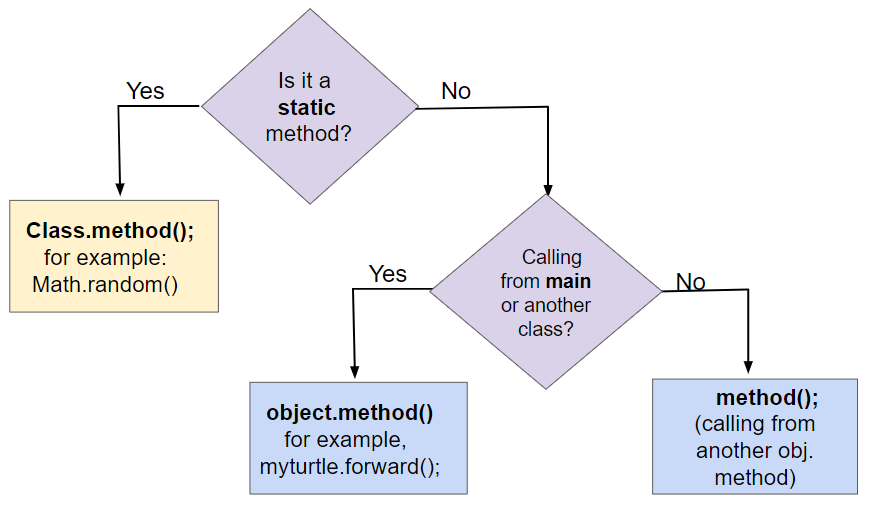

## Table of Contents
{: .no_toc .text-delta }

{: .fs-2 }
- TOC
{:toc}

---

{:.note}
📖 This page is a condensed version of [CSAwesome Topic 3.7](https://runestone.academy/ns/books/published/csawesome2/topic-3-7-static-vars-methods.html) 

---

## The `static` Keyword for Class Variables & Methods

In Unit 1, we explored the `Math` class and its many **static methods** like `Math.random()`, and we've always used a `main` method which is `static`. In this lesson, you will learn to write your own **static variables** and **static methods**.

There is only one copy of a class variable or method for the whole class. For example, the main method is a class (static) method because there should only be 1 main method. If the method is in the same class, you can call it with or without the class name from other static methods in the class: ``Classname.methodName();`` or ``staticMethodName();`` or even with an object of the class: ``objectName.methodName();``.

<div class="imp" markdown="block">
  
- **Static** variables and methods _belong to a class_, and are called with the `Class` name rather than using object variables, like `ClassName.methodName()`;
  
- There is only **ONE COPY** of a static variable or method for the whole class.
  > For example, the `main` method is `static` because there should only be 1 main method to run your program.

- Static **methods** can be `public` or `private`.

- The `static` **keyword** is placed right after the **access modifier** (public or private) and right before the **data type** of variables and methods in their declarations.

```java
public class ClassName {
     // static variable
     public static type variableName;

     // static method
     public static returnType methodName(parameters) {
           // implementation not shown
     }
}
```

📣 To **call** a static method or variable, use the `Class` name: 

```java
// call a static method or variable
System.out.println(ClassName.staticVariable);
ClassName.staticMethod();
```

</div>

### Class Methods

Class methods _belong to the class_ overall, rather than to a specific object of the class. They are called with the class name and the dot operator, like ``ClassName.methodName();``, for example the Math methods like ``Math.random();``. 

```java
    // Calling class methods
    // ClassName.methodName();
    int x = Math.sqrt(9);

     // If the method is in the same class,
     // you can call it with or without the class name 
     // from other static methods in the class
     ClassName.methodName();
     methodName();
```

Let's revisit the following flowchart to compare three different ways of calling methods. Class (`static`) methods are called using the **class name** rather than an individual object's name: 



{:.warning}
Static methods only have **access** to other static variables and static methods. Static methods cannot access or change the values of instance variables or the this reference (since there is no calling object for them), and static methods cannot call non-static methods. However, non-static methods have access to all variables (instance or static) and methods (static or non-static) in the class. 

### Class Variables

**Class variables** belong to the class, with all objects of a class_ sharing a single copy_ of the class variable. Class variables are designated with the ``static`` keyword before the variable type. Class variables that are designated ``public`` are accessed outside of the class by using the class name and the dot operator, since they are associated with a class, not objects of a class.

{:.highlight}
Since there is only **1 copy** of a ``static`` variable or method, static variables are often used to _count how many objects are generated_. 

In the following class ``Person``, there is a ``static`` variable called ``personCounter`` that is incremented each time the ``Person`` constructor is called to initialize a new ``Person`` object. The static method ``printCounter`` prints out its value. You can watch how it works in the [Java visualizer](http://www.pythontutor.com/visualize.html#code=%20public%20class%20Person%20%0A%20%20%7B%0A%20%20%20%20%20//%20instance%20variables%20%0A%20%20%20%20%20private%20String%20name%3B%0A%20%20%20%20%20private%20String%20email%3B%0A%20%20%20%20%20private%20String%20phoneNumber%3B%0A%20%20%20%20%20%0A%20%20%20%20%20//%20Static%20counter%20variable%0A%20%20%20%20%20public%20static%20int%20personCounter%20%3D%200%3B%0A%20%20%20%20%20%0A%20%20%20%20%20//%20static%20method%20to%20print%20out%20counter%0A%20%20%20%20%20public%20static%20void%20printPersonCounter%28%29%20%7B%0A%20%20%20%20%20%20%20%20%20%20System.out.println%28%22Person%20counter%3A%20%22%20%2B%20personCounter%29%3B%0A%20%20%20%20%20%7D%0A%20%20%20%20%20%0A%20%20%20%20%20//%20constructor%3A%20construct%20a%20Person%20copying%20in%20the%20data%20into%20the%20instance%20variables%0A%20%20%20%20%20public%20Person%28String%20initName,%20String%20initEmail,%20String%20initPhone%29%0A%20%20%20%20%20%7B%0A%20%20%20%20%20%20%20%20name%20%3D%20initName%3B%0A%20%20%20%20%20%20%20%20email%20%3D%20initEmail%3B%0A%20%20%20%20%20%20%20%20phoneNumber%20%3D%20initPhone%3B%0A%20%20%20%20%20%20%20%20personCounter%2B%2B%3B%0A%20%20%20%20%20%7D%0A%20%20%20%20%20%0A%20%20%20%20%20//%20toString%28%29%20method%0A%20%20%20%20%20public%20String%20toString%28%29%20%0A%20%20%20%20%20%7B%20%0A%20%20%20%20%20%20%20return%20%20name%20%2B%20%22%3A%20%22%20%2B%20email%20%2B%20%22%20%22%20%2B%20phoneNumber%3B%0A%20%20%20%20%20%7D%0A%20%20%20%20%20%0A%20%20%20%20%20//%20main%20method%20for%20testing%0A%20%20%20%20%20public%20static%20void%20main%28String%5B%5D%20args%29%0A%20%20%20%20%20%7B%0A%20%20%20%20%20%20%20%20//%20call%20the%20constructor%20to%20create%20a%20new%20person%0A%20%20%20%20%20%20%20%20Person%20p1%20%3D%20new%20Person%28%22Sana%22,%20%22sana%40gmail.com%22,%20%22123-456-7890%22%29%3B%0A%20%20%20%20%20%20%20%20Person%20p2%20%3D%20new%20Person%28%22Jean%22,%20%22jean%40gmail.com%22,%20%22404%20899-9955%22%29%3B%0A%20%20%20%20%20%20%20%20%0A%20%20%20%20%20%20%20%20Person.printPersonCounter%28%29%3B%0A%20%20%20%20%20%7D%0A%20%20%7D%0A%20%20&cumulative=false&curInstr=1&heapPrimitives=nevernest&mode=display&origin=opt-frontend.js&py=java&rawInputLstJSON=%5B%5D&textReferences=false)!

💬 **DISCUSS:** What will the following code print out? Try adding another Person object and see what happens.

_Tester method:_
```java
// main method for testing
public static void main(String[] args) {
          // call the constructor to create a new person
          Person p1 = new Person("Sana", "sana@gmail.com", "123-456-7890");
          Person p2 = new Person("Jean", "jean@gmail.com", "404 899-9955");

          Person.printPersonCounter();
}
```

_Class definition:_

```java
public class Person {
      // instance variables
      private String name;
      private String email;
      private String phoneNumber;

      // static counter variable
      public static int personCounter = 0;

      // static method to print out counter
      public static void printPersonCounter() {
          System.out.println("Person counter: " + personCounter);
      }

      // constructor: construct a Person copying in the data into the instance
      // variables
      public Person(String initName, String initEmail, String initPhone) {
          name = initName;
          email = initEmail;
          phoneNumber = initPhone;
          personCounter++;
      }
}
```

{:.highlight}
Another common use for `static` variables is the keep track of a _minimum_ value, _maximum_ value, or an _average_ of the values in a collection of objects.

Consider the class `Temperature` below which has a **static variable**. 

💬 **DISCUSS:** What is the output of the main method below? You can see this code in action in the [Java visualizer](http://www.pythontutor.com/visualize.html#code=public%20class%20Temperature%20%0A%7B%0A%20%20%20private%20double%20temperature%3B%0A%20%20%20public%20static%20double%20maxTemp%20%3D%200%3B%0A%20%20%20%0A%20%20%20public%20Temperature%28double%20t%29%0A%20%20%20%7B%0A%20%20%20%20%20%20%20temperature%20%3D%20t%3B%0A%20%20%20%20%20%20%20if%20%28t%20%3E%20maxTemp%29%0A%20%20%20%20%20%20%20%20%20%20%20maxTemp%20%3D%20t%3B%0A%20%20%20%7D%0A%20%20%20public%20static%20void%20main%28String%5B%5D%20args%29%0A%20%20%20%7B%0A%20%20%20%20%20%20%20Temperature%20t1%20%3D%20new%20Temperature%2875%29%3B%0A%20%20%20%20%20%20%20Temperature%20t2%20%3D%20new%20Temperature%28100%29%3B%0A%20%20%20%20%20%20%20Temperature%20t3%20%3D%20new%20Temperature%2865%29%3B%0A%20%20%20%20%20%20%20System.out.println%28%22Max%20Temp%3A%20%22%20%2B%20Temperature.maxTemp%29%3B%0A%20%20%20%7D%0A%7D&cumulative=false&curInstr=0&heapPrimitives=nevernest&mode=display&origin=opt-frontend.js&py=java&rawInputLstJSON=%5B%5D&textReferences=false).

_Tester method:_

```java
public static void main(String[] args) {
               Temperature t1 = new Temperature(75);
               Temperature t2 = new Temperature(100);
               Temperature t3 = new Temperature(65);
               System.out.println("Max Temp: " + Temperature.maxTemp);
}
```

_Class definition:_

```java
public class Temperature {
           private double temperature;
           public static double maxTemp = 0;

           public Temperature(double t) {
               temperature = t;
               if (t > maxTemp) {
                    maxTemp = t;
               }
           }
}
```

---

## The `final` Keyword for Constant Values

The keyword **final** can be used in front of a variable declaration to make it a **constant value** that cannot be modified. 
> Constant names are traditionally _capitalized_.
	
```java
  final double PI = 3.14 ;
```

---

## ⭐️ Summary

- (AP 3.7.A.1) Class methods cannot access or change the values of instance variables or call instance methods without being passed an instance of the class via a parameter.
- (AP 3.7.A.2) Class methods can access or change the values of class variables and can call other class methods.
- (AP 3.7.B.1) Class variables belong to the class, with all objects of a class sharing a single copy of the class variable. Class variables are designated with the **static** keyword before the variable type.
- (AP 3.7.B.2)	Class variables that are designated ``public`` are accessed outside of the class by using the class name and the dot operator, since they are associated with a class, not objects of a class.
- (AP 3.7.B.3) When a variable is declared ``final``, its value cannot be modified.

---

#### Acknowledgement
{: .no_toc }

Content on this page is adapted from [Runestone Academy - Barb Ericson, Beryl Hoffman, Peter Seibel](https://runestone.academy/ns/books/published/csawesome2/csawesome2.html).
{: .fs-2 }
