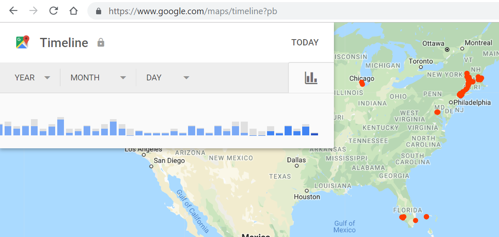

## Table of Contents
{: .no_toc .text-delta }

{: .fs-2 }
- TOC
{:toc}

---

{:.note}
📖 This page is a condensed version of [CSAwesome Topic 4.1](https://runestone.academy/ns/books/published/csawesome2/topic-4-1-data-ethics.html) 

---

## Ethical Issues with Data Collection

### Data Privacy
   
📱 Your phone keeps a lot of information about you, including where you have been, what you buy, what games you play, etc. Here's a video about the massive amounts of data our smart phones and computers collect about us: 

<iframe width="560" height="315" src="https://www.youtube.com/embed/bqWuioPHhz0?si=RxCz5FBuxH45Rw2r" title="YouTube video player" frameborder="0" allow="accelerometer; autoplay; clipboard-write; encrypted-media; gyroscope; picture-in-picture; web-share" referrerpolicy="strict-origin-when-cross-origin" allowfullscreen></iframe>

{:.highlight}
As users, we often don't realize how much personal **data** we are giving away. If you use a computer or phone at all, it means your personal **privacy** is at risk. 

#### Location Tracking

🗺️ If you have ever used your phone to give you directions to go somewhere, it probably still tracks your **location** data. Follow the directions in this [article](https://www.lifewire.com/location-history-google-maps-iphone-1683392) to see if you have location history settings on. You can also turn off location tracking, but it is useful when you want directions, and it's free...

💬 **DISCUSS:** Do the _benefits_ of apps that provide driving directions outweigh the _lack of privacy_ for you? In what situations would it be beneficial or harmful for the app to track your location?

As computer programmers, we must be aware of the **risks** to data privacy when our code collects and stores personal data on computer systems. The laws are slowly catching up to our technology, and many countries and states are passing laws to protect data privacy. 

💻 Programmers have a responsibility to attempt to _safeguard_ the **personal privacy** of the user: 
* Legally and ethically, we must _ask_ the users for permission to access and store their data.
* And if there are data breaches where the data is stolen, we must _inform_ the affected users. 

Computer use and programs have **beneficial** and/or **harmful** impacts on personal security. Software apps for maps and driving directions are very useful, but they have impacts on personal security and privacy if they keep track of your location. 
* This information could be **beneficial**, for example if you are lost and need to be found. But it could be **harmful** and unsafe if someone unauthorized gains access to your location.

💬 **DISCUSS:** Explore a popular app or web site and its _data collecting practices_. Explain the risks to privacy from collecting and storing personal data on computer systems. Discuss the ethical and legal problems that may arise and how programmers can try to avoid them. 

📺 Here are some interesting video resources about data collection and data privacy:

* A short <a href="https://www.cnbc.com/video/2018/03/23/everything-you-need-to-know-about-the-cambridge-analytica-scandal.html" target="_blank">1 minute video</a> about the Facebook Cambridge Analytica incident and a longer <a href="https://www.pbs.org/wgbh/frontline/film/facebook-dilemma/#video-2" target="_blank">1 hour PBS special</a> on Facebook.
* <a href="https://www.youtube.com/watch?v=gXiEBcb0Vs8"  target="_blank">What is Geo-fencing (2 mins)</a>
* <a href="https://www.youtube.com/watch?v=j6wwBqfSk-o"  target="_blank">The European General Data Protection Regulation (GDPR) (3 mins)</a>

### Data and Bias

The fields of **AI (Artificial Intelligence)** and **Machine Learning (ML)** are rapidly growing and increasingly involve ethical questions about data collection, privacy, and resource use. Machine learning algorithms to create software like ChatGPT require massive amounts of data to learn from as well as massive amounts of energy use. But where does this data come from? Often the data is collected from the internet, and the internet is full of biases. For example, if you search for professions like "programmer", "doctor", "CEO" in https://images.google.com/, you will probably see mostly images of white men. This reflects a bias in our world that AIs may learn. An AI could then generate text or images that are biased against historically underrepresented groups. For example, a prominent tech company in 2014 started building an automated hiring tool, a resume filtering AI trained on their current employees resumes, and ended up with an AI system that was biased against women [as described in this article](https://www.aclu.org/news/womens-rights/why-amazons-automated-hiring-tool-discriminated-against). This is a problem because the AI is learning from biased data and then creating biased outcomes that could affect people's lives. 

**Algorithmic bias** describes systemic and repeated errors in a program that create unfair outcomes for a specific group of users. 
* Bias in data can lead to unfair and unethical outcomes. For instance, facial recognition software has been shown to have higher error rates for people with darker skin tones.
* This is because the data used to train these algorithms often _contains fewer examples_ of people with darker skin tones. As a result, the software is less accurate for these individuals, which can lead to discriminatory practices.

Watch the following <a href="https://www.youtube.com/watch?v=TWWsW1w-BVo" target="_blank">Gender Shades video</a> about gender and race bias in face recognition algorithms by computer scientist <a href="https://www.poetofcode.com/" target="_blank">Joy Buolamwini</a> (MIT Media Lab and Algorithmic Justice League).

💬 **DISCUSS:** Explain the importance of recognizing _data quality_ and potential issues such as _data bias_ when using a data set in AI/ML applications.

🎮 Try this game about **algorithmic bias** in software design: <a href="https://survivalofthebestfit.com"><button class="btn btn-primary">Survival of the Best Fit</button></a>

> From the creators: "*Survival of the Best Fit* is an educational game about hiring bias in AI. We aim to explain how the misuse of AI can make machines inherit human **biases** and further inequality. Much of the public debate on AI has presented it as a threat imposed on us, rather than one that we have **agency** over. We want to change that by helping people understand the technology, and demand more **accountability** from those building increasingly pervasive software systems."

Here are some other interesting videos to watch about bias in algorithms:

* <a href="https://www.youtube.com/watch?v=QxuyfWoVV98" target="_blank">AI, Ain't I a Woman?</a>, a poem by Joy Buolamwini
* Ted Talk video on <a href="https://www.youtube.com/watch?v=UG_X_7g63rY" target="_blank">Bias in Facial Recognition</a> by Joy Buolamwini
* <a href="https://www.youtube.com/watch?v=7lpCWxlRFAw" target="_blank">A report on police crime prediction software and bias</a>

Programmers should be aware of the data set collection method and the potential for bias before using the data to extrapolate new information or drawing conclusions. Some data sets are incomplete or contain inaccurate data. Using such data in the development or use of a program can cause the program to work incorrectly or inefficiently. Or the contents of a data set might be related to a specific question or topic and might not be appropriate to give correct answers or extrapolate information for a different question or topic.

It is important for programmers and data scientists to take steps to mitigate bias in data collection and use. This can include using diverse and representative datasets, regularly testing algorithms for bias, and being transparent about the limitations of the software. Here are some steps that can be taken to address bias in machine learning:

- Use diverse and representative data sets to train algorithms.
- Regularly test algorithms for bias and accuracy.
- Be transparent about the limitations and potential biases of the software.
- Involve diverse teams in the development and testing of algorithms.
- Implement ethical guidelines and standards for the use of AI and machine learning.

#### In-Class Activity: Dataset Critique

  
🔍 Go to [Google Dataset Search](https://datasetsearch.research.google.com/) and search for a dataset for the topic of "face recognition" (or another topic you are interested in). Find an **appropriate** ("good") dataset and an **inappropriate** ("bad") dataset for your topic. 

🗣️ _Be prepared to share out:_
* Explanation of why you think the datasets are either **appropriate** or **inappropriate**.
   > For example, the inappropriate dataset might be too small, or incomplete, or biased.
* How the choice of your dataset could affect the **results** of a program that uses the data. 

---

## Summary

- (AP 4.1.A.1) When using a computer, personal privacy is at risk. When developing new programs, programmers should attempt to safeguard the personal privacy of the user.

- Computer use and the creation of programs have an impact on personal security and data privacy. These impacts can be beneficial and/or harmful.

- (AP 4.1.B.1) **Algorithmic bias** describes systemic and repeated errors in a program that create unfair outcomes for a specific group of users.
- (AP 4.1.B.2) Programmers should be aware of the data set collection method and the potential for bias when using this method before using the data to extrapolate new information or drawing conclusions.
- (AP 4.1.B.3) Some data sets are incomplete or contain inaccurate data. Using such data in the development or use of a program can cause the program to work incorrectly or inefficiently.
- (AP 4.1.C.1) Contents of a data set might be related to a specific question or topic and might not be appropriate to give correct answers or extrapolate information for a different question or topic.

---

#### Acknowledgement
{: .no_toc }

Content on this page is adapted from [Runestone Academy - Barb Ericson, Beryl Hoffman, Peter Seibel](https://runestone.academy/ns/books/published/csawesome2/csawesome2.html).
{: .fs-2 }
