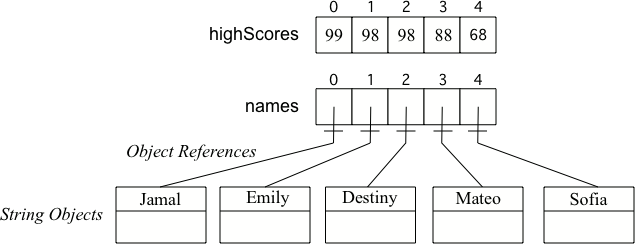

## Table of Contents
{: .no_toc .text-delta }

{: .fs-2 }
- TOC
{:toc}

---

{:.note}
📖 This page is a condensed version of [CSAwesome Topic 4.3](https://runestone.academy/ns/books/published/csawesome2/topic-4-3-array-basics.html) 

<div style="text-align: center;">
<span class="highlighter-green"> 
<strong>✴✴✴ NEW UNIT/SECTION! ✴✴✴</strong><br>Create a blank Java program to take your class notes in for the next few lessons.<br><em>Click on the collapsed heading below for GitHub instructions</em> ⤵  
</span>
</div>

<html>
  <details>
    <summary>📓 <strong class="text-green-200">NOTES PROGRAM SETUP INSTRUCTIONS</strong></summary>

<div class="setup" markdown="block">

1. Go to the public template **repository** for our class: [BWL-CS Java Template](https://github.com/BWL-CS/java-template)
2. Click the <button type="button" name="button" class="btn btn-green">Use this template</button> button above the list of files then select `Create a new repository`
3. Specify the **repository name**: `CS2-Unit4PartA-Notes`
4. For the **description**, write: `1D Array data collections, using text files`
5. Click <button type="button" name="button" class="btn btn-green">Create repository</button>
    > Now you have **your own personal copy** of this starter code that you can always access under the `Your repositories` section of GitHub! 📂
6. Now on your repository, click <button type="button" name="button" class="btn btn-green"> < > Code </button> and select the `Codespaces` tab
7. Click `Create Codespace on main` and wait for the environment to load, _then you're ready to code_!
8. 📝 Take notes in this Codespace during class, writing **code** & **comments** along with the instructor.

</div>

<br>

<div class="warn" markdown="block">

🛑 When class ends, don't forget to **SAVE YOUR WORK**! **Codespaces** are TEMPORARY editing environments, so you need to COMMIT changes properly in order to update the main **repository** for your program. 

_There are multiple steps to saving in GitHub Codespaces:_

1. Navigate to the `Source Control` menu on the _LEFT_ sidebar
2. Click the <button type="button" name="button" class="btn btn-green">commit changes</button> button on the _LEFT_ menu
3. Type a brief **commit message** at the top of the file that opens, for example: `updated Main.java`
4. Click the small `✔️` **checkmark** in the _TOP RIGHT_ corner
5. Click the <button type="button" name="button" class="btn btn-green">sync changes</button> button on the _LEFT_ menu
6. _Finally you can close your Codespace!_

</div>

</details>

</html>


---

## Array Creation and Access

To keep track of 10 exam scores, we could declare 10 separate variables: `int score1, score2, score3, … , score10;` _But what if we had 100 exam scores?_ That would be a lot of variables! 

📋 Most programming languages have a simple **data structure** for a _collection of related data_ that makes this easier. In some programming languages, this is called a **list**. In Java and many programming languages, this is called an **array**.

<html>
<dl>
  <dt>Array</dt>
  <dd>A block of memory that stores a <strong>collection</strong> of data items (elements) of the <em>same type</em> under one variable name.
  </dd>
</dl>
</html>

Arrays are useful whenever you have _many elements of data_ of the **same type** that you want to keep track of, but you don't need to name each one. Instead you use the array name and a number (called an **index**) for the _position_ of an item in the array. 
> You can make arrays of ints, doubles, Strings, and even object classes that you have written like Students. 

<html>
<dl>
  <dt>Index</dt>
  <dd>An integer that represents a <strong>location</strong> in a collection such as an Array. In Java, the first element in an array is stored at index <code>0</code>.
  </dd>
</dl>
</html>

📺 Here's a video that introduces the concept of an array and gives an example:

<iframe width="560" height="315" src="https://www.youtube.com/embed/G7aF-OuLfl4?si=jxdwtAeuuWRTW2lw" title="YouTube video player" frameborder="0" allow="accelerometer; autoplay; clipboard-write; encrypted-media; gyroscope; picture-in-picture; web-share" referrerpolicy="strict-origin-when-cross-origin" allowfullscreen></iframe>

#### ANALOGY
{:.no_toc}

An array is like a row of small lockers, except that you can't cram lots of stuff into it. You can only **store one value** at each locker: 


An array **index** is like a locker number.  It helps you find a particular place to store your stuff and retrieve stuff.  You can _get_ or store a _value_ from or to an array using its index.

{:.highlight}
Arrays and lists in most programming languages start counting elements from the number 0, so the first element in an array is at index 0. This is similar to how Strings are indexed in Java -- the first character is at index 0. 

> 💬 **DISCUSS:** Can you think of another example of something that is like an array?

### Declaring an Array

When we **declare** a variable, we specify its _type_ and then the variable _identifier_ (name). To make a variable into an array, we put square brackets after the data type:

```java
   // Declaration for a single int variable
   int score;
   // Declaration for an ARRAY of ints
   int[] scores;
```
> For example, ``int[] scores`` means we have an array called `scores` that contains `int` type values.

The declarations _do not create the actual array_. Arrays are **objects** in Java, so any variable that declares an array holds a 👉 **reference** to an object. If the array hasn't been created yet and you try to print the value of the variable, it will print `null` (meaning it doesn't reference any object yet).

There are two ways to create an array. You can use the keyword **new** to get new memory or use an **initializer list** to set up the values in the array.

Watch the following <a href="https://youtu.be/IbPFjw1FNkE" target="_blank"><button class="btn">📺 VIDEO</button></a> which shows the two ways of creating an array with a physical model of Java memory.

### Using `new` to Create Empty Arrays

To create an empty array after declaring the variable, use the **new** keyword with the type and the size of the array (the number of elements it can hold). This will actually create the array in memory.  You can do the declaration and the creation all in one step, see the String array names below. The size of an array is set at the time of creation and cannot be changed after that.

```java
  //declare an array variable
  int[] highScores;
  // create the array
  highScores = new int[5];
  // declare and create array in 1 step!
  String[] names = new String[5];
```

<div class="task" markdown="block">

Add two more array declarations:

1. One that creates an array of 5 doubles called `prices`
2. Another array of 5 Strings called `names`.

</div>

What happens in the computer's memory when you declare arrays?

<div class="imp" markdown="block">

Array elements are initialized to **default values** like the following:

- `0` for elements of type ``int``
- `0.0` for elements of type ``double``
- `false` for elements of type ``boolean``
- `null` for elements of type ``String`` or any other **object**


> Two 5 element arrays with their values set to the default values for integer and object arrays.

</div>

### Initializer Lists to Create Arrays with Values

Another way to create an array is to use an **initializer list**. You can initialize (set) the values in the array to a list of values in curly braces (``{}``) when you create it, like below. In this case you don't specify the size of the array, it will be determined from the number of values that you specify.

```java
  int[ ] highScores = {99,98,98,88,68};
  String[ ] names = {"Jamal", "Emily", "Destiny", "Mateo", "Sofia"};
```

When you create an array of a **primitive type** (like ``int``) with initial values specified, space is allocated for the specified number of items of that type and the values in the array are set to the specified values.  When you create an array of an **object type** (like ``String``) with initial values, space is set aside for that number of object references.  The objects are created and the object references set so that the objects can be found.




📺 Watch the following video which shows an array of String objects with a **physical model of Java memory**: 

<iframe width="560" height="315" src="https://www.youtube.com/embed/T-YZvVvPOac?si=RW2AdMvzUCu3Whm9" title="YouTube video player" frameborder="0" allow="accelerometer; autoplay; clipboard-write; encrypted-media; gyroscope; picture-in-picture; web-share" referrerpolicy="strict-origin-when-cross-origin" allowfullscreen></iframe>

### Array Length

Arrays know their **length** (_how many elements they can store_).  It is a `public` read-only **instance variable** so you can use **dot-notation** to access the instance variable (``arrayName.length``).  
> **Dot-notation** is using variable name followed by a ``.`` and then the instance variable (property) name or a method name. 

```java
System.out.println(highScores.length);
```
> Try adding another value to the `highScores` **initializer list** and run again to see the `length` value change.

{:.highlight}
Note that `length` is an **instance variable** and not a method, unlike the String ``length()`` method, so you don't add _parentheses_ after length. The length instance variable is declared as a ``public final int``.  ``public`` means you can access it and ``final`` means the value can't change.

### Access and Modify Array Values

To access the items in an array, we use an **indexed array variable** which is the array name and the index inside of square bracket `[ ]`. Remember that an **index** is a number that indicates the _position_ of an item in a list, starting at `0`. 

An indexed variable like **arrayname[index]** can be used anywhere a regular variable can be used, for example to assign a new value or to get a value from the array like below.


```java
  // assign a new value 99 to the first element in the array
  highScores[0] = 99;
  // print the first element of the array
  System.out.println( highScores[0] );
```

{:.highlight} 
The _first value_ in an array is stored at index `0` and the index of the _last value_ is the `length - 1` (since length is the number of items and the starting index is 0). Use `arrayname[index]` to **access** or **modify** array items.

Watch the following <a href="https://youtu.be/uagEJw6bTM4" target="_blank"><button class="btn">📺 VIDEO</button></a> which shows a physical model of Java memory setting array values.

#### Parallel Arrays
If you want to keep track of the top 5 highest scores in a game and the names of the people with those scores, you could use two **parallel arrays**. One array could keep track of the scores and the other the names. 
> With parallel arrays, you have to make sure you keep them in the **same order** so that the same index can be used to get correponding names and scores.

<div class="task" markdown="block">

Try out the following code which has two parallel arrays, `highScores` and `names`. 

1. Can you print out Mateo's score?
2. Can you change Sofia's score to 97 using an assignment statement in the code?
3. Can you modify the arrays so that they have 6 elements, add your name and score, and print them out?

```java
public static void main(String[] args) {
    // declare, create, initialize arrays
    int[] highScores = {99, 98, 98, 88, 68};
    String[] names = {"Jamal", "Emily", "Destiny", "Mateo", "Sofia"};

    // Print corresponding names and scores
    System.out.println(names[0] + " has a score of " + highScores[0]);
    System.out.println(names[1] + " has a score of " + highScores[1]);
}
```
</div>

> 💬 **DISCUSS:** What happens if you try to access an element that is not there? Try to access a ``highScore`` or ``name`` at index 7 above to see what happens. The index must be between 0 and the length of the array - 1 or it will give an error message called ``ArrayIndexOutOfBoundsException``.

{:.warning}
⚠️ Using an **index** value outside of the range `0 - (length-1)` will result in an `ArrayIndexOutOfBoundsException` being thrown.

One powerful feature in the array **data abstraction** is that we can use **variables** for the index! As long as the variable holds an integer, we can use it as an index:a

```java
  // use a variable for the index
  int index = 3;
  System.out.println(  highScores[index] );
```

#### 🗺 In-Class Challenge: Countries Arrays
{:.no_toc}

<div class="task" markdown="block">

1. Go to <a href="https://runestone.academy/ns/books/published/csawesome2/topic-4-3-array-basics.html"><button type="button" name="button" class="btn">CSAwesome Topic 4.3</button></a> 
2. Make sure you **SIGN IN**!
3. Complete the **Programming Challenge: Countries Array** activity in pairs. 🗺

</div>

#### 🎲 Practice Game: Array Indices
{:.no_toc}

Try the game below to practice! Click on **Arrays** and click on the element of the `*` array that would be printed out by the given code. If you're stuck, check on Labels to see the indices. We encourage you to work in pairs and see how high a score you can get.

<html>
        <iframe height="700px" width="100%" style="margin-left:10%;max-width:80%" src="https://csa-games.netlify.app/"></iframe>
</html>

---

## ⭐️ Summary

- (AP 4.3.A.1) An **array** stores multiple values of the same type. The values can be either primitive values or object references.
- (AP 4.3.A.2) The length (size) of an array is established at the time of creation and cannot be changed. The length of an array can be accessed through the ``length`` attribute.
- (AP 4.3.A.3) When an array is created using the keyword ``new``, all of its elements are initialized to the default values for the element data type. The default value for ``int `` is ``0``, for ``double`` is ``0.0``, for ``boolean`` is ``false``, and for a reference type (like ``String`` or a class you have created) is ``null``.
- (AP 4.3.A.4) Initializer lists can be used to create and initialize arrays.
- (AP 4.3.A.5) Square brackets ``[]`` are used to access and modify an element in a 1D (one dimensional) array using an index.
- (AP 4.3.A.6) The valid index values for an array are ``0`` through one less than the length of the array, inclusive. Using an index value outside of this range will result in an ``ArrayIndexOutOfBoundsException``.

---

#### Acknowledgement
{: .no_toc }

Content on this page is adapted from [Runestone Academy - Barb Ericson, Beryl Hoffman, Peter Seibel](https://runestone.academy/ns/books/published/csawesome2/csawesome2.html).
{: .fs-2 }
