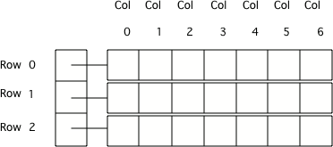

## Table of Contents
{: .no_toc .text-delta }

{: .fs-2 }
- TOC
{:toc}

---

{:.note}
📖 This page is a condensed version of [CSAwesome Topic 4.12](https://runestone.academy/ns/books/published/csawesome2/topic-4-12-2Darray-traversal.html) 

---

## Traversing 2D Arrays with Nested Loops

Since 2D arrays are really arrays of arrays, you can use **nested loops** to iterate through all elements in an array. We first loop through each of the rows (the "_inner arrays_"), and then loop through all the values inside each inner array.



### Enhanced For-Each Loops

An **enhanced for-each** loop "visits" each item in an array sequentially. Notice the type of the outer loop array variable - it is an array that will hold each row, `String[]` in the example below for a 2D String array. The `type` of the variables in the for-each loops must match the type of the array. 

```java
String[][] data;

// ENHANCED FOR-EACH nested loops to traverse 2D array
for (String[] rowArray : data) {
  for (String colValue : rowArray) {
    System.out.println(colValue);
  }
}
```
> In this case the ``for (String[] rowArray : array)`` means to loop through each element of the _outer_ array (`data`) which will set the current ``rowArray`` to the current array of columns. Then the _inner_ loop iterates through the _inner_ array (the current "column"), printing each of the values (`colValue`).

<div class="warn" markdown="block">

_**DATA TYPES:**_ To traverse with enhanced for-each loops, the variable of the _outer_ loop must be the `type` of each **row** - which is a 1D `array`. The _inner_ enhanced for loop variable must be the same `type` as the **elements** stored in the array.

</div>

### Standard For Loops

When writing **nested loops** to traverse a 2D array, **for-each** loops like above are much simpler since you don't have to use the indices and the `[]`'s, but you can only use them if you are NOT going to **modify the values** in an array. 

If you _do_ need to change values, or keep track of the index for another reason, stick to a **standard (indexed) for** loop:

```java
// STANDARD/INDEXED FOR nested loops to traverse 2D array
for (int row = 0; row < data.length; row++) {
  for (int col = 0; col < data[row].length; col++) {
    System.out.println(data[row][col]);
  }
}
```

<div class="imp" markdown="block">

* `array.length` provides the number of **rows** in a 2D array
* `array[0].length` provides the number of **columns**
  > The length of the _inner_ array (`array[0]` is the first _row_)

</div>

#### Looping through a Subset
{:.no_toc}

You can loop through a _subset_ (smaller portion) of a 2D array as long as you use a **standard for loop**. You just change the _starting_ and _ending_ bounds for your loops: 

```java
int[][] matrix = { {3, 2, 3}, {4, 3, 6}, {8, 9, 3}, {10, 3, 3}};

for (int row = 1; row < 3; row++) {
  for (int col = 0; col <= 2; col++) {
    System.out.println(matrix[row][col]);
  }
}
```
> 💬 **DISCUSS:** What do you think the above code will print out? Which part of the `matrix` 2D array?


---

## ⭐️ Summary 

- (AP 4.12.A.1)	Nested iteration statements (loops) are used to traverse and access all or an ordered sequence of elements in a 2D array. Since 2D arrays are stored as arrays of arrays, the way 2D arrays are traversed using ``for`` loops and enhanced ``for`` loops is similar to 1D array objects. 

- (AP 4.12.A.1) Nested iteration statements can be written to traverse the 2D array in row-major order, column-major order, or a uniquely defined order. **Row-major order** refers to an ordering of 2D array elements where traversal occurs across each row, whereas **column-major order** traversal occurs down each column.

- (AP 4.12.A.2)	The outer loop of a nested enhanced ``for`` loop used to traverse a 2D array traverses the rows. Therefore, the enhanced ``for`` loop variable must be the type of each row, which is a 1D array. The inner loop traverses a single row. Therefore, the inner enhanced ``for`` loop variable must be the same type as the elements stored in the 1D array. Assigning a new value to the enhanced ``for`` loop variable does not change the value stored in the array.

- The 2D array's length gives the number of rows. A row's length array[0].length gives the number of columns.
  
---

#### Acknowledgement
{: .no_toc }

Content on this page is adapted from [Runestone Academy - Barb Ericson, Beryl Hoffman, Peter Seibel](https://runestone.academy/ns/books/published/csawesome2/csawesome2.html).
{: .fs-2 }
