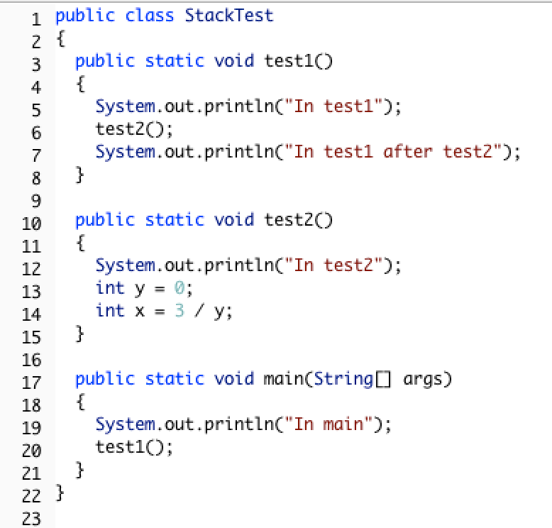

## Table of Contents
{: .no_toc .text-delta }

{: .fs-2 }
- TOC
{:toc}

---

{:.note}
📖 This page is a condensed version of [CSAwesome Topic 4.16](https://runestone.academy/ns/books/published/csawesome2/topic-4-16-recursion.html) 

---

## What is Recursion?

**Recursion** in Java is when a _method calls itself_. Recursion is another strategy for *repeating code* - an alternative to **loops**.

<html>
    <dl>
        <dt>Recursive Method</dt>
        <dd>A method that contains at least one <strong>call to itself</strong> inside the method body, thereby <em>repeating</em> its own process recursively.</dd>
    </dl>
</html>


> Check out more [recursion visualizations](https://giphy.com/explore/recursion)!

The method below will print out "This is the method that never ends!" and then _call itself_, which will print out the message again, and then call itself, and so on.

```java
public static void neverEnd() {
    System.out.println("This is the method that never ends!");
    neverEnd();
}
```
> ♾️ This is called **infinite recursion**, which is a recursion that never ends. Of course, this particular method is not very useful. (Actually, in practice it *will* end, crashing with a ``StackOverFlowError`` because there is a limit on how many times you can recurse.)

{:.highlight} 
The AP CSA exam usually has about **4-6 recursion problems** in the MCQ section. You only need to know how to _trace_ recursive methods, as in, figure out what they _return_ or _print_. ✍️


#### Why Use Recursion?
{:.no_toc}

Recursion is most useful for solving problems where the structure of the problem
allows it to be **broken into smaller but similar problems**, whose _solutions can
be combined_ into the **solution to the original problem**.

EXAMPLES:

* 🗂️ Suppose you wanted to find out how much space a **folder** on your computer uses? Well, if you knew how much space each of the **files** and **sub-folders** in that folder used, you could add them up and get the answer.
    * Getting the size of a regular **file** is usually easy, but figuring out how much space each **sub-folder** takes up is the same problem we stared with, just with a different folder...
    * But that’s actually great news because we can **use the same procedure to solve this smaller problem:** find the size of all the files and sub-folders *in it* and add them up.
    * Eventually, as we try to get the size more deeply **nested folders**, eventually we'll get to folders that only _contain plain files whose sizes we can add up_ and `return`, and eventually we work our way back up to give the answer to our question about the original top-most folder.

* Recursion can also be used to create **fractals**. 
    * A simple fractal example is **Sierpinski's Triangle** in which you subdivide a triangle into 4 new triangles as shown below. You can then do the _same procedure_ with each new triangle except the center one.


* Recursion can also be used to **traverse** ``String``s, arrays, and ``ArrayList``s just like a loop. In fact, any loop—also known as *iterative* code—can be
re-written using recursion! 
> However in most languages, including Java, there are limitations on how deeply code can recurse, which rules out using recursion for infinite or even very long loops.

<div class="imp" markdown="block">

🌳 Recursion is more **powerful** than simple loops, especially when dealing with _branching structures_ like the file folder example. Computer scientists call such data structures **trees** and they are incredibly common in computer programs. Thus one way to think about recursion is as “_loops for trees_”. 

> 🔁 If you need to loop over a **simple linear data structure** like a ``String``, array, or `ArrayList`, by all mean use a ``for`` loop _instead of recursion_. And if you want to navigate a 2D array, a pair of nested ``for`` loops is the way to go. 

</div>

### Factorial Method

The following video introduces the concept of recursion and tracing recursion with the **factorial method**.

<iframe width="560" height="315" src="https://www.youtube.com/embed/V2S_8E_ubBY?si=GbmCun5a8pxewGLI" title="YouTube video player" frameborder="0" allow="accelerometer; autoplay; clipboard-write; encrypted-media; gyroscope; picture-in-picture; web-share" referrerpolicy="strict-origin-when-cross-origin" allowfullscreen></iframe>

See the method `factorial` below that calculates the **factorial** of a number. The **factorial** of a number is defined as `1` for 0, and ``n * factorial (n-1)`` for any other number.

```java
   public static int factorial(int n) {
       if (n == 0)
           return 1;
       else
           return n * factorial(n-1);
   }
```
> You can also play with an interactive demonstration of the recursive factorial computation at [https://gigamonkeys.com/misc/factorial/#java](https://gigamonkeys.com/misc/factorial/#java).


### Base Case
    
Every non-infinite recursive method must have at least one **base case** as a way to _stop recursion_. 🛑 

<html>
    <dl>
        <dt>Base Case</dt>
        <dd>A <strong>condition</strong> where a recursive method can <code>return</code> an answer <em>without another recursive call</em>. In other words, the smallest possible problem (or problems) that the method knows how to solve, the ones it can <em>answer directly</em> without any more recursion.</dd>
    </dl>
</html>

The base case is often handled by an ``if`` statement that checks for the **base case condition**, and _returns directly_ when the condition for the base case is met.

* In the **factorial** method: the base case is when the argument is 0 as that is the smallest number that the factorial method can handle.

* When we recurse through **folders** on our computer there are TWO base cases: a simple file, whose size we can find out directly, and an empty folder whose size is 0.

{:.highlight}
The goal of every **recursive call** in a recursive method is to *shrink the problem* in some way that gets **closer to the base case**. 
> You can see that in ``factorial`` where the recursive call is passing ``n - 1``, one closer to ``0``. This is the equivalent in recursion to _incrementing_ your loop variable in a
``for`` loop.

<iframe width="560" height="315" src="https://www.youtube.com/embed/Q83nN97LVOU?si=F48d7kHn96smMDpG" title="YouTube video player" frameborder="0" allow="accelerometer; autoplay; clipboard-write; encrypted-media; gyroscope; picture-in-picture; web-share" referrerpolicy="strict-origin-when-cross-origin" allowfullscreen></iframe>


## The Call Stack

In Java, the **call stack** keeps track of the _methods that you have called_ since the `main` method executes. A **stack** is a way of organizing data that _adds and removes items only from the top_ of the stack. 


> An example is a stack of cups. You can grap a cup from the top of the stack, or add more cups at the top of the stack.

When you are executing one method (`method a`) and it calls another method (`method b`), that method call is **placed on the call stack** along with information about where it was called from, which tells the run-time _where to return_ to when the current method finishes executing. When `method b` finishes executing, the run-time pops the `method b` off of the call stack and returns execution to the next line to be executed in `method a`.

Consider the following class definition:



{:.warning}
The code above will cause a run-time error of division by zero when it runs.  The ``main`` method calls the method ``test1`` (at line 20) which calls the method ``test2`` (at line 6) which has the divide by zero error (line 14).  

This error can be seen in the **call stack** below, which shows the call stack from the top (_most recent method_) to the bottom (_original method call_).


{:.highlight}
➕ When a method calls itself, the **new method call** gets _added to the top_ of the call stack, taking first priority as the most recent method called. Execution of the current method _pauses_ while the recursive call is being processed. Each recursive call on the stack has its own set of _local variables_, including the parameter variables. The parameter values progressively change in each recursive call until we reach the **base case** which stops the recursion.

### Tracing Recursive Methods

Let's **trace** the execution of the factorial method defined below.

```java
public static int factorial(int n) {
    if (n == 0) {
        return 1;
    }
    else {
        return n * factorial(n-1);
    }
}
```
* What happens when we call ``factorial(0)``?  
    > It will return 1 (line 5) since `n` is equal to 0.
* How about ``factorial(1)``?
    > It will return ``1 * factorial(0)``. We already know that ``factorial(0)`` returns 1, but the computer won't *remember* that.  It will execute ``factorial(0)`` and return the result (1). So  ``factorial(1)`` returns `1 * 1`, which is `1`.

How can you **show what is happening** in a recursive call? The lines below show the _call stack upside down_ (with the bottom of the stack, or the **original call** at the _top_ and the **most recent call** at the _bottom_) for a call to ``factorial(5)``.  
> ✍️ This is a handy way to _trace_ a recursive method on the exam!!!

```java
  factorial(5) returns 5 * factorial(4)
  factorial(4) returns 4 * factorial(3)
  factorial(3) returns 3 * factorial(2)
  factorial(2) returns 2 * factorial(1)
  factorial(1) returns 1 * factorial(0)
  factorial(0) returns 1
```

Once `factorial(0)` executes and returns `1`, that value can be **substituted back** into the previous method call, starting at the _top_ of the stack (_shown at the bottom here_) and working our way back to the _bottom_ of the stack (_shown at the top here_).

```
  factorial(5) returns 5 * factorial(4) = 5 * 24 = 120
  factorial(4) returns 4 * factorial(3) = 4 * 6 = 24
  factorial(3) returns 3 * factorial(2) = 3 * 2 = 6
  factorial(2) returns 2 * factorial(1) = 2 * 1 = 2
  factorial(1) returns 1 * factorial(0) = 1 * 1 = 1
  factorial(0) returns 1
```

So ``factorial(5)`` returns `120`, as the final solution to the original question.


<div class="task" markdown="block">
    
✍️ **Trace** the execution of the bunny ears method defined below:

```java
public static int bunnyEars(int bunnies) {
    if (bunnies == 0) {
        return 0;
    }
    else if (bunnies == 1) {
        return 2;
    }
    else {
        return 2 + bunnyEars(bunnies - 1);
    }
}
```

* What happens when we call ``bunnyEars(0)``?  
    > It will return 0 since `n` is equal to 0.
* How about ``bunnyEars(1)``?
    > It will return 2 since `n` is equal to 1. 
* What about ``bunnyEars(5)``?

</div>

<html>
<details><summary><strong>✅ CHECK YOUR SOLUTION:</strong></summary>

<div markdown="block">
    
```
  bunnyEars(5) returns 2 + bunnyEars(4)
  bunnyEars(4) returns 2 + bunnyEars(3)
  bunnyEars(3) returns 2 + bunnyEars(2)
  bunnyEars(2) returns 2 + bunnyEars(1)
  bunnyEars(1) returns 2
```

This approach shows the call stack from bottom to top. Once ``bunnyEars(1)`` executes and returns 2 that value can be substituted back into the previous method call, starting at the top and working our way back toward the bottom (or beginning) of the call stack.

```
  bunnyEars(5) returns 2 + bunnyEars(4) = 2 + 8 = 10
  bunnyEars(4) returns 2 + bunnyEars(3) = 2 + 6 = 8
  bunnyEars(3) returns 2 + bunnyEars(2) = 2 + 4 = 6
  bunnyEars(2) returns 2 + bunnyEars(1) = 2 + 2 = 4
  bunnyEars(1) returns 2
```

So ``bunnyEars(5)`` returns 10.

</div>
</details>
</html>

---

## ⭐️ Summary

- (AP 4.16.A.1)	A **recursive method** is a method that calls itself. 
- (AP 4.16.A.1) Recursive methods contain at least one **base case**, which halts the recursion, and at least one **recursive call**. (unless it is a case of **infinite recursion**).
- (AP 4.16.A.1) Recursion is another form of repetition.
- (AP 4.16.A.2)	Each recursive call has its own set of local variables, including the parameters. Parameter values capture the progress of a recursive process, much like loop control variable values capture the progress of a loop.
- (AP 4.16.A.3)	Any recursive solution can be replicated through the use of an iterative approach and vice versa. (although the recursive solution may have memory limitations for the recursive call stack, and the iterative approach may require additional data structures).
- Note that writing recursive code is outside the scope of the AP Computer Science A course and exam.
- Recursion can be used to traverse ``String``\ s, arrays, and ``ArrayList``\ s.
  
---

#### Acknowledgement
{: .no_toc }

Content on this page is adapted from [Runestone Academy - Barb Ericson, Beryl Hoffman, Peter Seibel](https://runestone.academy/ns/books/published/csawesome2/csawesome2.html).
{: .fs-2 }
